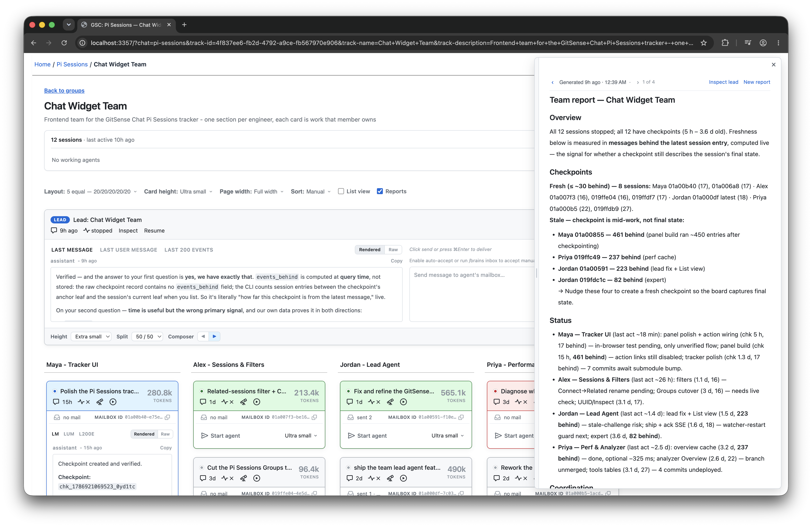
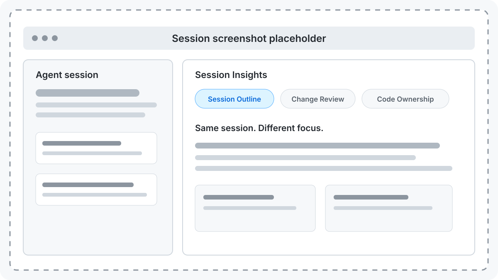
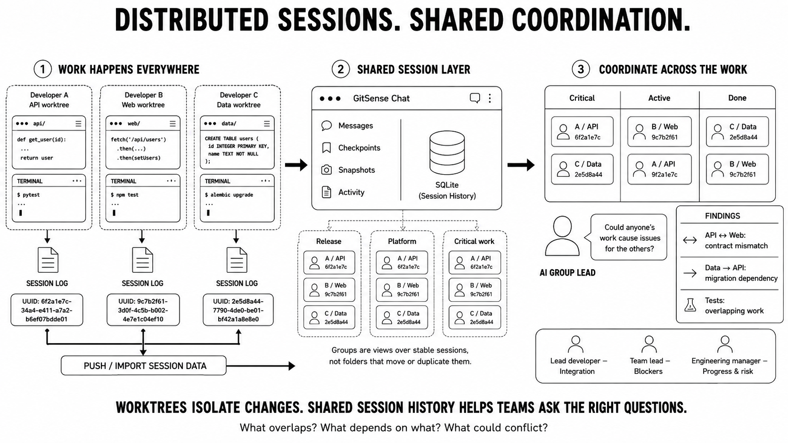

# GitSense: Chat

**Give your agents a home. Make AI collaboration manageable at scale.**

Agents may work across different terminals, repositories, and tasks, but their
sessions do not have to remain scattered. GitSense Chat brings that work
together while it is happening and when it stops.

## Multiple sessions. One conversation.

Give your sessions a lead agent and stay on top of the work through one
conversation.

<table>
  <tr>
    <td width="35%" valign="top">
      <h3>Ask about your sessions</h3>
      <p>
        "Generate a change report for every session not in Done. Use GitSense
        Markdown actions to make each changed file open in Zed."
      </p>
      <strong>Work from your layout</strong>
      <p>
        The lead agent works from the sessions and columns you arranged, so you
        do not need to find or name every session.
      </p>
    </td>
    <td width="65%">
      
    </td>
  </tr>
  <tr>
    <td width="35%" valign="top">
      <h3>Ask about your team's sessions</h3>
      <p>
        "Generate a team report using each session's latest checkpoint.
        Highlight stale checkpoints, blockers, coordination risks, and work
        that needs attention."
      </p>
      <strong>Check status without interrupting</strong>
      <p>
        The lead agent starts with checkpoints and session freshness, then
        tells you where the available evidence may be incomplete.
      </p>
    </td>
    <td width="65%">
      
    </td>
  </tr>
</table>

## One session. Multiple views.

Choose what to surface so every session is easier to understand.



## Quick Start

Review the [install script](install.sh), then install `gsc`:

```bash
curl https://raw.githubusercontent.com/gitsense/chat/refs/heads/main/install.sh | bash
```

Or [build it yourself](https://github.com/gitsense/chat).

### Ask Your Coding Agent

```text
Install and configure GitSense Chat for me. Start by running `gsc docs help`.
```

Your agent will guide you through the rest and stop when you need to enter an
API key privately.

For detailed installation instructions, run:

```bash
gsc docs install
```

## A foundation for scalable AI collaboration

Scale starts with reducing how much any one person must keep in their head.
GitSense Chat helps individuals find, organize, and understand a growing
history of agent sessions. The same foundation helps teams preserve knowledge,
discover related work, and coordinate agents through shared groups and lead
agents.

| **Find the work** | **Organize your sessions** | **Understand what matters** |
| :---: | :---: | :---: |
|  |  |  |
| [See how to find any session](#find-work-wherever-it-happened) | [See how to organize your sessions](#organize-your-sessions) | [See how Session Insights work](#see-what-matters) |

| For an individual | For a team |
| :--- | :--- |
| Find and return to previous sessions | Discover work across available team sessions |
| Organize a growing session history into useful groups | Build shared project and workflow views |
| Surface the details that matter through Session Insights | Apply ownership, policy, risk, and team-specific views |
| Use checkpoints to catch up without replaying transcripts | Produce group-wide reports without interrupting every agent |
| Give any group of sessions a lead | Coordinate distributed work through lead agents |
| Preserve personal discoveries | Turn lessons, notes, rules, and Brains into shared knowledge |




## How GitSense Chat supports this

GitSense Chat provides three layers for working with agents at scale:

| | Purpose | GitSense capabilities |
| :--- | :--- | :--- |
| **Remember** | Preserve what the team and its agents learn. | Brains, lessons, notes, and rules |
| **Understand** | Turn agent activity into the signals people and agents need. | Search, Session Insights, checkpoints, and freshness |
| **Coordinate** | Work across many sessions without checking each one individually. | Groups, mailboxes, lifecycle tools, and lead agents |

### Build shared knowledge

Brains encode structured domain knowledge about repositories and teams.
Lessons preserve discoveries that should not be rediscovered. Notes record
useful implementation context. Rules carry guidance into future work and can
apply it at the point where it matters.

Together, these give current and future agents more than another transcript.
They provide durable context that can travel with the repository and improve
the starting point for the next task.


### See what matters

Session Insights let developers, team leads, and managers create views around
their own questions. One view might show a compact session outline. Another
might focus on changed files, code ownership, risk, tests, repository lessons,
or whether a required command ran.

The same session can support different views because what matters depends on
who is asking and what they need to decide.

| **Session Outline** | **Change Review** | **Code Ownership** |
| :---: | :---: | :---: |
|  |  |  |
| Condense a long session into a useful timeline. | Focus on the changes and evidence worth reviewing. | Connect file activity to the people and policies that apply. |

### Organize your sessions

Bring sessions together in groups built around a project, workflow, team, or
temporary review. Choose the layout that fits the work, from ordered rows to a
Kanban board or a fixed side panel. A session can appear in every group where
it is useful.


### Understand session state without interrupting the agent

Checkpoints record an agent's goal, current task, understanding, next action,
decisions, evidence, risks, open questions, and self-reported health. A lead
can read these records without sending a message to each agent or replaying
complete transcripts.

Checkpoint freshness is computed when queried. `events_behind` measures how
many session entries occurred after the checkpoint, which is often more useful
than age alone. A three-day-old checkpoint may describe the final state when
the session stopped immediately afterward. A checkpoint from fifteen hours ago
may already be stale when hundreds of events followed it.

Checkpoints report what was known when they were created. They are evidence,
not proof that the work is complete or correct.


### Find work wherever it happened

Search sessions available to GitSense by message content, tool activity, file
operations, changed files, repository metadata, and connected knowledge such as
lessons, notes, and rules. This makes it practical to find relevant work even
when nobody remembers which terminal, session, or agent produced it.

Groups are views over sessions, not folders. The same session can appear in
every project, workflow, dashboard, or temporary review where it is useful.


### Give a group a lead agent

Create a group, add a lead, and manage its sessions through one conversation.
The lead receives the current group layout and roster, starts with member
checkpoints, checks live session state, and reports uncertainty when evidence
is stale or unavailable.

Agents do not need to share a parent or have started together. A group can
bring independently created sessions into the same coordination structure.
The lead gives the user one place to ask what is happening across that group.


## How it works

GitSense Chat uses the session logs your agents already create, so the core
search, review, insight, and organization workflows work while sessions are
active and after they end. Optional lifecycle integration adds live state,
mailboxes, agent-to-agent communication, and managed session startup.

| With session logs | With optional lifecycle integration |
| :--- | :--- |
| Search conversations, files, and operations | See which agents are running |
| Inspect messages, tool calls, file activity, and Git state | Start an eligible stopped session when requested |
| Create custom Session Insight views | Send messages to an agent's inbox |
| Group and organize related sessions | Let agents communicate with one another |
| Read checkpoints and measure freshness | Coordinate a group through a lead agent |
| Copy resume and attach commands | Receive messages in the agent's existing interface |

**Runtime support:** Pi is currently the supported integration. Codex, Claude
Code, OpenCode, and other coding-agent harnesses are not yet integrated. The
goal is a shared workspace where sessions, knowledge, and agent communication
work across harnesses.

## Working examples

- [smart-ripgrep](https://github.com/gitsense/smart-ripgrep) shows how committed
  repository knowledge helps agents find the right files, consult earlier
  lessons, and create custom Session Insight views.
- The Session Outline and Change Review analyzers show how the same raw session
  can be shaped around different questions.
- The Pi integration demonstrates session search, groups, checkpoints,
  messaging, lifecycle state, and lead-agent coordination.

## Boundaries

GitSense Chat surfaces evidence and makes distributed work easier to inspect.
It does not decide whether an agent's work is correct. Checkpoints and agent
reports describe what was known at a point in time. Humans remain responsible
for reviewing evidence, resolving uncertainty, and deciding what happens next.
