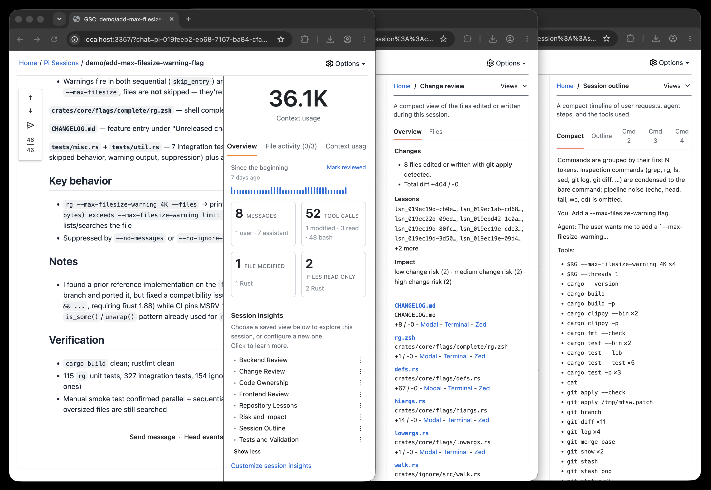

# GitSense: Chat

**Turn session logs into insights. Make knowledge reusable. Give every agent a better starting point.**

GitSense Chat works with the logs your agents already create and the knowledge
around your work. Turn sessions into useful views, build focused knowledge
around repositories, pull requests, and domains, and make it available to every
agent that needs it. Your agents keep working in the same tools.

## Resume Faster.

**Find the conversation that already did the work.**

You should not have to remember which terminal, session, or agent worked on a
problem. Review sessions by their latest message and checkpoint. Search by
message content, files, and operations. When keywords are not enough, ask AI to
rank sessions by intent using checkpoints as compact summaries.

| **Review quickly** | **Search what you remember** | **Ask by intent** |
| :---: | :---: | :---: |
| Scan the latest message and checkpoint without opening every transcript. | Search conversations, files, and the operations that touched them. | Ask AI which sessions best match the work you want to continue. |
|  |  |  |

Checkpoints give the search enough context to compare many sessions without
loading every conversation. The full transcript is still there when you need
more evidence.

## Same Sessions. More Useful.

**One prompt. 52 tool calls. Now what?**

A session log records what happened, but that does not make it easy to review.
Important files, decisions, risks, and lessons can stay buried inside messages,
commands, and tool calls.

Session Insights turn the same log into focused views built around the questions
you care about. Create an outline, review changed files, check ownership or
risk, verify that a command ran, or connect the evidence to an action.



### Turn sessions into conversations

Bring related sessions into a group and arrange them around the work. The group
becomes a dashboard you can talk to. Reference a section by name, ask what an
agent is working on, or request a report across everything that is not done.

**Bring your sessions together**

Create a group to organize sessions and see what is happening. Add a lead agent
to ask questions and coordinate the work.


The lead works from the sessions and layout you chose. You do not have to find
and name every session again.

## Make Knowledge Reusable.

**What one agent learns should not stay in one transcript.**

GitSense Chat makes it easy to capture useful knowledge and put it to work
wherever it is needed next.

| | |
| :--- | :--- |
| **Brains** | Give agents structured, queryable knowledge about a repository or domain. |
| **Lessons** | Preserve discoveries that should not have to be rediscovered. |
| **Notes** | Record useful context and point agents to the source that matters. |
| **Rules** | Bring guidance and context into the conversation when it applies. |
| **Domain experts** | Organize large bodies of knowledge and route questions to focused agents. |

Capture what one session learns. Make it available across future sessions,
agents, repositories, and teams. This is how knowledge scales without asking
every agent to read every transcript or rediscover the same facts.


## Keep the workflow you already have

GitSense Chat does not replace the terminals and tools where your agents work.
The core experience starts with the session logs you already have. Optional
runtime integration adds live status, messaging, and coordination.

| With session logs | With optional runtime integration |
| :--- | :--- |
| Find sessions by messages, files, and operations | See which agents are running |
| Review messages, tool calls, changes, and checkpoints | Start an eligible stopped session |
| Create focused Session Insight views | Send messages through agent mailboxes |
| Group and organize related sessions | Let agents communicate with one another |
| Copy resume and attach commands | Coordinate a group through a lead agent |

## Quick Start

Review the [install script](install.sh), then install `gsc`:

```bash
curl https://raw.githubusercontent.com/gitsense/chat/refs/heads/main/install.sh | bash
```

Install it yourself by [building from source](https://github.com/gitsense/chat),
or ask your coding agent:

```text
Install and configure GitSense Chat for me. Start by running `gsc docs help`.
```

Pi is GitSense Chat's first full reference integration. Follow
[pi-brains](https://github.com/gitsense/pi-brains) to see how sessions, Session
Insights, checkpoints, shared knowledge, messaging, and lead agents work
together.

GitSense knowledge is not tied to Pi. Any agent that can run `gsc` can query the
same Brains, notes, lessons, and rules.

## How GitSense Chat works

GitSense Chat reads the session logs agents already produce and makes them
searchable, inspectable, and reusable while sessions are active and after they
stop. Analyzers can turn the recorded activity into Session Insights. Brains,
lessons, notes, and rules carry reviewed knowledge into future work.

Groups are views over sessions, not folders. A session can appear in every
project, workflow, dashboard, or temporary review where it is useful. Add a lead
when you want one conversation across the group.

### Current support and boundaries

Pi is currently the supported runtime integration. Codex, Claude Code,
OpenCode, and other coding-agent harnesses are not yet integrated.

GitSense Chat surfaces evidence and supports action. It does not decide whether
an agent's work is correct, and agent findings do not automatically become
trusted knowledge. People remain responsible for reviewing evidence, resolving
uncertainty, and deciding what happens next.

## License

The [`gsc` CLI](https://github.com/gitsense/gsc-cli) is open source under the
[Apache License 2.0](https://www.apache.org/licenses/LICENSE-2.0).

GitSense Chat is licensed under the
[Fair Core License (FCL-1.0-ALv2)](https://fcl.dev/). You may use, modify, and
run it internally, including for personal projects, shared workflows, and
self-hosted deployments. You may not use it to build or operate a product or
service that competes directly with GitSense Chat. Each version becomes
available under Apache 2.0 two years after its release. See [LICENSE](LICENSE)
and [NOTICE](NOTICE) for the complete terms.
