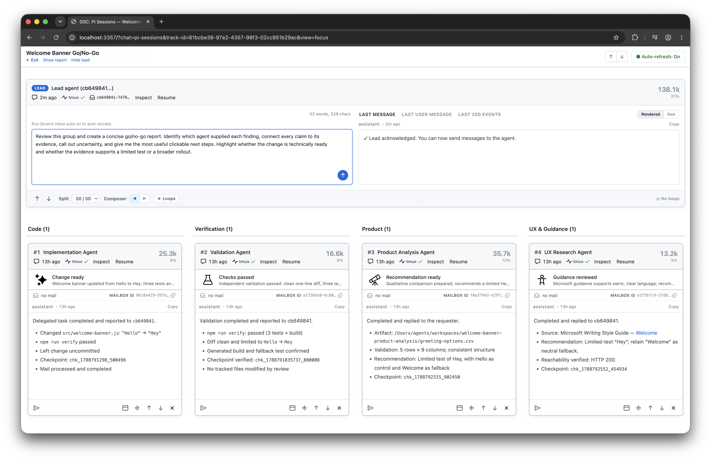

# GitSense: Chat

**GitSense adds intelligence and coordination to your agent workflows.**

GitSense works quietly alongside the tools you already use. No proxy or wrapper
is required. It gives you a clearer view of your agent sessions, lets you
organize them under leads that can monitor and coordinate the work, and turns
session and codebase activity into reviewed, reusable knowledge that you and
other agents can use.

<h3 align="center">Create specialized knowledge agents</h3>

<p align="center">Make what they know available to Claude, Codex, or any other
agent.</p>

<p align="center">
  <strong><a href="https://raw.githubusercontent.com/gitsense/chat/refs/heads/main/assets/create-specialized-knowledge-agents.mp4">▶ Download and watch the demo video (MP4, 3.1 MB)</a></strong>
</p>

<p align="center">
  <a href="https://raw.githubusercontent.com/gitsense/chat/refs/heads/main/assets/create-specialized-knowledge-agents.mp4"></a>
</p>

<h3 align="center">Scale how you work</h3>

<table>
  <tr>
    <td width="50%" align="center"><strong>Scale attention.</strong></td>
    <td width="50%" align="center"><strong>Scale coordination.</strong></td>
  </tr>
  <tr>
    <td align="center" valign="top">Create a group lead to watch your sessions and alert you.</td>
    <td align="center" valign="top">Create a personal assistant to coordinate your team’s work.</td>
  </tr>
  <tr>
    <td valign="top"></td>
    <td valign="top"></td>
  </tr>
</table>

<h3 align="center">Give complex work a lead</h3>

<p align="center">Let focused agents work independently, then have the lead
bring their results together in a review-ready handoff with actions you
control.</p>

<p align="center">
  <strong><a href="https://raw.githubusercontent.com/gitsense/chat/refs/heads/main/assets/give-complex-work-a-lead.mp4">▶ Download and watch the demo video (MP4, 833 KB)</a></strong>
</p>

<p align="center">
  <a href="https://raw.githubusercontent.com/gitsense/chat/refs/heads/main/assets/give-complex-work-a-lead.mp4"></a>
</p>

## How GitSense Chat Works

Your agents keep working in the tools you already use. GitSense works with the
activity they create and connects it with reviewed knowledge, giving people and
AI agents more ways to understand and guide the work without replacing the
workflow.


## Quick Start

Review the [install script](install.sh), then install `gsc`:

```bash
curl https://raw.githubusercontent.com/gitsense/chat/refs/heads/main/install.sh | bash
```

Install it yourself by [building from source](https://github.com/gitsense/chat),
or ask your coding agent:

```text
Install and configure GitSense Chat for me. Start by running `gsc docs help`.
```

Pi is GitSense Chat's first full reference integration. Follow
[pi-brains](https://github.com/gitsense/pi-brains) to see how sessions, Session
Insights, checkpoints, shared knowledge, messaging, lead agents, and group
observation loops work together.

GitSense knowledge is not tied to Pi. Any agent that can run `gsc` can query the
same Brains, notes, lessons, and rules.

## Why GitSense?

GitSense changes both how work begins and how people and agents collaborate while
it is underway.

### Give you and your agents a better starting point

GitSense gives you and your agents more to work with before starting something
new. Agents can understand why a file matters before reading it, while you can
find previous sessions worth continuing, reusing, or turning into shared
knowledge.

<table>
  <thead>
    <tr>
      <th width="50%" align="center">Same search, more context</th>
      <th width="50%" align="center">Find work worth reusing</th>
    </tr>
  </thead>
  <tbody>
    <tr>
      <td width="50%" valign="top"></td>
      <td width="50%" valign="top"></td>
    </tr>
    <tr>
      <td width="50%" valign="top">Regular ripgrep is on the left; GitSense-enriched search is on the right. Both find the same files, but GitSense can add purpose, ownership, risks, and reviewed guidance, so agents can choose what deserves their tokens.</td>
      <td width="50%" valign="top">Search past sessions by conversation, files, repository, role, or time to quickly resume work, reuse findings, or extract knowledge.</td>
    </tr>
  </tbody>
</table>

### Give you and your agents a better way to work together

Terminals and multiplexers give each agent session a place to run, whether that
is a pane, tab, or workspace. GitSense builds on them by letting you bring
related sessions into a Group, organize them around the work, and use sections
and layouts to see how everything fits together without changing where your
agents run.

#### Coordinate sessions with a lead

Bring the sessions you already have into a Group, then add a lead and dedicated
agents for the responsibilities that need them. Each agent keeps its own
context and workspace, while you and the Group lead get a shared view for
understanding and guiding the work.

<p align="center"></p>

#### Organize sessions your way

Arrange sessions by status, recent activity, role, or any structure that makes
sense for the work.

<table>
  <thead>
    <tr>
      <th width="33%" align="center">Organize by status</th>
      <th width="33%" align="center">Review recent activity</th>
      <th width="34%" align="center">Filter what you see</th>
    </tr>
  </thead>
  <tbody>
  <tr>
    <td width="33%" valign="top"></td>
    <td width="33%" valign="top"></td>
    <td width="34%" valign="top"></td>
  </tr>
  </tbody>
</table>

## All you need is a lead, really

GitSense is built around AI assistance. Agents know how to get more help when
they need it, and creating a Group with a lead gives you a personal GitSense
assistant to organize, coordinate, and guide the work. Start with an empty Group
and add a lead with two clicks. Describe the outcome you want, and it can help
turn a complex problem into coordinated work: creating the right team, querying
progress, guiding agents, and bringing the results back in a report. Whether
you need one agent or dozens, the lead can create and organize them with your
direction. The examples below show how one lead can help you scale management,
observation, and knowledge.

### Create a lead in seconds, then put it to work

Tell the lead what you want to know or monitor. GitSense leads know how to
retrieve only the context they need, avoid reprocessing unchanged activity,
and monitor the Group token efficiently.

<table>
  <tbody>
    <tr>
      <td width="25%" valign="top"><strong>1. Add a lead</strong><br><br><br><br>Click <strong>Add a lead</strong> from the Group.</td>
      <td width="25%" valign="top"><strong>2. Create the lead agent</strong><br><br><br><br>Confirm the settings and click <strong>Create lead agent</strong>.</td>
      <td width="25%" valign="top"><strong>3. Describe what you need</strong><br><br><br><br>Tell the lead what to monitor, how often to check, and the safeguards to follow.</td>
      <td width="25%" valign="top"><strong>4. Review the report</strong><br><br><br><br>The report appears beside the Group and shows what needs your attention.</td>
    </tr>
  </tbody>
</table>

### Scale your attention with a lead

Use one conversation to coordinate many agents while the lead tracks each task
and brings the results together. In the Hello World Lab demo, the lead asks nine
agents to create language-specific files, verifies their replies, then directs
selected agents to change `Hello` to `Hey`. It reports exact paths and provides
actions to open each file in Zed or inspect its git diff.

This demonstrates scalable visibility, targeted coordination, and actionable
cross-session results without replacing terminals or multiplexers.


## Current Support and Boundaries

Pi is currently the supported runtime integration. Codex, Claude Code,
OpenCode, and other coding-agent harnesses are not yet integrated for session
logs, lifecycle state, or Group coordination.

GitSense knowledge is portable. Any agent that can run `gsc` can query the same
Brains, notes, lessons, and rules without requiring runtime integration.

GitSense Chat surfaces evidence and supports action. It does not decide whether
an agent's work is correct, and agent findings do not automatically become
trusted knowledge. People remain responsible for reviewing evidence, resolving
uncertainty, and deciding what happens next.

## License

The [`gsc` CLI](https://github.com/gitsense/gsc-cli) is licensed under the
[Apache License 2.0](https://www.apache.org/licenses/LICENSE-2.0).

GitSense Chat is licensed under the
[Fair Core License (FCL-1.0-ALv2)](https://fcl.dev/). You may use, modify, and
run it internally, including for personal projects, shared workflows, and
self-hosted deployments. You may not use it to build or operate a product or
service that competes directly with GitSense Chat. Each version becomes
available under Apache 2.0 two years after its release. See [LICENSE](LICENSE)
and [NOTICE](NOTICE) for the complete terms.
