# GitSense: Chat

**GitSense is an intelligence platform for your agents and their workflows.**

It works quietly alongside the tools you already use. No proxy or wrapper is
required. GitSense gathers useful information from agent sessions and codebase
activity, then helps you turn it into reviewed, reusable knowledge. Use that
intelligence to understand what your agents are doing, guide work while it is
underway, and give you and your agents a better starting point.

## How GitSense Chat Works

Your agents keep working in the tools you already use. GitSense works with the
activity they create and connects it with reviewed knowledge, giving people and
AI agents more ways to understand and guide the work without replacing the
workflow.

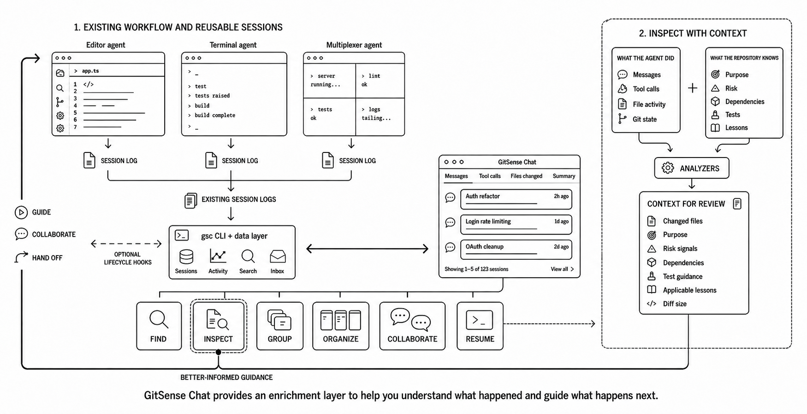

## Quick Start

Review the [install script](install.sh), then install `gsc`:

```bash
curl https://raw.githubusercontent.com/gitsense/chat/refs/heads/main/install.sh | bash
```

Install it yourself by [building from source](https://github.com/gitsense/chat),
or ask your coding agent:

```text
Install and configure GitSense Chat for me. Start by running `gsc docs help`.
```

Pi is GitSense Chat's first full reference integration. Follow
[pi-brains](https://github.com/gitsense/pi-brains) to see how sessions, Session
Insights, checkpoints, shared knowledge, messaging, lead agents, and group
observation loops work together.

GitSense knowledge is not tied to Pi. Any agent that can run `gsc` can query the
same Brains, notes, lessons, and rules.

## Why GitSense?

GitSense changes both how work begins and how people and agents collaborate while
it is underway.

### Give you and your agents a better way to work together

GitSense gives you and your agents more to work with before starting something
new, and a better way to stay oriented while work is underway. Agents can
understand why a file matters before reading it, while you can find previous
sessions worth continuing, reusing, or turning into shared knowledge.

<table>
  <thead>
    <tr>
      <th width="50%" align="center">Same search, more context</th>
      <th width="50%" align="center">Find work worth reusing</th>
    </tr>
  </thead>
  <tbody>
    <tr>
      <td width="50%" valign="top"></td>
      <td width="50%" valign="top">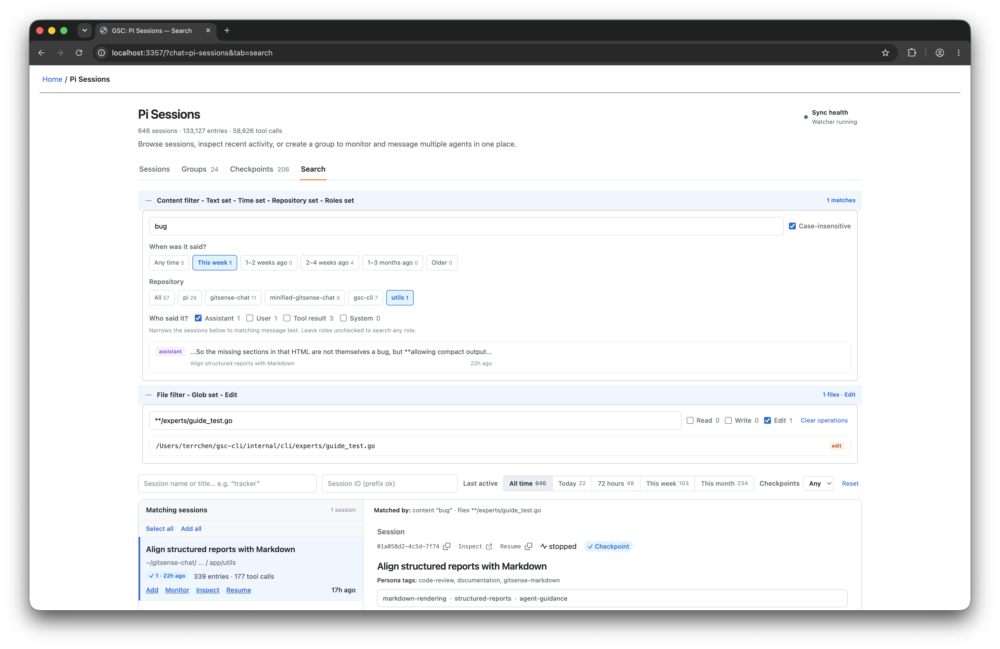</td>
    </tr>
    <tr>
      <td width="50%" valign="top">On the left is a regular ripgrep search; on the right is the same search enriched with GitSense. Both find the same files, but GitSense also explains what each file is for and can surface details such as which team owns the code, known risks, or previously reviewed guidance. The agent now has more to reason with before deciding whether a file is worth spending tokens on.</td>
      <td width="50%" valign="top">GitSense lets you search activity across previous sessions by what was said, which files were touched, repository, role, and time. This makes it easier to find work worth resuming or reusing, or sessions with knowledge you want to extract and review.</td>
    </tr>
  </tbody>
</table>

<p align="center">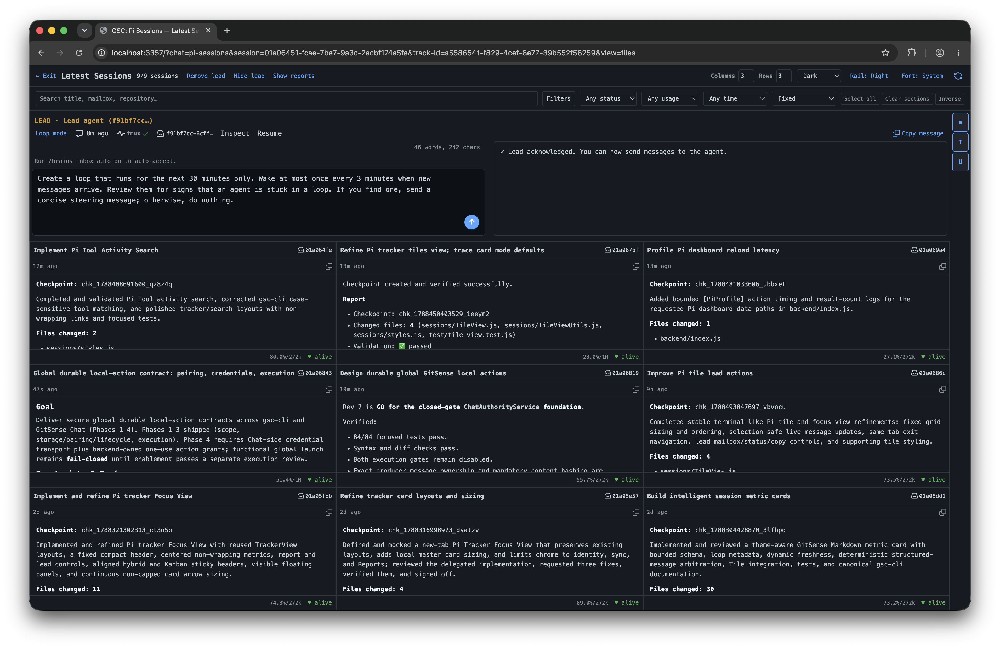</p>

The lead sits alongside the sessions it coordinates, giving you one place to
see the work and guide agents as it unfolds.

Terminals and multiplexers give each agent session a place to run, whether that
is a pane, tab, or workspace. GitSense builds on that by letting you bring
related sessions into a Group, use sections and layouts to show how the work
fits together, and filter which sessions you see without changing where your
agents run.

<table>
  <thead>
    <tr>
      <th width="33%" align="center">Organize by status</th>
      <th width="33%" align="center">Review recent activity</th>
      <th width="34%" align="center">Filter what you see</th>
    </tr>
  </thead>
  <tbody>
  <tr>
    <td width="33%" valign="top">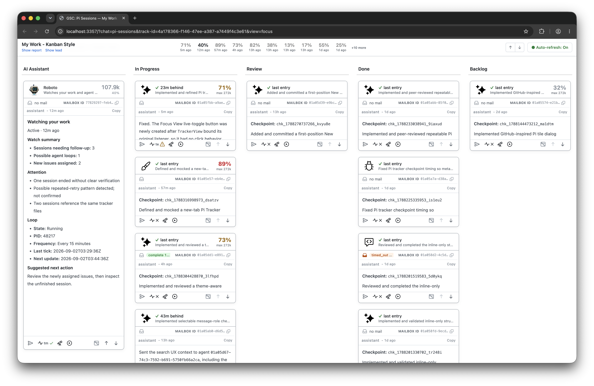</td>
    <td width="33%" valign="top">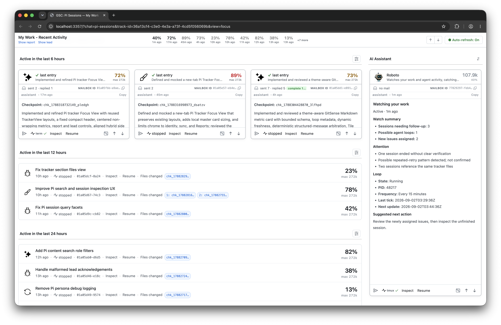</td>
    <td width="34%" valign="top">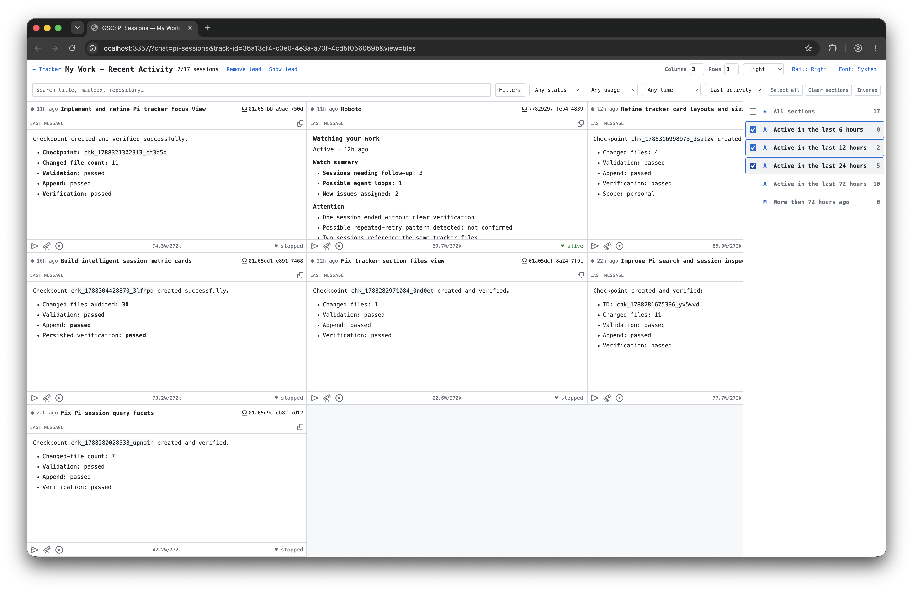</td>
  </tr>
  </tbody>
</table>

### Steer and query your agents through one conversation

Give a Group a lead, then use one conversation to steer its agents and query
their work. Each agent keeps its own context and responsibility while the lead
brings their progress and results together.

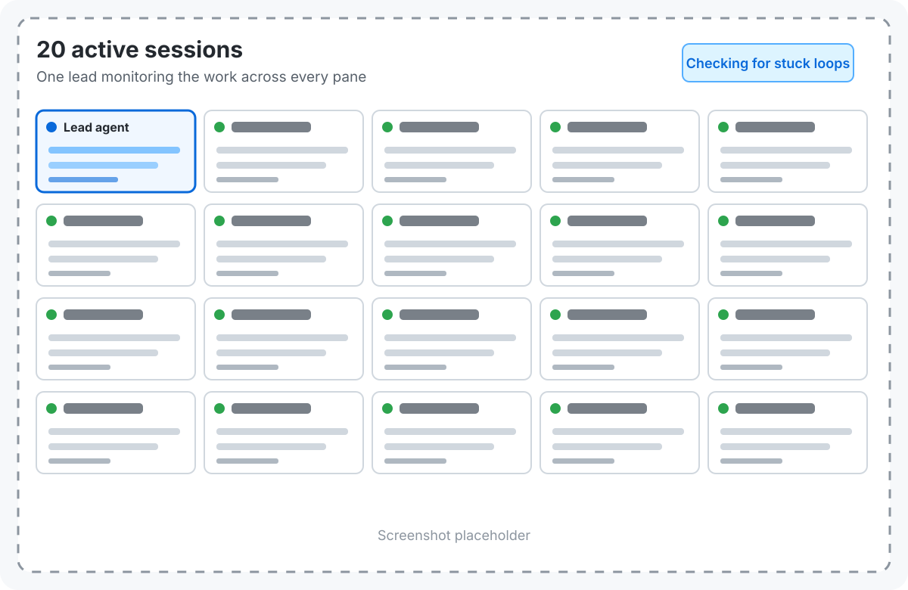

## Scale with ease

### It starts with a lead

**Create an empty Group and add a lead with two clicks to get started.**

A Group lead understands how GitSense organizes sessions, agents, Groups, and
knowledge. Describe the outcome you want, and the lead can guide you through
turning it into an organized team. Whether you need one agent or dozens, the
lead can create and organize them with your direction.

### Add a lead that understands your work

**Two clicks and a prompt. That is all it takes.**

Tell the lead what you want to know or monitor. GitSense leads know how to
retrieve only the context they need, avoid reprocessing unchanged activity,
and monitor the Group token efficiently.

<table>
  <tbody>
    <tr>
      <td width="50%" valign="top"><strong>1. Add a lead</strong><br><br>Click <strong>Add a lead</strong> from the Group.<br><br>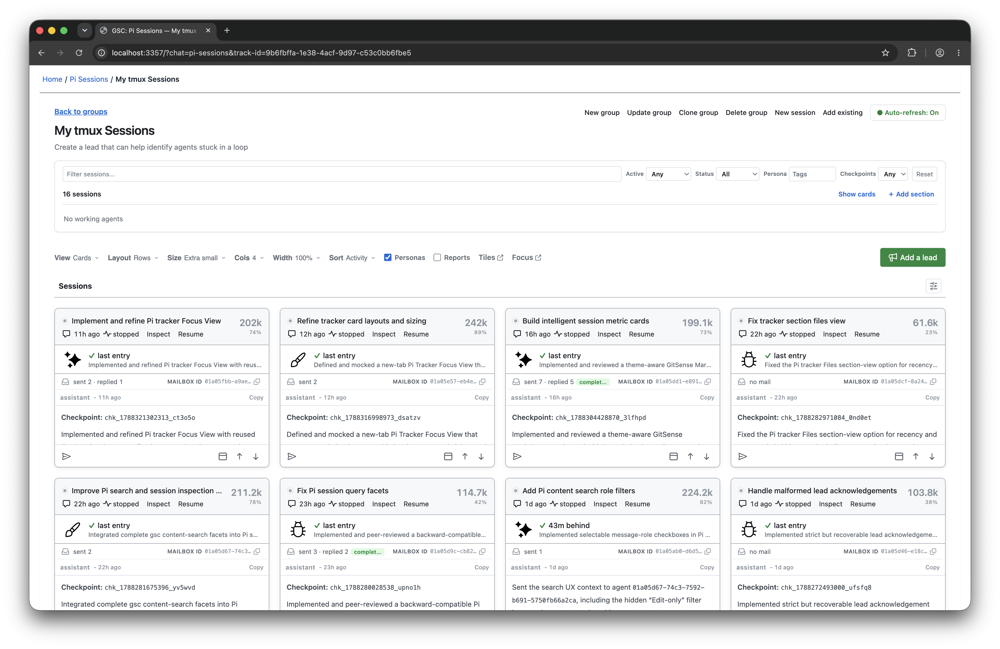</td>
      <td width="50%" valign="top"><strong>2. Create the lead agent</strong><br><br>Confirm the settings and click <strong>Create lead agent</strong>.<br><br>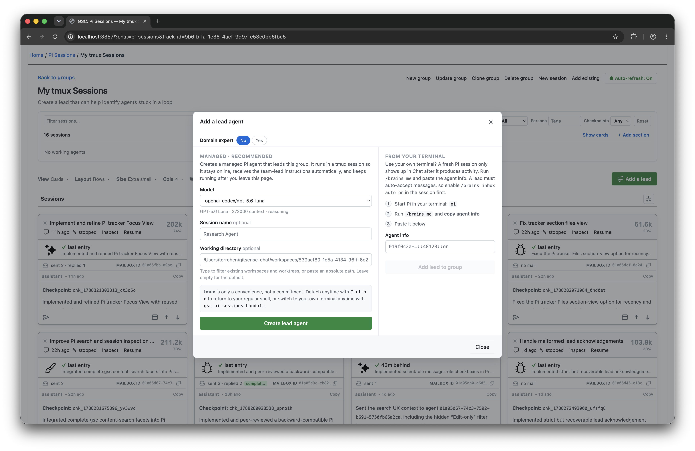</td>
    </tr>
    <tr>
      <td width="50%" valign="top"><strong>3. Describe what you need</strong><br><br>Tell the lead what to monitor, how often to check, and the safeguards to follow.<br><br>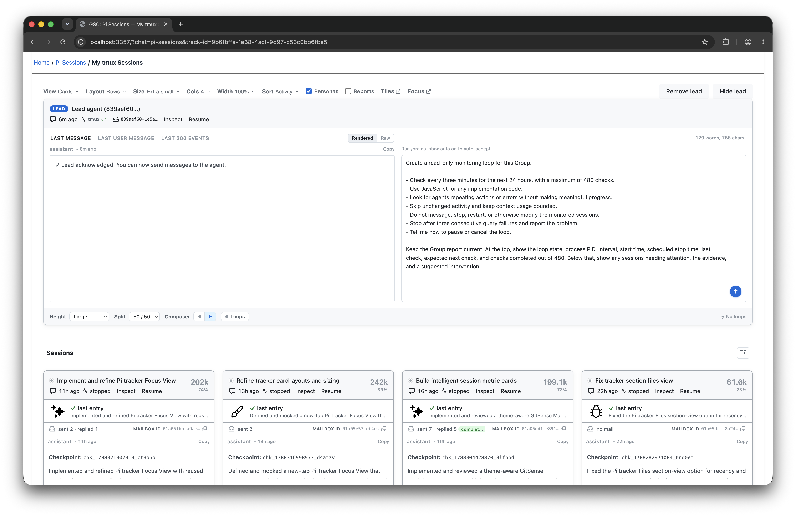</td>
      <td width="50%" valign="top"><strong>4. Review the report</strong><br><br>The report appears beside the Group and shows what needs your attention.<br><br>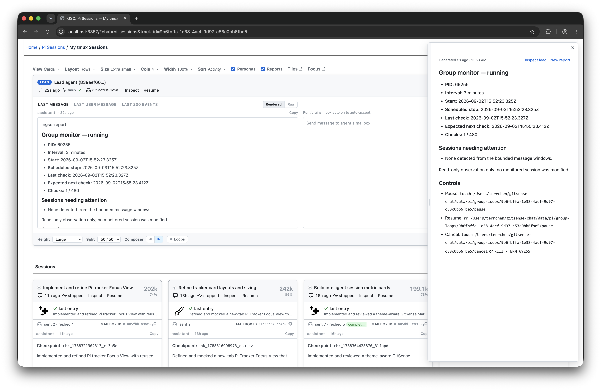</td>
    </tr>
  </tbody>
</table>

### Scale observation

Tell the lead what you want the dashboard to cover, which agents to create, and
what each one should be responsible for. The lead can build the team, coordinate
its work, and turn the Group into a live dashboard.

Every card in the dashboard is an agent with its own context and responsibility.
An agent can gather and report information on its own, or it can lead a focused
team behind the scenes and bring their combined work back as one card.

<table>
  <thead>
    <tr>
      <th width="33%" align="center">Observation architecture</th>
      <th width="33%" align="center">My Team Dashboard Group</th>
      <th width="34%" align="center">GitHub Watcher Group</th>
    </tr>
  </thead>
  <tbody>
    <tr>
      <td width="33%" valign="top">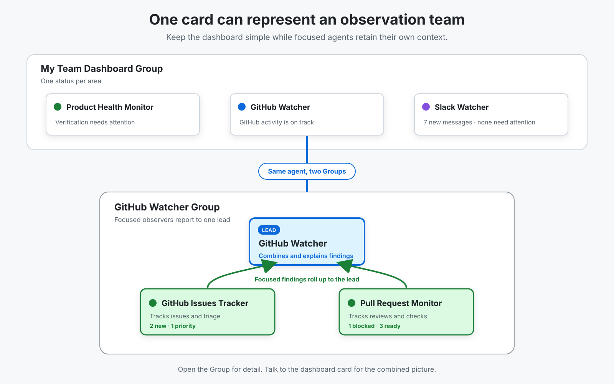</td>
      <td width="33%" valign="top">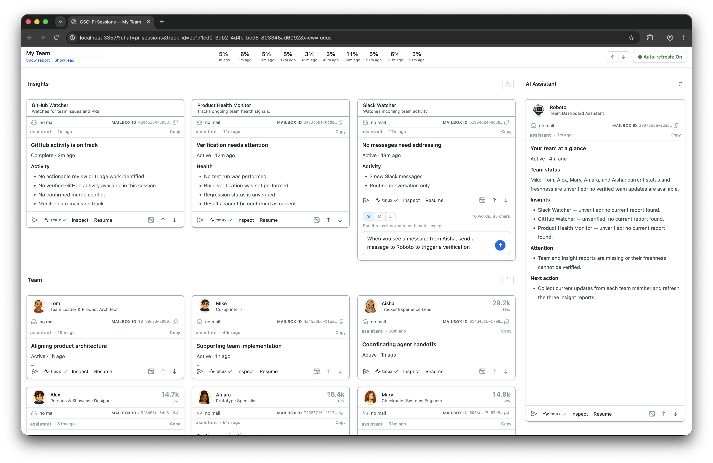</td>
      <td width="34%" valign="top">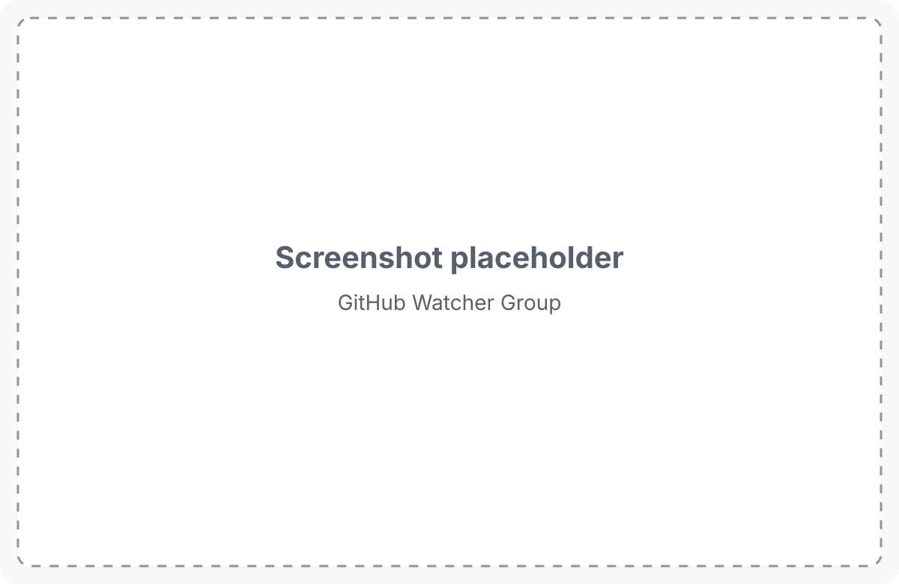</td>
    </tr>
    <tr>
      <td width="33%" valign="top">One lead can represent a focused team inside a larger dashboard.</td>
      <td width="33%" valign="top">The dashboard shows one card for each area of work.</td>
      <td width="34%" valign="top">The GitHub Watcher lead coordinates separate agents for issues and pull requests.</td>
    </tr>
  </tbody>
</table>

Every Pi agent running the Pi Brains extension sends a heartbeat, so GitSense
Chat can show whether it is online, stopped, or unresponsive and whether it is
running in tmux or a terminal. From the Chat app, start and stop GitSense-managed
agents and send messages to steer their work. Managed agents run in tmux, so
they can stay online in the background and you can attach whenever you want,
hand one off to your own terminal, or run an agent there directly.

See how to [add a lead that understands your work](#add-a-lead-that-understands-your-work).

### Scale knowledge

Ask the lead to make knowledge available across a 4,800-file repository. It can
first create a short-lived scout to assess the architecture and recommend how
the work should be divided, then help create the agents needed to build that
knowledge. Once it is reviewed, any agent that can run `gsc ask` can use it.

<table>
  <thead>
    <tr>
      <th width="33%" align="center">Knowledge architecture</th>
      <th width="33%" align="center">Repository Group</th>
      <th width="34%" align="center">Query from any agent</th>
    </tr>
  </thead>
  <tbody>
    <tr>
      <td width="33%" valign="top">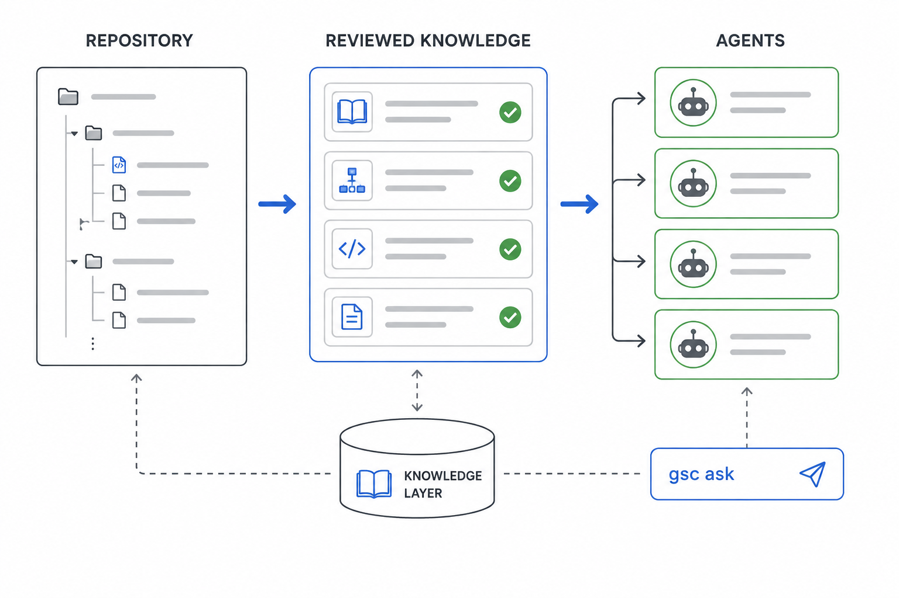</td>
      <td width="33%" valign="top">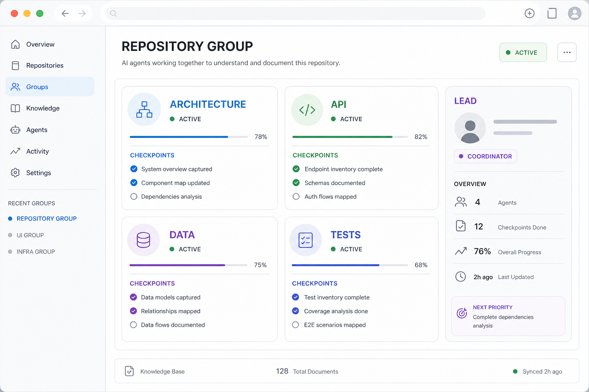</td>
      <td width="34%" valign="top">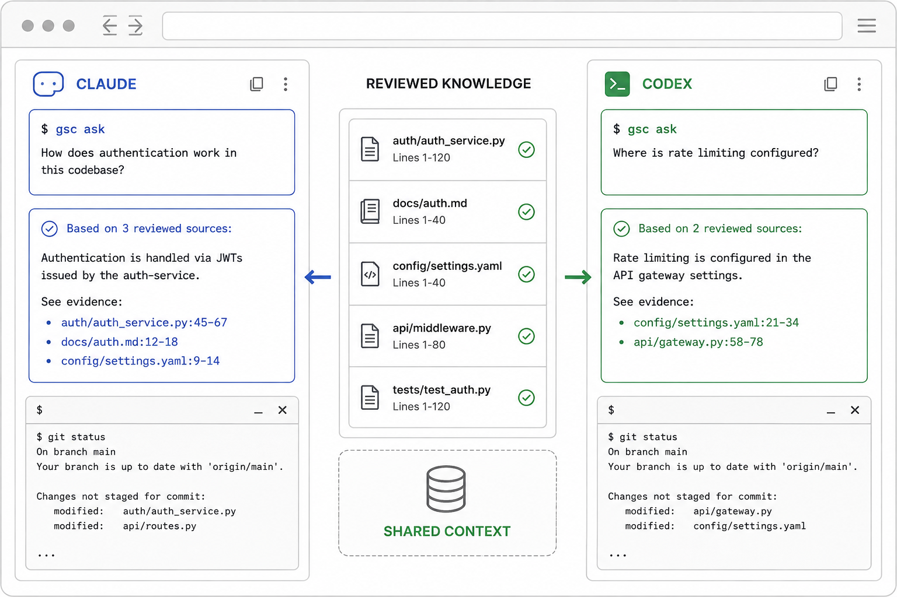</td>
    </tr>
    <tr>
      <td width="33%" valign="top">One knowledge layer can support many focused agents.</td>
      <td width="33%" valign="top">A lead can divide a repository into focused responsibilities.</td>
      <td width="34%" valign="top">Different agents can query the same reviewed knowledge with <code>gsc ask</code>.</td>
    </tr>
  </tbody>
</table>

## Current Support and Boundaries

Pi is currently the supported runtime integration. Codex, Claude Code,
OpenCode, and other coding-agent harnesses are not yet integrated for session
logs, lifecycle state, or Group coordination.

GitSense knowledge is portable. Any agent that can run `gsc` can query the same
Brains, notes, lessons, and rules without requiring runtime integration.

GitSense Chat surfaces evidence and supports action. It does not decide whether
an agent's work is correct, and agent findings do not automatically become
trusted knowledge. People remain responsible for reviewing evidence, resolving
uncertainty, and deciding what happens next.

## License

The [`gsc` CLI](https://github.com/gitsense/gsc-cli) is licensed under the
[Apache License 2.0](https://www.apache.org/licenses/LICENSE-2.0).

GitSense Chat is licensed under the
[Fair Core License (FCL-1.0-ALv2)](https://fcl.dev/). You may use, modify, and
run it internally, including for personal projects, shared workflows, and
self-hosted deployments. You may not use it to build or operate a product or
service that competes directly with GitSense Chat. Each version becomes
available under Apache 2.0 two years after its release. See [LICENSE](LICENSE)
and [NOTICE](NOTICE) for the complete terms.
