# GitSense: Chat

**GitSense adds intelligence and coordination to your agent workflows.**

GitSense works quietly alongside the tools you already use. No proxy or wrapper
is required. It gives you a clearer view of your agent sessions, lets you
organize related sessions into Groups with leads that can monitor and coordinate
the work, and turns session and codebase activity into reviewed, reusable
knowledge that you and other agents can use.

**Keep working with the agents you already use. GitSense connects them to shared
knowledge and coordinated work.**

### Give your agents specialized knowledge at scale

Let focused Pi agents build knowledge about specific sources, then make what
they know available to any agent that needs it. GitSense gives agents a
conversational API for specialized knowledge.

GitSense Chat currently supports Pi sessions, but you do not need to move your
coding work into Pi. Claude, Codex, OpenCode, and other agents can ask Pi agents
for knowledge or send them information through GitSense.

**[▶ Download and watch the demo video (MP4, 3.1 MB)](https://raw.githubusercontent.com/gitsense/chat/refs/heads/main/assets/create-specialized-knowledge-agents.mp4)**

[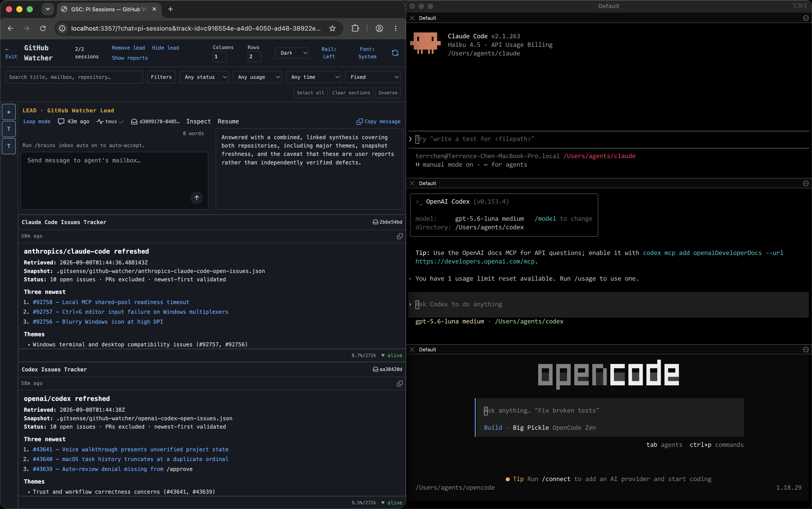](assets/create-specialized-knowledge-agents.png)

### Bring your development workflow into the agentic age

Start with an Agent Development Group that understands issues and pull requests
across your projects. Ask what needs attention, then create a dedicated Group
and lead for the work you choose. Any agent can report the new Group back,
giving the Agent Development lead visibility as the work grows.

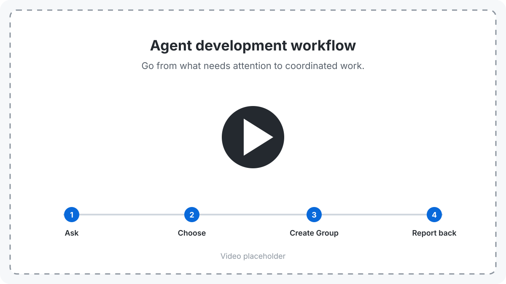

## How GitSense Chat Works

Your agents keep working in the tools you already use. GitSense works with the
activity they create and connects it with reviewed knowledge, giving people and
AI agents more ways to understand and guide the work without replacing the
workflow.


### Share knowledge without sharing entire conversations

GitSense keeps knowledge outside an agent's context until it is needed. Notes
capture information worth sharing, Lessons preserve reusable experience, Rules
introduce relevant context and behavior at the right time, and Checkpoints
create compact handoffs of the current work. Together, they keep context focused
as knowledge moves between agents.

### Turn an issue into a working Group

Create a Group and lead for the selected issue or pull request. Add agents as
the work grows, then ask the lead to bring their progress and results together
for review.

<table>
  <tr>
    <td width="50%" align="center"><strong>Start with an empty group</strong></td>
    <td width="50%" align="center"><strong>Ask your lead to build the team</strong></td>
  </tr>
  <tr>
    <td valign="top">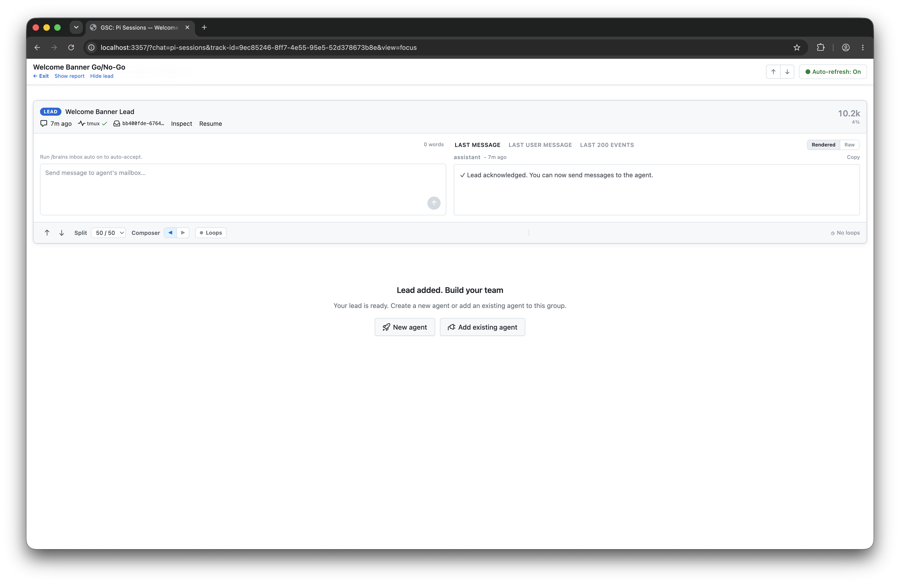</td>
    <td valign="top">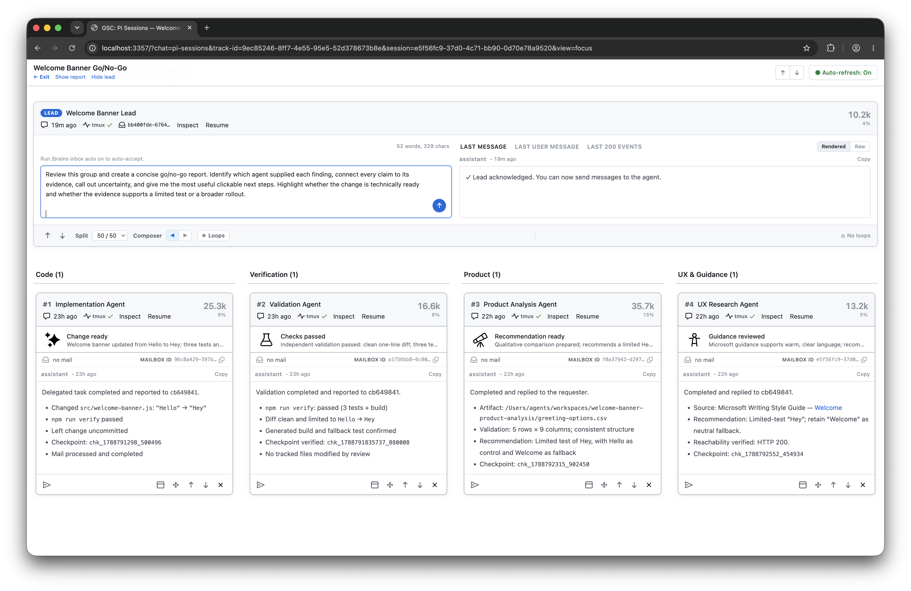</td>
  </tr>
  <tr>
    <td width="50%" align="center"><strong>Add the agents you need</strong></td>
    <td width="50%" align="center"><strong>Review the report</strong></td>
  </tr>
  <tr>
    <td valign="top">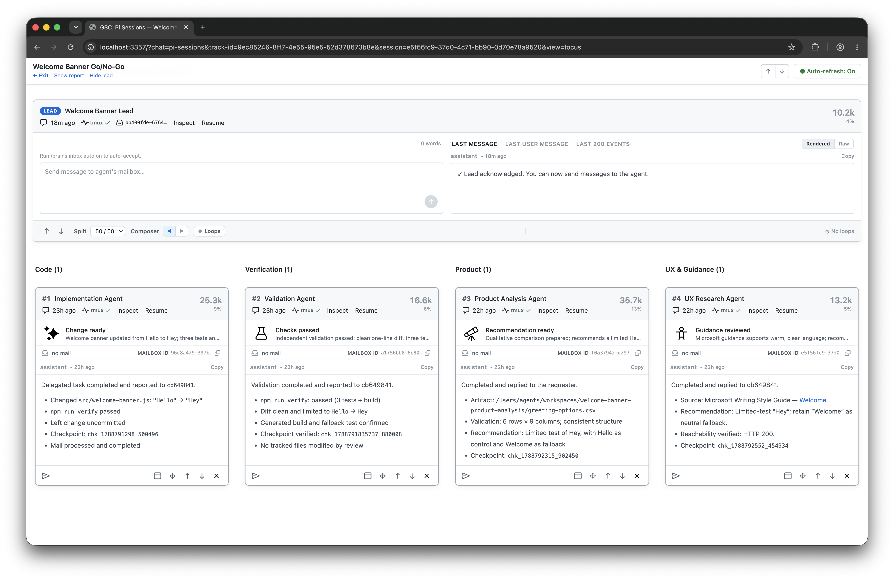</td>
    <td valign="top">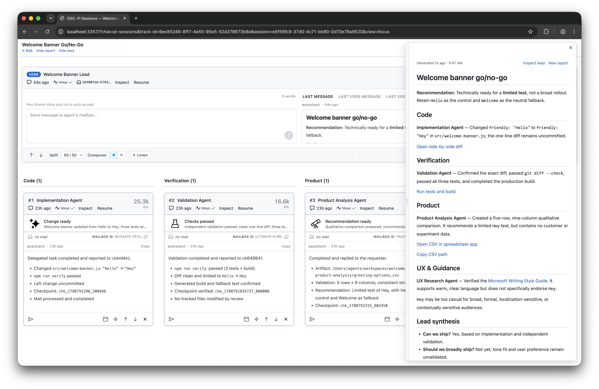</td>
  </tr>
</table>

## Quick Start

Review the [install script](install.sh), then install `gsc`:

```bash
curl https://raw.githubusercontent.com/gitsense/chat/refs/heads/main/install.sh | bash
```

Install it yourself by [building from source](https://github.com/gitsense/chat),
or ask your coding agent:

```text
Install and configure GitSense Chat for me. Start by running `gsc docs help`.
```

Pi is GitSense Chat's first full reference integration. Follow
[pi-brains](https://github.com/gitsense/pi-brains) to see how sessions, Session
Insights, checkpoints, shared knowledge, messaging, lead agents, and group
observation loops work together.

GitSense knowledge is not tied to Pi. Any agent that can run `gsc` can query the
same Brains, notes, lessons, and rules.

## Why GitSense?

GitSense changes both how work begins and how people and agents collaborate while
it is underway.

### Give you and your agents a better starting point

GitSense gives you and your agents more to work with before starting something
new. Agents can understand why a file matters before reading it, while you can
find previous sessions worth continuing, reusing, or turning into shared
knowledge.

<table>
  <thead>
    <tr>
      <th width="50%" align="center">Same search, more context</th>
      <th width="50%" align="center">Find work worth reusing</th>
    </tr>
  </thead>
  <tbody>
    <tr>
      <td width="50%" valign="top"></td>
      <td width="50%" valign="top"></td>
    </tr>
    <tr>
      <td width="50%" valign="top">Regular ripgrep is on the left; GitSense-enriched search is on the right. Both find the same files, but GitSense can add purpose, ownership, risks, and reviewed guidance, so agents can choose what deserves their tokens.</td>
      <td width="50%" valign="top">Search past sessions by conversation, files, repository, role, or time to quickly resume work, reuse findings, or extract knowledge.</td>
    </tr>
  </tbody>
</table>

### Bring your agents into one workspace

Terminals and multiplexers give each agent session a place to run, whether that
is a pane, tab, or workspace. GitSense builds on them by bringing related
sessions into a Group, where you can organize them by status, activity, role, or
any structure that helps you understand the work without changing where your
agents run.

<table>
  <thead>
    <tr>
      <th width="33%" align="center">Organize by status</th>
      <th width="33%" align="center">Review recent activity</th>
      <th width="34%" align="center">Filter what you see</th>
    </tr>
  </thead>
  <tbody>
  <tr>
    <td width="33%" valign="top">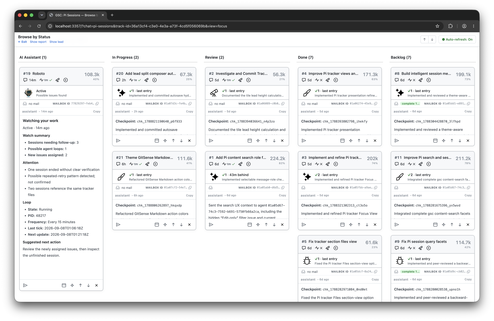</td>
    <td width="33%" valign="top">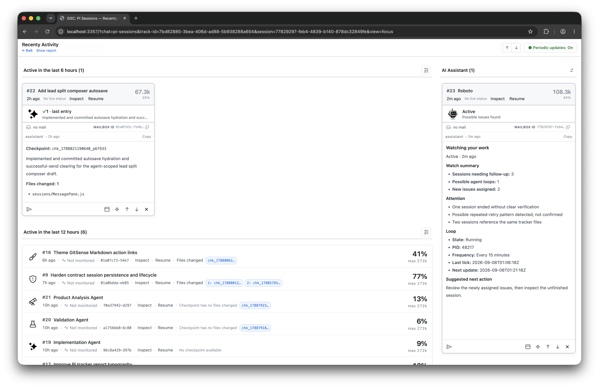</td>
    <td width="34%" valign="top">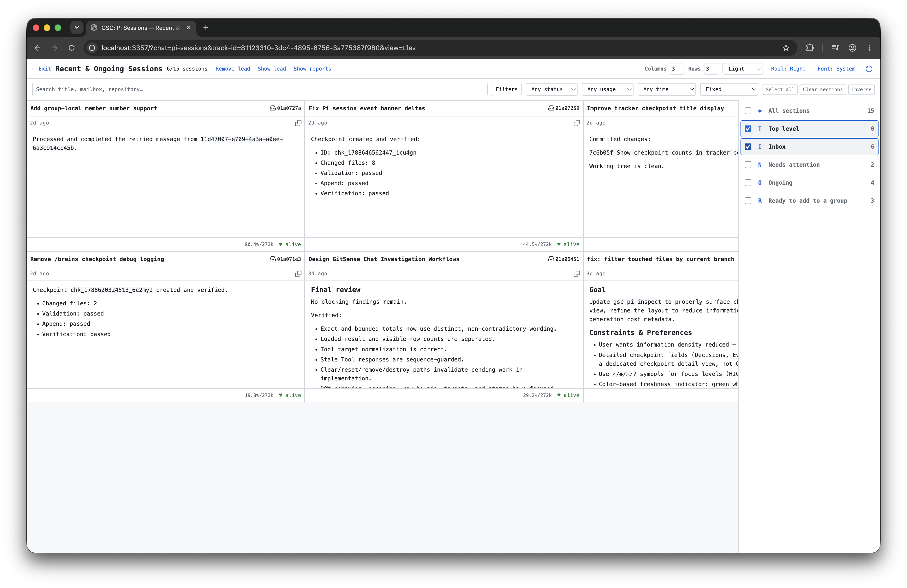</td>
  </tr>
  </tbody>
</table>

## All you need is a lead, really

GitSense is built around AI assistance. Agents know how to get more help when
they need it, and creating a Group with a lead gives you a personal GitSense
assistant to organize, coordinate, and guide the work. Start with an empty Group
and add a lead with two clicks. Describe the outcome you want, and it can help
turn a complex problem into coordinated work: creating the right team, querying
progress, guiding agents, and bringing the results back in a report. Whether
you need one agent or dozens, the lead can create and organize them with your
direction. The examples below show how one lead can help you scale management,
observation, and knowledge.

### Create a lead in seconds, then put it to work

Tell the lead what you want to know or monitor. GitSense leads know how to
retrieve only the context they need, avoid reprocessing unchanged activity,
and monitor the Group token efficiently.

<table>
  <tbody>
    <tr>
      <td width="25%" valign="top"><strong>1. Add a lead</strong><br><br><br><br>Click <strong>Add a lead</strong> from the Group.</td>
      <td width="25%" valign="top"><strong>2. Create the lead agent</strong><br><br><br><br>Confirm the settings and click <strong>Create lead agent</strong>.</td>
      <td width="25%" valign="top"><strong>3. Describe what you need</strong><br><br><br><br>Tell the lead what to monitor, how often to check, and the safeguards to follow.</td>
      <td width="25%" valign="top"><strong>4. Review the report</strong><br><br><br><br>The report appears beside the Group and shows what needs your attention.</td>
    </tr>
  </tbody>
</table>

### Scale how you work

Use your lead to scale how you work. Have it create reminders so you don’t
forget what needs attention, add specialized agents to monitor what matters,
and coordinate many agents from one conversation.

<table>
  <tr>
    <td width="50%" align="center"><strong>Scale attention.</strong></td>
    <td width="50%" align="center"><strong>Scale observation.</strong></td>
  </tr>
  <tr>
    <td align="center" valign="top">Create a group lead to watch your sessions and alert you.</td>
    <td align="center" valign="top">Create specialized agents to monitor what matters.</td>
  </tr>
  <tr>
    <td valign="top">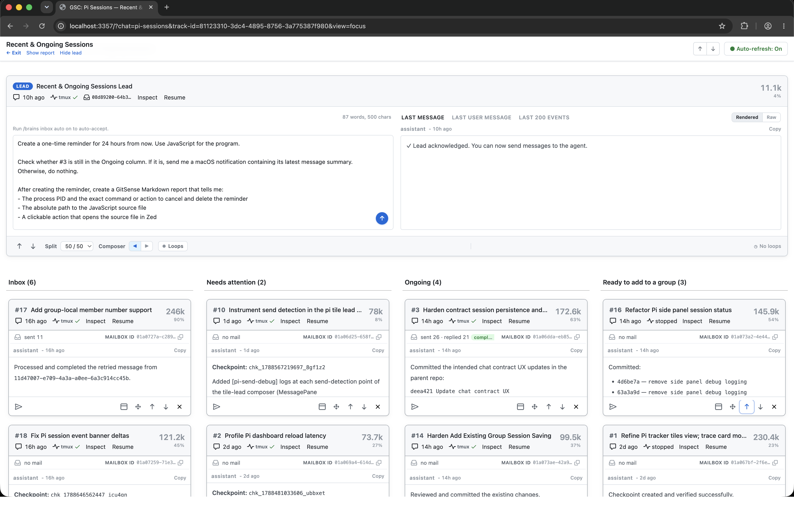</td>
    <td valign="top">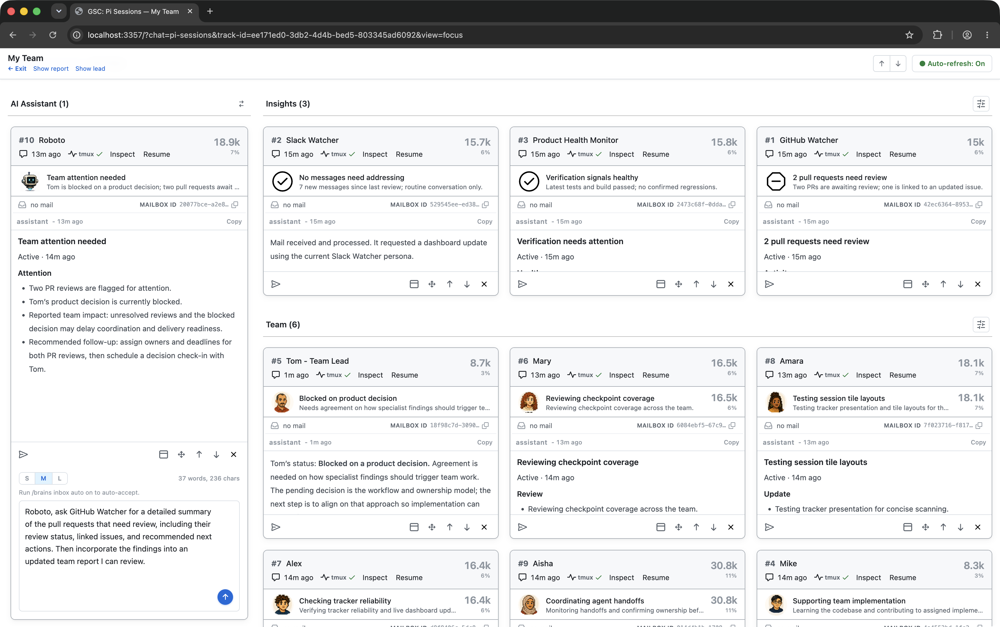</td>
  </tr>
</table>

<p align="center"><strong>Scale coordination.</strong></p>

<p align="center">Ask a lead to coordinate your agents' work.</p>

<p align="center">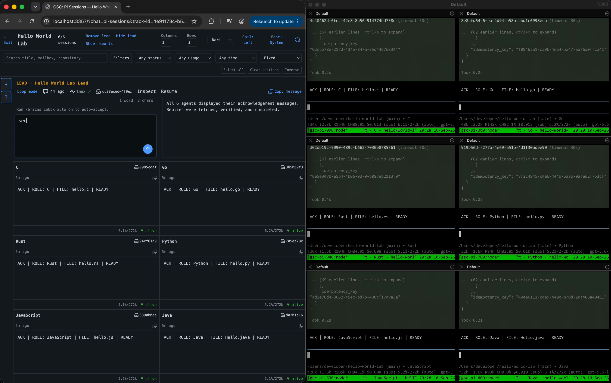</p>

## Current Support and Boundaries

Pi is currently the supported runtime integration. Codex, Claude Code,
OpenCode, and other coding-agent harnesses are not yet integrated for session
logs, lifecycle state, or Group coordination.

GitSense knowledge is portable. Any agent that can run `gsc` can query the same
Brains, notes, lessons, and rules without requiring runtime integration.

GitSense Chat surfaces evidence and supports action. It does not decide whether
an agent's work is correct, and agent findings do not automatically become
trusted knowledge. People remain responsible for reviewing evidence, resolving
uncertainty, and deciding what happens next.

## License

The [`gsc` CLI](https://github.com/gitsense/gsc-cli) is licensed under the
[Apache License 2.0](https://www.apache.org/licenses/LICENSE-2.0).

GitSense Chat is licensed under the
[Fair Core License (FCL-1.0-ALv2)](https://fcl.dev/). You may use, modify, and
run it internally, including for personal projects, shared workflows, and
self-hosted deployments. You may not use it to build or operate a product or
service that competes directly with GitSense Chat. Each version becomes
available under Apache 2.0 two years after its release. See [LICENSE](LICENSE)
and [NOTICE](NOTICE) for the complete terms.
