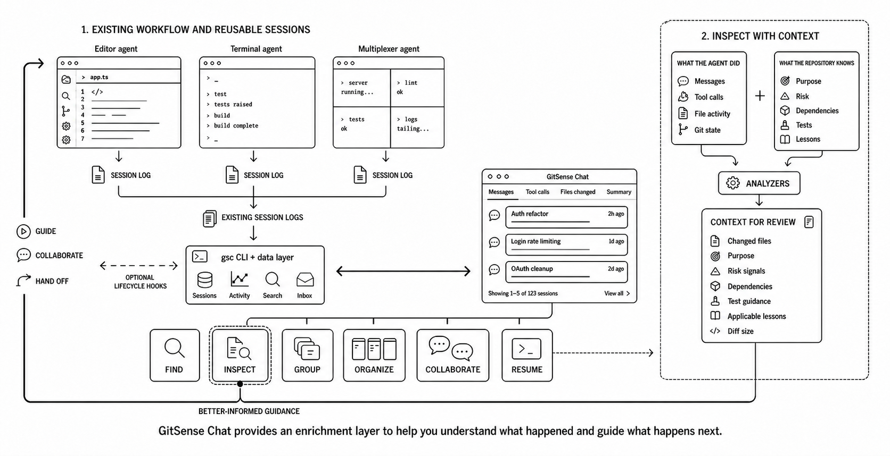
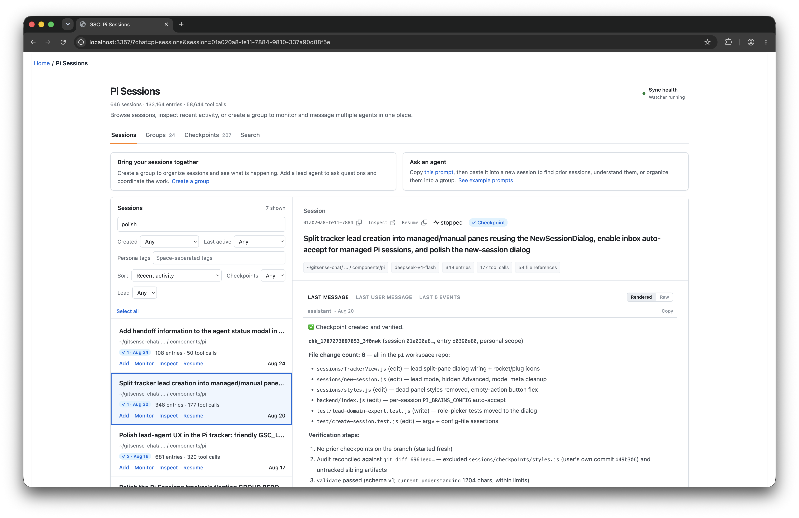
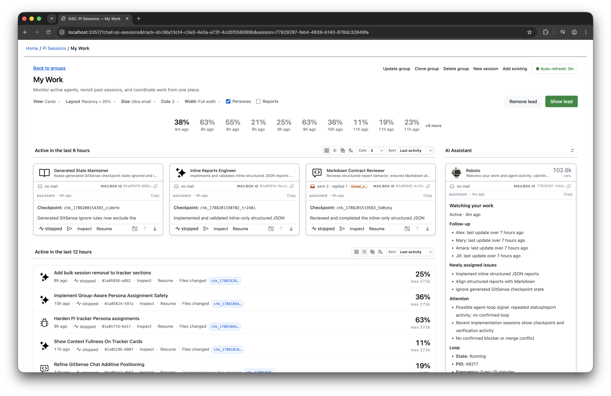
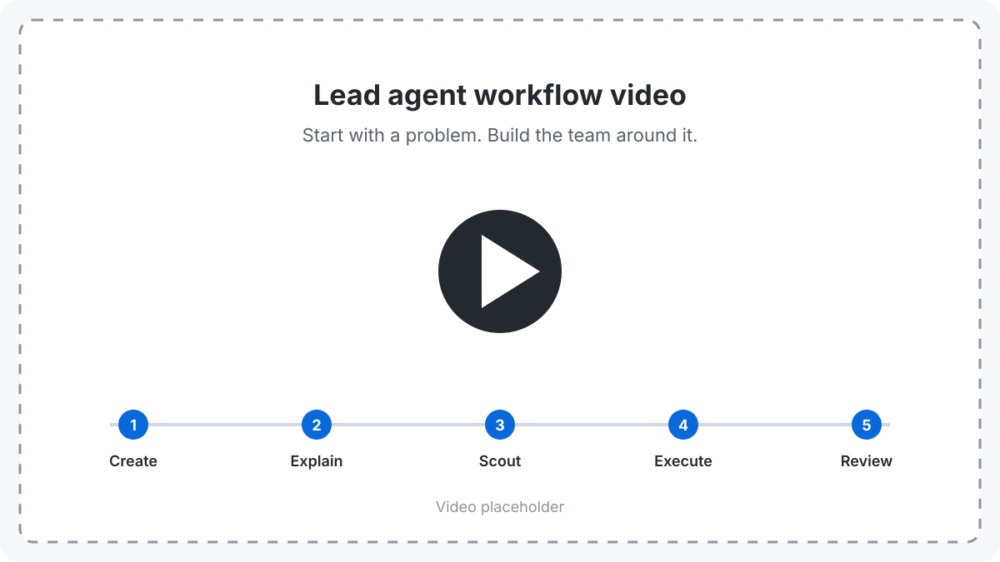

# GitSense: Chat

**GitSense is the intelligence platform for AI agent workflows.**

It works quietly alongside the tools you already use, gathering useful
information from agent sessions, codebase activity, and reviewed knowledge.
Use it to understand what your agents are doing, guide work while it is
underway, and give every agent a better starting point.

GitSense Chat makes that intelligence easy to work with. Find sessions, ask AI
about the work, organize related sessions into Groups, monitor sessions and
generate reports from their activity, and build reusable knowledge. The `gsc`
CLI makes the same intelligence available to terminal workflows and other
agents.

## How GitSense Chat Works

Your agents keep working in the tools you already use. GitSense works with the
activity they create and connects it with reviewed knowledge, giving people and
AI agents more ways to understand and guide the work without replacing the
workflow.



## Quick Start

Review the [install script](install.sh), then install `gsc`:

```bash
curl https://raw.githubusercontent.com/gitsense/chat/refs/heads/main/install.sh | bash
```

Install it yourself by [building from source](https://github.com/gitsense/chat),
or ask your coding agent:

```text
Install and configure GitSense Chat for me. Start by running `gsc docs help`.
```

Pi is GitSense Chat's first full reference integration. Follow
[pi-brains](https://github.com/gitsense/pi-brains) to see how sessions, Session
Insights, checkpoints, shared knowledge, messaging, lead agents, and group
observation loops work together.

GitSense knowledge is not tied to Pi. Any agent that can run `gsc` can query the
same Brains, notes, lessons, and rules.

## What Intelligence Lets You Do

Here are a few ways GitSense Chat turns agent activity and repository knowledge
into useful information for people and AI agents.

### Resume Faster

**Need more than a session name?**

The Sessions page shows the latest message beside each session, so you can
preview the work before opening the transcript. Search by file or conversation
content when you remember a detail instead of a title.

| **Preview before you open** | **Search what you remember** |
| :---: | :---: |
|  |  |

When a conversation starts to wander, when you finish a task, or before context
is compacted, capture what matters while it is still fresh:

> **Ask your agent:**
>
> Create a GitSense checkpoint for this session. Capture the goal, what has
> happened, key decisions, evidence, risks, open questions, files changed, and
> next action.

Later, resume by asking what you remember:

> **Then ask:**
>
> What issue did I flag while updating `TrackerView.js`, and what did I plan to
> do next?

### Many Sessions. One Conversation.

Organize related sessions into a Group, then give that Group an agent with a
purpose. A Personal Assistant can keep track of your work, while a Team Lead
can watch progress, blockers, and coordination risks across the team. Both can
provide ongoing updates as often as you need them.

| **My Work** | **My Team** |
| :---: | :---: |
|  |  |

### One Session. Multiple Perspectives.

Create custom views to examine the same session through different lenses. See
how one prompt and 52 tool calls become something you can actually review.

| **The session** | **Change Review** | **Session Outline** |
| :---: | :---: | :---: |
|  |  |  |

### Same Search. More Context.

Give agents enough context to decide what matters before spending tokens on
entire files.

<table>
  <tr>
    <td width="35%" valign="top">
      <strong>Same matches. More to go on.</strong>
      <p>Plain ripgrep finds the matching code:</p>
      <pre><code>rg -g '**/src/**/s*.rs' matcher</code></pre>
      <p>GitSense returns the same matches with the purpose of each file:</p>
      <pre><code>gsc rg matcher \
  -g '**/src/**/s*.rs' \
  --db code-intent \
  --fields purpose</code></pre>
      <p>Agents can decide what matters before loading entire files.</p>
    </td>
    <td width="65%" valign="top">
      
    </td>
  </tr>
</table>

### One Expert. Many Agents.

Build a Pi domain expert over knowledge too large for one context window. Five
focused helpers each cover part of the GitHub issue history, while the lead
keeps a lightweight map of who knows what and routes questions to the right
agent.

Agents are designed to be swappable. Save what needs to survive as durable
notes so new agents can pick up where previous agents left off.

**Build the GitHub Issues Expert**


Codex, Claude Code, and other agents can consult the same expert through
`gsc ask`:

> Do we already have an issue similar to [problem]? Return the matching issue
> numbers and explain why they are related.

| **Ask from Codex** | **Ask from Claude Code** |
| :---: | :---: |
|  |  |

## One Goal. 4,878 Files. Start With a Conversation.

The examples above show a few things intelligence makes possible. This
walkthrough shows how they work together.

Create a Group and add a lead in three clicks. Then explain what you need. The
lead helps you turn the request into a goal with clear acceptance criteria,
decide how to divide the work, and create focused agents, each with a clear
name, identity, and responsibility.

In the demo, a human and a lead agent divide and conquer the 4,878-file Codex
repository. The lead coordinates focused agents, keeps the plan visible, and
helps the human monitor progress and steer the work through conversation.

The same workflow can build knowledge without stuffing the whole repository
into every context. Agents can preserve what matters in durable notes, and the
lead can keep a lightweight map of who knows what. Observation loops can watch
session activity and generate focused reports, giving both the human and the
lead better information for deciding what happens next.

The agents can work independently without turning the work into a black box.



## Current Support and Boundaries

Pi is currently the supported runtime integration. Codex, Claude Code,
OpenCode, and other coding-agent harnesses are not yet integrated for session
logs, lifecycle state, or Group coordination.

GitSense knowledge is portable. Any agent that can run `gsc` can query the same
Brains, notes, lessons, and rules without requiring runtime integration.

GitSense Chat surfaces evidence and supports action. It does not decide whether
an agent's work is correct, and agent findings do not automatically become
trusted knowledge. People remain responsible for reviewing evidence, resolving
uncertainty, and deciding what happens next.

## License

The [`gsc` CLI](https://github.com/gitsense/gsc-cli) is licensed under the
[Apache License 2.0](https://www.apache.org/licenses/LICENSE-2.0).

GitSense Chat is licensed under the
[Fair Core License (FCL-1.0-ALv2)](https://fcl.dev/). You may use, modify, and
run it internally, including for personal projects, shared workflows, and
self-hosted deployments. You may not use it to build or operate a product or
service that competes directly with GitSense Chat. Each version becomes
available under Apache 2.0 two years after its release. See [LICENSE](LICENSE)
and [NOTICE](NOTICE) for the complete terms.
