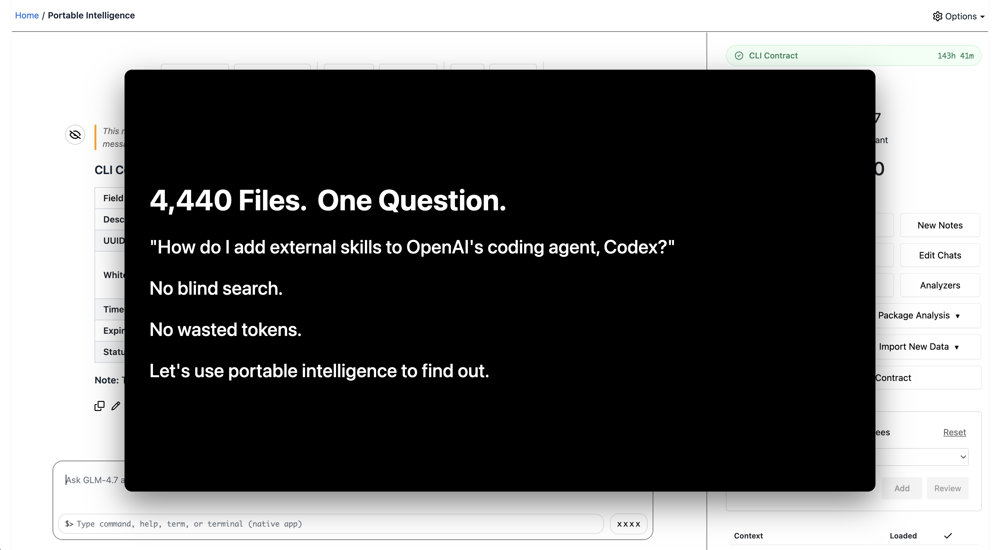

# GitSense: Chat

**GitSense is the intelligence layer that works alongside your agentic
development tools.**

Here, intelligence means useful information gathered from the work, not a
smarter underlying model. GitSense turns session logs, checkpoints, tool calls,
file activity, and reviewed knowledge into better information for people and
AI agents.

GitSense Chat makes that intelligence easy to work with. Find sessions, ask AI
about the work, organize related sessions into Groups, monitor reports, and
build reusable knowledge. The open source
[`gsc` CLI](https://github.com/gitsense/gsc-cli) brings the same intelligence
into terminals, scripts, and coding agents.

Work with GitSense Chat when you need it, or let it quietly monitor what
matters and keep a report ready for when you return. Your workflow does not
have to change.


## What Intelligence Looks Like

GitSense Chat turns the activity and knowledge around agentic work into
information that helps people and agents understand what happened, what
matters, and where to look next.

| **Understand work across sessions** | **Focus on the evidence that matters** |
| :---: | :---: |
|  |  |
| Ask one lead what is happening across a Group and get a report grounded in the available session evidence. | Turn a wall of tool calls into views for the files, commands, risks, and decisions you care about. |

| **Search with more to go on** | **Make knowledge portable** |
| :---: | :---: |
|  |  |
| Find the same matching code while seeing what each file is for before deciding what to open. | Turn repository knowledge into a queryable Brain that people and agents can use without loading the entire corpus. |

## Quick Start

Review the [install script](install.sh), then install `gsc`:

```bash
curl https://raw.githubusercontent.com/gitsense/chat/refs/heads/main/install.sh | bash
```

Install it yourself by [building from source](https://github.com/gitsense/chat),
or ask your coding agent:

```text
Install and configure GitSense Chat for me. Start by running `gsc docs help`.
```

Pi is GitSense Chat's first full reference integration. Follow
[pi-brains](https://github.com/gitsense/pi-brains) to see how sessions, Session
Insights, checkpoints, shared knowledge, messaging, lead agents, and group
observation loops work together.

GitSense knowledge is not tied to Pi. Any agent that can run `gsc` can query the
same Brains, notes, lessons, and rules.

## Resume Faster

**Need more than a session name?**

Search what you remember: a message, file, command, operation, or repository.
Scan recent messages and checkpoints without opening every transcript. If you
remember the goal but not the exact words, ask an agent to review the available
checkpoints and find the sessions that match.

| **Review quickly** | **Search what you remember** | **Ask by intent** |
| :---: | :---: | :---: |
| Scan recent messages and checkpoints without opening every transcript. | Search conversations, files, and the operations that touched them. | Ask AI which sessions best match the work you want to continue. |
|  |  |  |

Find the session worth returning to, then resume it in the tool where the work
already lives.

## `/goal`, But Better

**Need more than a slash command?**

A `/goal` can keep an agent working toward a durable objective. Complex work
also needs a process you can shape. Start by telling a lead what you want to
accomplish. Work together to define the acceptance criteria, decide what
resources the work needs, and determine how many agents should be involved.

Then watch the work unfold. Review progress, blockers, and evidence as the
agents work. Ask the lead to investigate, reorganize, or change direction when
something needs attention.

| **Define** | **Resource** | **Monitor** | **Steer** |
| :---: | :---: | :---: | :---: |
| Agree on the outcome and how you will know it is done. | Choose the agents, roles, and responsibilities the work needs. | Review checkpoints, reports, risks, and available evidence. | Ask the lead to clarify, reorganize, or redirect the work. |

**The agents can work independently without the work becoming a black box.**

## Beyond Tabs and Workspaces

**Tabs and workspaces make sessions easier to find. They cannot tell you how
the work is going.**

Bring related sessions into a Group and give them a lead. Ask what needs
attention, which sessions overlap, or how the work should be organized. The
lead starts with the sessions and layout you chose, then checks checkpoints and
other available evidence before reporting what it finds.

Add an observation loop when you want the lead to keep watching something.
When you return to the Group, the latest report is waiting.

| **Catch repetitive loops** | **Keep up with your sessions** | **Watch work across a team** |
| :---: | :---: | :---: |
| Ask a lead to watch for sessions repeating the same actions without making meaningful progress. | Ask a personal assistant to explain what each session is doing and what may need your attention. | Ask a team lead to flag overlapping file changes, stale checkpoints, blockers, and coordination risks. |
|  |  |  |

Groups are views over sessions, not folders. The same session can appear in
every project, workflow, dashboard, or temporary review where it is useful.
Sections can organize the work like tabs, while the lead gives you one
conversation across the whole Group.

## Scale Knowledge, Not Context Costs

**Your agents need the right context, not all of it.**

Brains turn large repositories and domains into shared, queryable knowledge.
Instead of stuffing the same corpus into every conversation, give focused
agents a coherent part to understand. A lead can keep a compact map of who
knows what and route new questions to the agents with the relevant knowledge.

Focused agents have less context to carry and a narrower problem to solve. That
makes it practical to use smaller, cost-effective models for focused roles and
reserve larger models for the work that needs them.

| **Build distributed expertise** | **Ask from the tools you already use** |
| :---: | :---: |
| Map a large domain, divide it into coherent areas, and give each focused agent access to the same queryable Brain. | Ask Codex and Claude Code questions backed by the same Brain through the `gsc` CLI. The knowledge can travel without moving every agent into a new workflow. |
|  |  |

In the first demo, a domain expert maps the 4,878-file `smart-codex`
repository and coordinates four focused helpers. Each helper uses the existing
`code-intent` Brain to understand a coherent part of the repository, while the
lead keeps a compact map of their expertise and routes questions to the right
agent.

In the second demo, Codex and Claude Code ask questions using the same portable
knowledge. This demonstrates Brain access through `gsc`; it does not imply that
their session logs or runtime lifecycle are integrated with GitSense Chat.

**More knowledge becomes available without making every conversation larger
and more expensive.**

## One Prompt. 52 Tool Calls. Now What?

**Start with what you care about, not every step the agent took.**

One request can produce a wall of messages, commands, and tool calls. Important
files, decisions, risks, and lessons can disappear inside all that activity.
You should not have to read the entire transcript just to understand what
happened.

Session Insights turn the same log into focused views built around your
questions. Start with a compact outline, review the files that changed, check
whether tests ran, or focus on the risks and decisions that need attention.
Open the underlying evidence only when you need it.


The same session can support different views because what matters depends on
who is looking and what they need to decide.

## Keep the Workflow You Already Have

GitSense Chat does not replace the terminals and tools where your agents work.
The core experience starts with the session logs you already have. Optional
runtime integration adds live status, messaging, coordination, and recurring
observation loops.

| With session logs | With optional runtime integration |
| :--- | :--- |
| Find sessions by messages, files, and operations | See which agents are running |
| Review messages, tool calls, changes, and checkpoints | Start an eligible stopped session |
| Create focused Session Insight views | Send messages through agent mailboxes |
| Group and organize related sessions | Let agents communicate with one another |
| Copy resume and attach commands | Coordinate and monitor a Group through a lead agent |

## How GitSense Chat Works

GitSense Chat reads the session logs agents already produce and makes them
searchable, inspectable, and reusable while sessions are active and after they
stop. Analyzers can turn recorded activity into Session Insights. Brains,
lessons, notes, and rules carry reviewed knowledge into future work.

With a supported runtime integration, a Group lead can also check live session
state, communicate with agents, coordinate work, and run observation loops that
update a report over time.

### Current Support and Boundaries

Pi is currently the supported runtime integration. Codex, Claude Code,
OpenCode, and other coding-agent harnesses are not yet integrated for session
logs, lifecycle state, or Group coordination.

GitSense knowledge is portable. Any agent that can run `gsc` can query the same
Brains, notes, lessons, and rules without requiring runtime integration.

GitSense Chat surfaces evidence and supports action. It does not decide whether
an agent's work is correct, and agent findings do not automatically become
trusted knowledge. People remain responsible for reviewing evidence, resolving
uncertainty, and deciding what happens next.

## License

The [`gsc` CLI](https://github.com/gitsense/gsc-cli) is open source under the
[Apache License 2.0](https://www.apache.org/licenses/LICENSE-2.0).

GitSense Chat is licensed under the
[Fair Core License (FCL-1.0-ALv2)](https://fcl.dev/). You may use, modify, and
run it internally, including for personal projects, shared workflows, and
self-hosted deployments. You may not use it to build or operate a product or
service that competes directly with GitSense Chat. Each version becomes
available under Apache 2.0 two years after its release. See [LICENSE](LICENSE)
and [NOTICE](NOTICE) for the complete terms.
