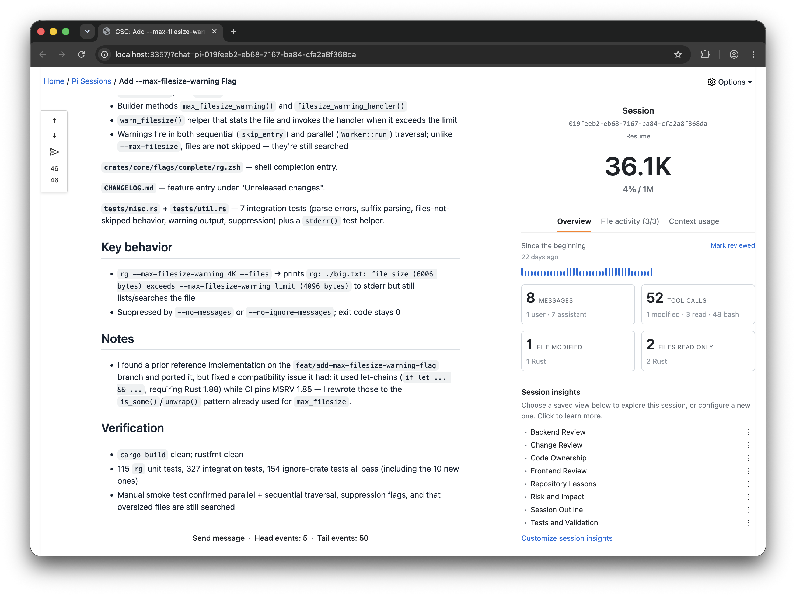
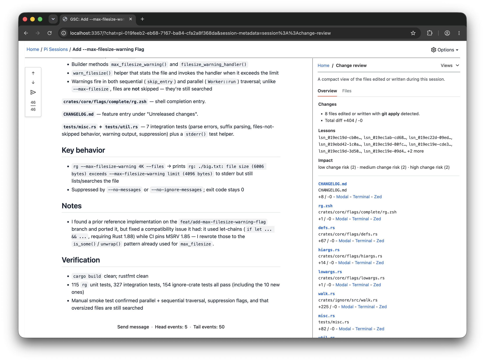
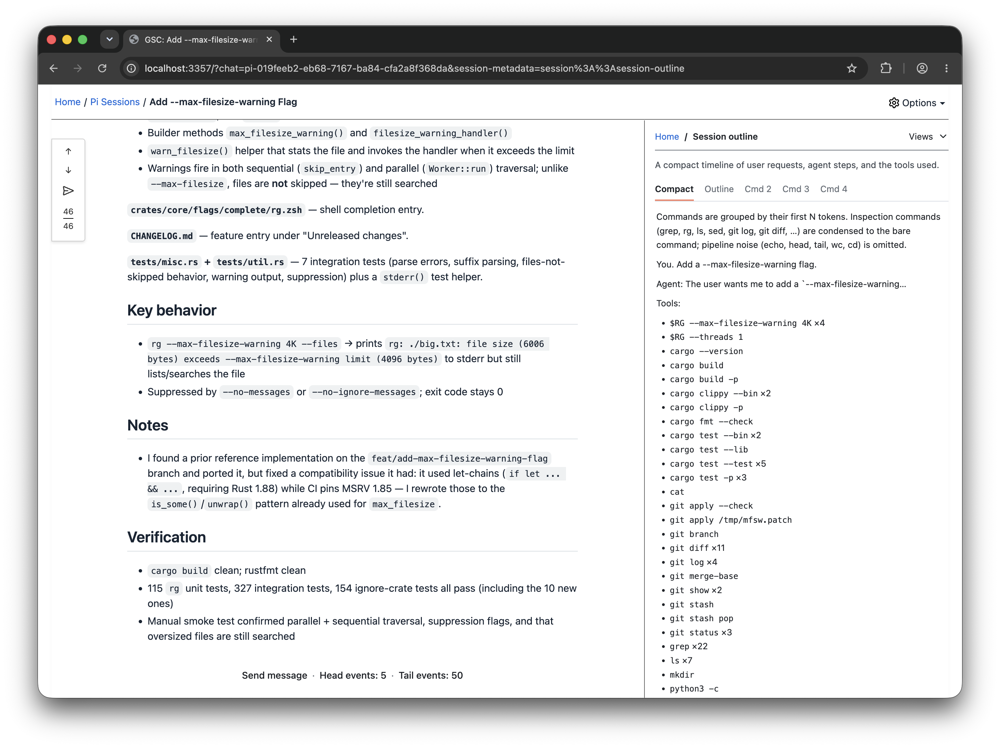

# GitSense: Chat

**GitSense is the intelligence platform for AI agent workflows.**

It works quietly alongside the tools you already use. No proxy or wrapper is
required. GitSense gathers useful information from agent sessions, codebase
activity, and reviewed knowledge. Use it to understand what your agents are
doing, guide work while it is underway, and give every agent a better starting
point.

## How GitSense Chat Works

Your agents keep working in the tools you already use. GitSense works with the
activity they create and connects it with reviewed knowledge, giving people and
AI agents more ways to understand and guide the work without replacing the
workflow.


## Quick Start

Review the [install script](install.sh), then install `gsc`:

```bash
curl https://raw.githubusercontent.com/gitsense/chat/refs/heads/main/install.sh | bash
```

Install it yourself by [building from source](https://github.com/gitsense/chat),
or ask your coding agent:

```text
Install and configure GitSense Chat for me. Start by running `gsc docs help`.
```

Pi is GitSense Chat's first full reference integration. Follow
[pi-brains](https://github.com/gitsense/pi-brains) to see how sessions, Session
Insights, checkpoints, shared knowledge, messaging, lead agents, and group
observation loops work together.

GitSense knowledge is not tied to Pi. Any agent that can run `gsc` can query the
same Brains, notes, lessons, and rules.

## So what is an intelligence platform for AI agent workflows?

GitSense gives people and AI agents the information they need to make more
informed decisions about what to do next. Here are two examples of what that can
look like.

### For agents

When agents work with GitSense, they get useful context alongside the information
they find, giving them more to reason with as they decide what to do next.


On the left is a regular ripgrep search; on the right is the same search enriched
with GitSense. Both find the same files, but GitSense also explains what each
file is for and can surface details such as which team owns the code, known risks,
or previously reviewed guidance. The agent now has more to reason with before
deciding whether a file is worth spending tokens on.

### For people

When you work with GitSense, intelligence from across your sessions lets you
bring the ones you care about into a single conversation with an AI lead that
helps you track progress and guide the work.


GitSense gives agents the tools they need to understand what is happening across
your workflow and respond efficiently.

## Organize around how you work.

Terminals and multiplexers give each agent session a place to run, whether that
is a pane, tab, or workspace. GitSense builds on that by letting you bring
related sessions into a Group, use sections and layouts to show how the work
fits together, and filter which sessions you see without changing where your
agents run.

<table>
  <thead>
    <tr>
      <th width="33%" align="center">Organize by status</th>
      <th width="33%" align="center">Review recent activity</th>
      <th width="34%" align="center">Filter what you see</th>
    </tr>
  </thead>
  <tbody>
  <tr>
    <td width="33%" valign="top"></td>
    <td width="33%" valign="top"></td>
    <td width="34%" valign="top"></td>
  </tr>
  </tbody>
</table>

## Add a lead that understands your work.

**Two clicks and a prompt. That is all it takes.**

Tell the lead what you want to know or monitor. GitSense leads know how to
retrieve only the context they need, avoid reprocessing unchanged activity,
and monitor the Group token efficiently.

<table>
  <tbody>
    <tr>
      <td width="50%" valign="top"><strong>1. Add a lead</strong><br><br>Click <strong>Add a lead</strong> from the Group.<br><br></td>
      <td width="50%" valign="top"><strong>2. Create the lead agent</strong><br><br>Confirm the settings and click <strong>Create lead agent</strong>.<br><br></td>
    </tr>
    <tr>
      <td width="50%" valign="top"><strong>3. Describe what you need</strong><br><br>Tell the lead what to monitor, how often to check, and the safeguards to follow.<br><br></td>
      <td width="50%" valign="top"><strong>4. Review the report</strong><br><br>The report appears beside the Group and shows what needs your attention.<br><br></td>
    </tr>
  </tbody>
</table>

## Build an observation system that scales.

Creating agents is easy. Keeping them connected and making their combined work
visible is harder. GitSense gives them Groups, agent-to-agent messaging, and
leads that can coordinate the work, then lets you see the result through
dashboards and reports.

Start with one focused task. Create a Group, add the agents it needs, and give
the Group a lead. Each agent keeps the context for its part of the work. To
bring that work into a larger view, add the lead to another Group. The GitHub
Watcher can lead a focused Group for issues and pull requests while appearing
as one agent in the My Team Dashboard Group.


<table>
  <thead>
    <tr>
      <th width="50%" align="center">My Team Dashboard Group</th>
      <th width="50%" align="center">GitHub Watcher Group</th>
    </tr>
  </thead>
  <tbody>
    <tr>
      <td width="50%" valign="top"></td>
      <td width="50%" valign="top"></td>
    </tr>
  </tbody>
</table>

Every Pi agent running the Pi Brains extension sends a heartbeat, so GitSense
Chat can show whether it is online, stopped, or unresponsive and whether it is
running in tmux or a terminal. From the Chat app, start and stop GitSense-managed
agents and send messages to steer their work. Managed agents run in tmux, so
they can stay online in the background and you can attach whenever you want,
hand one off to your own terminal, or run an agent there directly.

## One Session. Multiple Perspectives.

Create custom views to examine the same session through different lenses. See
how one prompt and 52 tool calls become something you can actually review.

<table>
  <thead>
    <tr>
      <th width="33%" align="center">The session</th>
      <th width="33%" align="center">Change Review</th>
      <th width="33%" align="center">Session Outline</th>
    </tr>
  </thead>
  <tbody>
    <tr>
      <td width="33%" valign="top"></td>
      <td width="33%" valign="top"></td>
      <td width="33%" valign="top"></td>
    </tr>
  </tbody>
</table>

## Current Support and Boundaries

Pi is currently the supported runtime integration. Codex, Claude Code,
OpenCode, and other coding-agent harnesses are not yet integrated for session
logs, lifecycle state, or Group coordination.

GitSense knowledge is portable. Any agent that can run `gsc` can query the same
Brains, notes, lessons, and rules without requiring runtime integration.

GitSense Chat surfaces evidence and supports action. It does not decide whether
an agent's work is correct, and agent findings do not automatically become
trusted knowledge. People remain responsible for reviewing evidence, resolving
uncertainty, and deciding what happens next.

## License

The [`gsc` CLI](https://github.com/gitsense/gsc-cli) is licensed under the
[Apache License 2.0](https://www.apache.org/licenses/LICENSE-2.0).

GitSense Chat is licensed under the
[Fair Core License (FCL-1.0-ALv2)](https://fcl.dev/). You may use, modify, and
run it internally, including for personal projects, shared workflows, and
self-hosted deployments. You may not use it to build or operate a product or
service that competes directly with GitSense Chat. Each version becomes
available under Apache 2.0 two years after its release. See [LICENSE](LICENSE)
and [NOTICE](NOTICE) for the complete terms.
