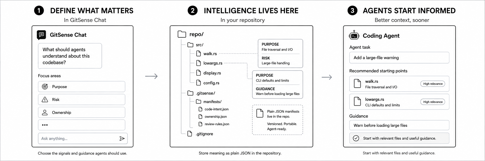
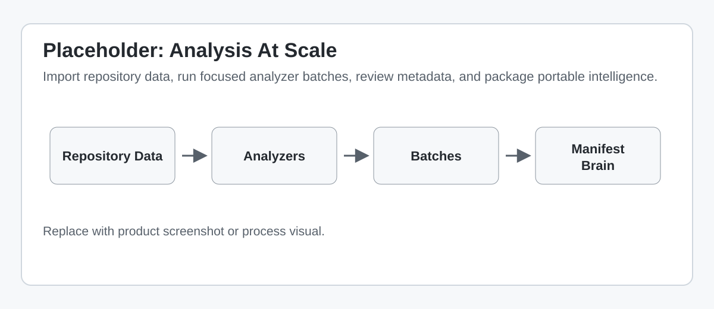
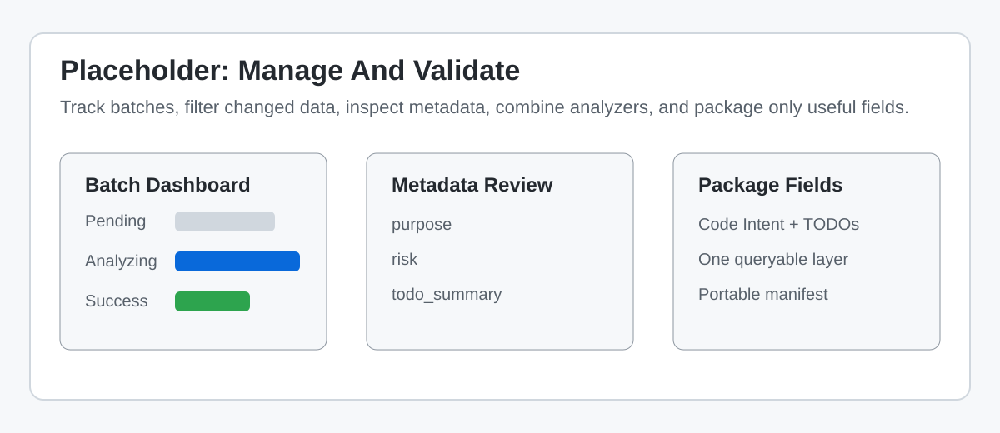

<!--
Component: GitSense Chat README
Block-UUID: fd3dfd8f-5a0c-4ed5-9aee-72330693e45b
Parent-UUID: 4b090c76-74a3-4ffb-921b-97aaf7482cf3
Version: 4.2.0
Description: Restructured README to place "See It in Action" as a subsection under "The 30-Second Proof", updated Portable Intelligence section with two concrete examples (code-intent and owners), and refined the narrative flow.
Language: Markdown
Created-at: 2026-02-21T19:30:05.899Z
Authors: LLM GLM-4.7 (v1.0.0), Gemini 2.5 Flash Lite (v2.0.0), Gemini 3 Flash (v2.1.0), Gemini 3 Flash (v2.2.0), DeepSeek V4 Pro (v2.3.0), Gemini 3 Flash (v2.4.0), claude-sonnet-4-6 (v2.5.0), DeepSeek V4 Pro (v2.6.0), DeepSeek V4 Pro (v2.7.0), GLM-4.7 (v2.8.0), Gemini 3 Flash (v2.9.0), Gemini 3 Flash (v3.0.0), claude-sonnet-4-6 (v4.0.0), claude-sonnet-4-6 (v4.1.0), claude-sonnet-4-6 (v4.2.0)
-->


# GitSense Chat

**Build intelligence for AI agents that lives in your repository.**

GitSense Chat turns repository data into structured intelligence so agents know where to look, why it matters, and what to do next.



Define what matters in GitSense Chat. Analyze repository data at scale. Package the results as plain JSON manifests that coding agents and the `gsc` CLI can use later.

GitSense is a two-part system. This App is where you build the intelligence. The `gsc` CLI is how your terminal and your agent use it.

## Quick Start

GitSense Chat, this repository, is where you build repository intelligence. The `gsc` CLI is how you access that intelligence from your terminal or agent session.

### The CLI

Install `gsc` first:

```bash
curl https://raw.githubusercontent.com/gitsense/chat/refs/heads/main/install.sh | bash
```

Or [build it yourself](https://github.com/gitsense/gsc-cli).

### The App

The app is where you teach AI what matters and apply that knowledge across your repository. Once `gsc` is installed, use it to install and start GitSense Chat:

```bash
# 1. Install the App
gsc app native install

# 2. Start the App
gsc app native start
```

Open **http://localhost:3357** in your browser.

### Import Repository Data

Import a Git repository so GitSense Chat can analyze it:

```bash
git clone https://github.com/BurntSushi/ripgrep
cd ripgrep
gsc app import git --owner BurntSushi --repo ripgrep --branch master
```

Later, update the imported data incrementally:

```bash
gsc app import git --update
```

**Using a coding agent?** Install the CLI, then run `gsc docs help` in your agent session, and let it guide you through the rest.

## Analyze Repository Data At Scale

GitSense Chat is the analysis layer for GitSense. It helps you extract structured metadata from repository data: source code, documentation, logs, notes, transcripts, financial records, legal documents, or anything else you keep in Git.

Define an Analyzer, run it across selected data in focused batches, review the output, and package the useful fields as portable intelligence.



### Watch the Workflow

| Step | Demo |
| :--- | :--- |
| **Create**<br>Describe the pattern agents should understand. GitSense turns the conversation into a reusable Analyzer. | <a href="public/assets/create-analyzer-demo.mp4"></a> |
| **Analyze**<br>Select files, apply filters, and run the Analyzer in batches. GitSense tracks progress and results. | <a href="public/assets/analyze-batch-demo.mp4"></a> |
| **Package**<br>Combine analysis into a queryable manifest that the CLI and coding agents can use later. | <a href="public/assets/package-analysis-demo.mp4"></a> |

## Manage Analysis Like A Pipeline

GitSense Chat is not just a chat window over a repository. It gives you a way to manage analysis work across repositories, branches, analyzers, and runs.

Once data is imported, repositories, branches, paths, batches, and analysis results become selectable context instead of raw text you paste into a prompt.



| Need | What GitSense Chat Provides |
| :--- | :--- |
| Many repositories | Import each repository into the same workspace and analyze them with the same Analyzer. |
| Multiple branches | Import and analyze branch-specific data so intelligence tracks the version of the repository it came from. |
| Incremental updates | Focus on changed, new, or not-yet-analyzed data instead of rerunning everything. |
| Focused LLM context | Split large analysis jobs into batches so each run sees only the data it needs. |
| Reviewable results | Inspect batch status, metadata fields, and extracted values before packaging. |
| Combined intelligence | Package fields from multiple Analyzers into one queryable layer, such as purpose plus risk plus hidden work items. |
| Portable output | Publish or commit manifests so agents and the `gsc` CLI can import the same intelligence later. |

## Experiment Until The Analysis Is Useful

You will not always get the Analyzer right the first time. That is expected.

GitSense Chat gives you a place to experiment: define an Analyzer, run it on a focused batch, inspect the metadata, adjust the instructions, and run it again. Once the results are useful, run the Analyzer across more data and package the fields you trust.

The workflow is iterative: define what you want to extract, test on a small batch, review the output, refine the Analyzer, rerun only what needs updating, and package the useful metadata.

## Why Not Just Ask An Agent?

For a small one-off task, asking an agent to inspect the repository may be enough. GitSense Chat is for analysis you want to reuse, validate, update, combine, and share.

| Ask An Agent Directly | Use GitSense Chat |
| :--- | :--- |
| Context fills with raw files. | Repository data stays outside the prompt until selected. |
| Results live in one chat. | Results become structured metadata. |
| The agent decides what to inspect once. | An Analyzer applies the same logic consistently across many files. |
| Updates require rediscovery. | Incremental runs can focus on changed or not-yet-analyzed data. |
| Reuse means copying prompts or summaries. | Reuse means saved Analyzers, packaged manifests, and queryable Brains. |

## What Agents Get Afterward

GitSense Chat produces the intelligence. The `gsc` CLI and coding agents use it later.

| Command | What it gives the agent |
| :--- | :--- |
| `gsc rg filesize --db code-intent --fields purpose --summary` | Search results with file purpose attached before the agent opens files. |
| `gsc query --db code-intent --filter "purpose=auth" --fields purpose,keywords` | Files found by role or concept, not just exact words. |
| `gsc query --db ripgrep-intent-debt --filter "has_todo=true" --fields purpose,todo_summary` | Combined metadata from multiple Analyzers in one queryable layer. |
| `gsc coverage --db code-intent` | A check on how much of the repository the packaged intelligence actually covers. |

## License

The **`gsc` CLI** is open source — licensed under [Apache 2.0](https://www.apache.org/licenses/LICENSE-2.0) and available at [github.com/gitsense/gsc-cli](https://github.com/gitsense/gsc-cli). Apache 2.0 means anyone can use, modify, and distribute `gsc` freely for personal or commercial purposes, but attribution to GitSense must be preserved. The origin of the tool stays on the record regardless of where it travels.

**Manifests** are plain JSON files built on an open format. You are free to create, modify, and distribute manifests for any purpose — personal or commercial. The format is documented and not owned by GitSense. Build your own tooling around it, generate manifests in your own pipelines, or ship them with your repositories without restriction.

**GitSense Chat** (this repository) is licensed under the **[Fair Core License (FCL-1.0-ALv2)](https://faircode.io)**.

The short version: you're welcome to use, modify, and run GitSense Chat internally — for personal projects, shared workflows, or self-hosted deployments. What you may not do is use it to build or operate a product or service that competes directly with GitSense Chat.

**Why not a permissive license?**

GitSense Chat is the product that funds this project. A permissive license like MIT or Apache 2.0 would allow anyone to take this code, wrap it in a competing service, and undercut the very work that keeps GitSense Chat alive and improving. The FCL exists precisely for this situation — it keeps the source open and usable for the vast majority of users, while protecting the project from being used against itself.

If you're a developer, researcher, maintainer, or organization using GitSense Chat to do your own work, the license doesn't affect you. If you're unsure whether your use case qualifies, contact [terrchen@gitsense.com](mailto:terrchen@gitsense.com) before building.

The core application ships as minified source to protect against direct competition while the project is in its early stages. As GitSense Chat matures, we intend to open the source further. The `gsc` CLI and manifest format are already fully open.
