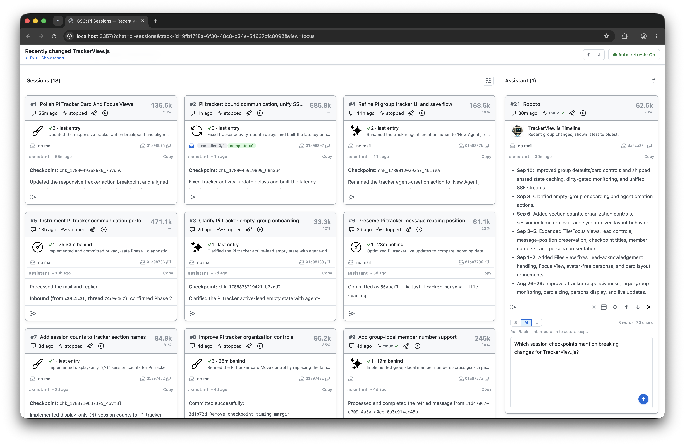
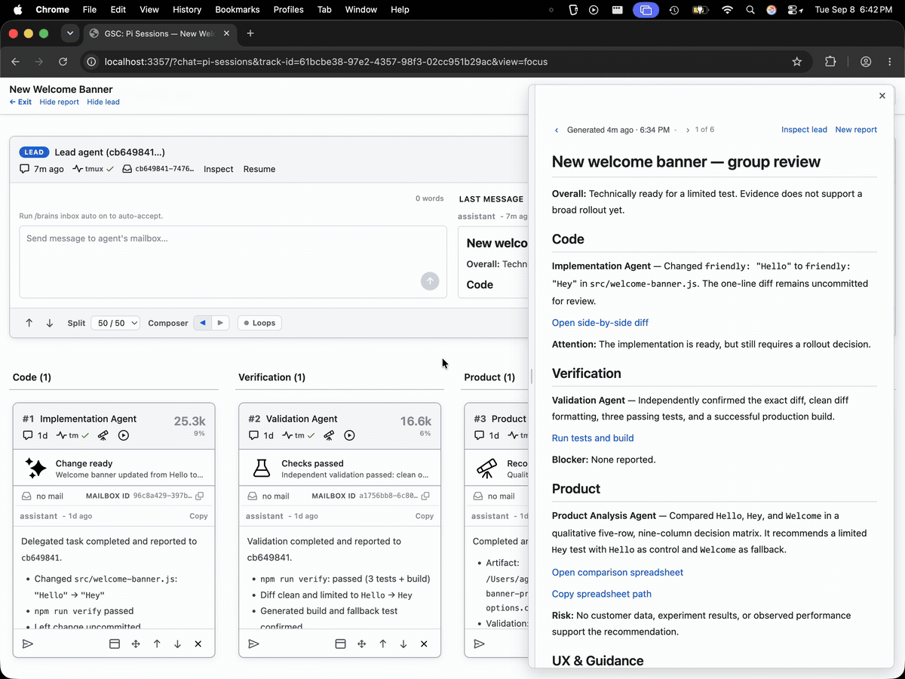

# GitSense: Chat

**A platform for scaling agent work through coordination and shared knowledge.**

GitSense Chat helps you organize sessions, coordinate work with lead agents, and
build knowledge you and your agents can reuse. Keep using the tools you already
use. No proxy or wrapper is required.

Start with the agents you have. As your work grows, use leads to bring in more
agents, organize sessions into focused groups, and track progress without having
to follow every conversation yourself.

### Beyond terminal tabs and panes

Keep using your terminal, agent environment, and existing workspace setup.
GitSense Chat adds a shared view across sessions so you can review, coordinate,
and monitor work without changing where you do it.

Find sessions by what was discussed or which files they touched, then bring
them into a Group. Add a lead or a dedicated agent to compare approaches,
summarize progress, and help coordinate the work.

Session activity stays up to date as agents work, giving you visibility across
the Group without switching between individual conversations.

<p align="center"><strong>Review and monitor the work</strong></p>
<p align="center">
  
</p>

### Multiple sessions, one conversation

Create a group in GitSense Chat and add a lead in two clicks. Your lead knows
how to use GitSense to help you create agents, bring existing ones into the
group, and organize their work.

Your lead knows which sessions are in the group and how they're organized.
Refer to a session by name, section, or member number to tell it where to focus.

Tell it what needs to happen. Here, one request reaches nine agents, then a
follow-up changes only the C and Go programs. The example is Hello World.
The same approach can help you tackle complex tasks through independent code
reviews, competing implementations, or experiments across agents.


### Build and scale knowledge through conversation

Tell your lead what knowledge you want your agents to have, and let it help
you build and grow the group.

Agents can save findings as notes and lessons, letting the lead pass along
references without pulling every detail into its own conversation. As your
needs grow, ask it to add agents or help fresh sessions take over, without
juggling every conversation yourself.

Here, a GitHub Watcher brings together recent issues from two repositories and
answers questions from Claude Code, Codex, and OpenCode.

**[▶ Download and watch the demo video (MP4, 3.1 MB)](https://raw.githubusercontent.com/gitsense/chat/refs/heads/main/assets/create-specialized-knowledge-agents.mp4)**

[](assets/create-specialized-knowledge-agents.png)

Any agent that can run `gsc` can ask your knowledge agents for help or share
information with them, such as new findings or a progress update.

### Give your agents more ways to help

You can ask an agent to open a diff or run a command. But coming back later can
mean finding the right session and asking again. GitSense Chat lets agents
include actions directly in their answers and reports, so you can open files,
launch applications, or run commands when you're ready.

You control execution permissions, including which commands can run without
another confirmation and for how long.

Here, a lead brings together findings from multiple sessions and adds actions
that take you to the work. Opening Zed is already approved for this demo, so
the diff opens with one click.



## Quick Start

Review the [install script](install.sh), then install the `gsc` CLI:

```bash
curl https://raw.githubusercontent.com/gitsense/chat/refs/heads/main/install.sh | bash
```

This installs the `gsc` CLI. To install and configure GitSense Chat, ask your
coding agent:

```text
Install and configure GitSense Chat for me. Start by running `gsc docs help`.
```

You can also [build the CLI from source](https://github.com/gitsense/gsc-cli).

GitSense Chat currently supports Pi sessions, which you can organize into Groups
with lead agents. Follow
[pi-brains](https://github.com/gitsense/pi-brains) to see how sessions, Session
Insights, checkpoints, shared knowledge, messaging, lead agents, and group
observation loops work together.

GitSense knowledge is not tied to Pi. Any agent that can run `gsc` can query the
same Brains, notes, lessons, and rules.

## Why GitSense Chat?

Spend less time finding past work, explaining it again, and keeping track of
separate sessions.

### Give you and your agents a better starting point

Turn what you explain in a conversation into context agents can find and reuse.
Enrich code searches with what files do and why they matter, so agents have
more to go on before opening them.

Find past sessions by what was discussed or worked on, so you can pick up
useful work without remembering what the session was called.

<table>
  <thead>
    <tr>
      <th width="50%" align="center">Same search, more context</th>
      <th width="50%" align="center">Find work worth reusing</th>
    </tr>
  </thead>
  <tbody>
    <tr>
      <td width="50%" valign="top"></td>
      <td width="50%" valign="top"></td>
    </tr>
    <tr>
      <td width="50%" valign="top">Regular ripgrep on the left. GitSense adds each file’s purpose on the right, helping agents decide where to look next.</td>
      <td width="50%" valign="top">Search sessions by conversation, files, repository, role, or time to find the work you want to pick up again.</td>
    </tr>
  </tbody>
</table>

### Organize sessions around the work

Keep your terminals and panes arranged how you like. Groups give you another
way to organize sessions by status, recent activity, role, or whatever makes
sense for the work. The same session can appear in multiple Groups without
moving or copying it. Add a lead to help you keep track of the work across
those sessions.

<table>
  <thead>
    <tr>
      <th width="33%" align="center">Organize by status</th>
      <th width="33%" align="center">Review recent activity</th>
      <th width="34%" align="center">Filter what you see</th>
    </tr>
  </thead>
  <tbody>
  <tr>
    <td width="33%" valign="top"></td>
    <td width="33%" valign="top"></td>
    <td width="34%" valign="top"></td>
  </tr>
  </tbody>
</table>

## All you need is a lead, really

Your lead is a personal GitSense assistant. Tell it what you need help with,
from keeping an eye on sessions to creating agents and coordinating their work.
Start small and let it help you grow, without managing every session yourself.

### Create a lead in seconds

Adding a lead to a Group takes two clicks. No setup, no scripting.

<table>
  <tbody>
    <tr>
      <td width="50%" valign="top"><strong>1. Add a lead</strong><br><br><br><br>Click <strong>Add a lead</strong> from the Group.</td>
      <td width="50%" valign="top"><strong>2. Create the lead agent</strong><br><br><br><br>Confirm the settings and click <strong>Create lead agent</strong>.</td>
    </tr>
  </tbody>
</table>

Once it's running, tell the lead what you need or ask how it can help:

- Create agents or bring existing sessions into the Group.
- Arrange sessions into columns or sections that fit your work.
- Check progress and bring findings together.
- Set up reminders or monitoring for things you care about.

### Work smarter with a lead

Give your lead something to watch, remind you about, or help coordinate. It
can check for changes and use saved checkpoints to stay informed without
rereading every conversation. The examples below show a few ways to put it
to work.

<table>
  <tr>
    <td width="50%" align="center"><strong>Delegate the watching</strong></td>
    <td width="50%" align="center"><strong>Monitor what matters</strong></td>
  </tr>
  <tr>
    <td align="center" valign="top">Give the lead a job, like notifying you when a session stalls or finishes.</td>
    <td align="center" valign="top">Add focused agents that each watch a responsibility.</td>
  </tr>
  <tr>
    <td valign="top"></td>
    <td valign="top"></td>
  </tr>
</table>

## Current Support and Boundaries

Pi is currently the supported runtime integration. Codex, Claude Code,
OpenCode, and other coding-agent harnesses are not yet integrated for session
logs, lifecycle state, or Group coordination.

GitSense knowledge is portable. Any agent that can run `gsc` can query the same
Brains, notes, lessons, and rules without requiring runtime integration.

GitSense Chat surfaces evidence and supports action. Executable actions remain
subject to application authorization and command validation. It does not decide
whether an agent's work is correct, and agent findings do not automatically
become trusted knowledge. People remain responsible for reviewing evidence,
resolving uncertainty, and deciding what happens next.

## License

The [`gsc` CLI](https://github.com/gitsense/gsc-cli) is licensed under the
[Apache License 2.0](https://www.apache.org/licenses/LICENSE-2.0).

GitSense Chat is licensed under the
[Fair Core License (FCL-1.0-ALv2)](https://fcl.dev/). You may use, modify, and
run it internally, including for personal projects, shared workflows, and
self-hosted deployments. You may not use it to build or operate a product or
service that competes directly with GitSense Chat. Each version becomes
available under Apache 2.0 two years after its release. See [LICENSE](LICENSE)
and [NOTICE](NOTICE) for the complete terms.
