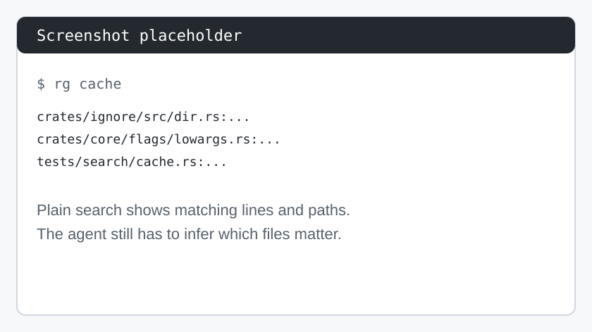
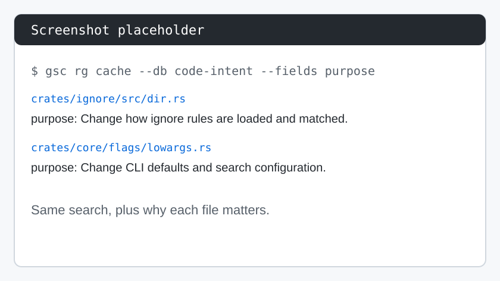
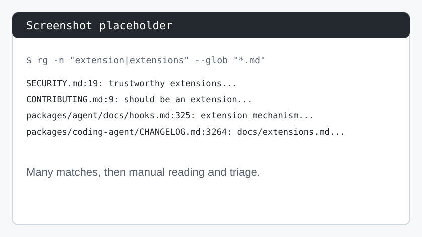
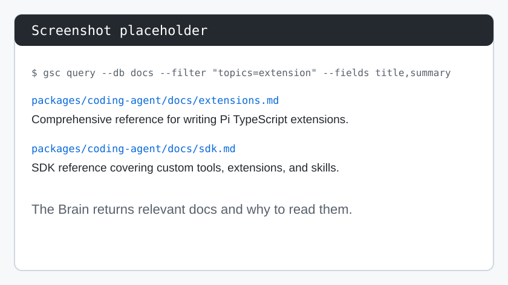

<!--
Component: GitSense Chat README
Block-UUID: fd3dfd8f-5a0c-4ed5-9aee-72330693e45b
Parent-UUID: 4b090c76-74a3-4ffb-921b-97aaf7482cf3
Version: 4.2.0
Description: Restructured README to place "See It in Action" as a subsection under "The 30-Second Proof", updated Portable Intelligence section with two concrete examples (code-intent and owners), and refined the narrative flow.
Language: Markdown
Created-at: 2026-02-21T19:30:05.899Z
Authors: LLM GLM-4.7 (v1.0.0), Gemini 2.5 Flash Lite (v2.0.0), Gemini 3 Flash (v2.1.0), Gemini 3 Flash (v2.2.0), DeepSeek V4 Pro (v2.3.0), Gemini 3 Flash (v2.4.0), claude-sonnet-4-6 (v2.5.0), DeepSeek V4 Pro (v2.6.0), DeepSeek V4 Pro (v2.7.0), GLM-4.7 (v2.8.0), Gemini 3 Flash (v2.9.0), Gemini 3 Flash (v3.0.0), claude-sonnet-4-6 (v4.0.0), claude-sonnet-4-6 (v4.1.0), claude-sonnet-4-6 (v4.2.0)
-->


# GitSense Chat

**Build intelligence for AI agents that lives in your repository.**

GitSense Chat turns domain knowledge into queryable repository intelligence so agents know where to look, why it matters, and what to do next.


Define what matters in GitSense Chat. Store that knowledge as plain JSON manifests in the repository. Let coding agents start with relevant files and useful guidance instead of opening files cold.

GitSense is a two-part system. This App is where you build the intelligence. The `gsc` CLI is how your terminal and your agent use it.

## Quick Start

GitSense Chat, this repository, is where you build repository intelligence. The `gsc` CLI is how you access that intelligence from your terminal or agent session.

### The CLI

Install `gsc` first:

```bash
curl https://raw.githubusercontent.com/gitsense/chat/refs/heads/main/install.sh | bash
```

Or [build it yourself](https://github.com/gitsense/gsc-cli).

### The App

The app is where you teach AI what matters and apply that knowledge across your repository. Once `gsc` is installed, use it to install and start GitSense Chat:

```bash
# 1. Install the App
gsc app native install

# 2. Start the App
gsc app native start
```

Open **http://localhost:3357** in your browser.

**Using a coding agent?** Install the CLI, then run `gsc docs help` in your agent session, and let it guide you through the rest.

## Teach AI What Matters

You just need your files and an understanding of what you want agents to understand. GitSense Chat handles the prompt engineering, batching, model selection, and reuse strategy so agents can work across large collections without reanalyzing everything from scratch. Filter what needs reanalysis, set your batch size, and pick the right model for the job.

### Watch the Workflow

| Step | Demo |
| :--- | :--- |
| **Create**<br>Describe the pattern agents should understand. GitSense turns the conversation into a reusable Analyzer. | <a href="public/assets/create-analyzer-demo.mp4"></a> |
| **Analyze**<br>Select files, apply filters, and run the Analyzer in batches. GitSense tracks progress and results. | <a href="public/assets/analyze-batch-demo.mp4"></a> |
| **Package**<br>Combine analysis into a queryable manifest that the CLI and coding agents can use later. | <a href="public/assets/package-analysis-demo.mp4"></a> |

### What Agents Can Learn

- **Class notes:** what themes, definitions, sources, assignments, or open questions matter across a course
- **Financial records:** which transactions, accounts, patterns, or anomalies need closer review
- **Legal documents:** which matter, status, attorney, obligation, or risk applies to each file
- **Codebases:** what a file is for, which behavior it protects, where tests belong, and what patterns are risky

## What Changes With GitSense

GitSense does not replace search. It adds repository knowledge to the places where agents already start.

Same search, better starting point:

| Without GitSense | With GitSense |
| :--- | :--- |
|  |  |

| Command | What it gives the agent |
| :--- | :--- |
| `gsc rg cache --db code-intent --fields purpose` | Search still finds matching text, but the agent also sees why each matching file exists before opening it. |
| `gsc rg TODO --db implicit-todos --fields todo_summary --summary` | The agent can look for a familiar signal and see higher-level findings, not just raw matching lines. |
| `gsc query --db docs --filter "topics=extension" --fields title,summary,section_anchors` | The agent can ask for relevant documents by topic and start with summaries and sections instead of broad Markdown search results. |
| `gsc query --db code-intent --filter "purpose=auth" --fields purpose,keywords` | The agent can search for concepts, not only exact strings that happen to appear in code. |

The difference is not that the agent stops searching. The difference is that search starts with meaning: purpose, risk, guidance, summaries, topics, and the reading paths you already built.

## Similar Problems, Better Start

Some questions are not hard because the words are hidden. They are hard because the answer is spread across several documents.

Same question, different starting point. In both runs, the agent has to explain how to build and distribute a Pi extension, then report how many files it read.

| Without GitSense | With GitSense |
| :--- | :--- |
| In `~/pi`, I want to understand how to build and distribute a Pi extension.<br><br>Do not use GitSense, `gsc`, or any Brain. Use normal repository search to find the documentation you think is relevant.<br><br>First, list the docs you plan to read and why. Then read only the docs you need and explain the workflow.<br><br>At the end, answer this: how many files did you need to read?<br><br> | In `~/pi`, I want to understand how to build and distribute a Pi extension.<br><br>Use the docs Brain first to find the documentation you think is relevant. Do not open files until you have used the Brain to build the reading list.<br><br>First, list the docs you plan to read and why. Then read only the docs you need and explain the workflow.<br><br>At the end, answer this: how many files did you need to read?<br><br> |

Yes, you have to build the Brain first. That is the tradeoff. But once it exists, the knowledge is durable and reusable. If the manifest is committed with the code, everyone who clones the repository inherits that knowledge too.

## License

The **`gsc` CLI** is open source — licensed under [Apache 2.0](https://www.apache.org/licenses/LICENSE-2.0) and available at [github.com/gitsense/gsc-cli](https://github.com/gitsense/gsc-cli). Apache 2.0 means anyone can use, modify, and distribute `gsc` freely for personal or commercial purposes, but attribution to GitSense must be preserved. The origin of the tool stays on the record regardless of where it travels.

**Manifests** are plain JSON files built on an open format. You are free to create, modify, and distribute manifests for any purpose — personal or commercial. The format is documented and not owned by GitSense. Build your own tooling around it, generate manifests in your own pipelines, or ship them with your repositories without restriction.

**GitSense Chat** (this repository) is licensed under the **[Fair Core License (FCL-1.0-ALv2)](https://faircode.io)**.

The short version: you're welcome to use, modify, and run GitSense Chat internally — for personal projects, shared workflows, or self-hosted deployments. What you may not do is use it to build or operate a product or service that competes directly with GitSense Chat.

**Why not a permissive license?**

GitSense Chat is the product that funds this project. A permissive license like MIT or Apache 2.0 would allow anyone to take this code, wrap it in a competing service, and undercut the very work that keeps GitSense Chat alive and improving. The FCL exists precisely for this situation — it keeps the source open and usable for the vast majority of users, while protecting the project from being used against itself.

If you're a developer, researcher, maintainer, or organization using GitSense Chat to do your own work, the license doesn't affect you. If you're unsure whether your use case qualifies, contact [terrchen@gitsense.com](mailto:terrchen@gitsense.com) before building.

The core application ships as minified source to protect against direct competition while the project is in its early stages. As GitSense Chat matures, we intend to open the source further. The `gsc` CLI and manifest format are already fully open.
