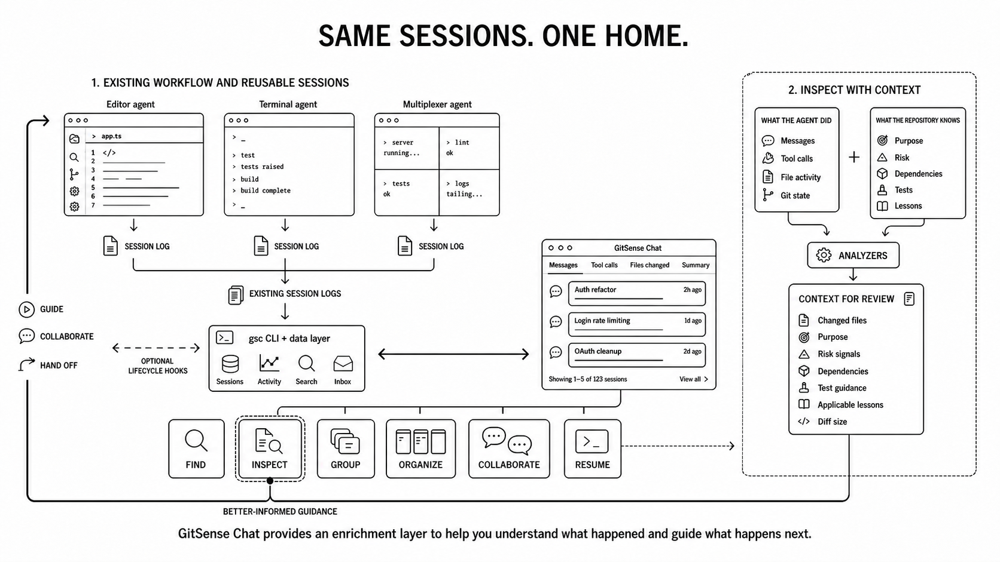
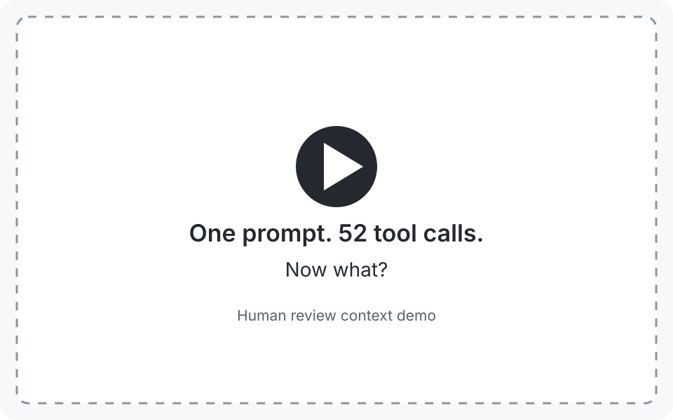
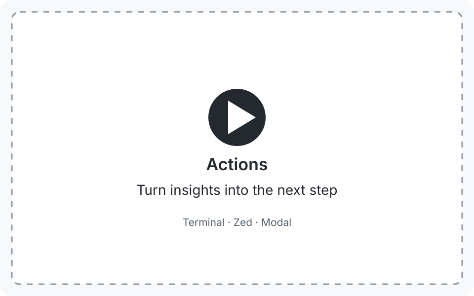

# GitSense: Chat

**Give your agents a home. Turn their work into actionable insights.**

Your agents may work across different terminals, repositories, and tasks, but
their sessions do not have to remain scattered. A single prompt can easily turn
into a wall of tool calls, but the work that matters does not have to stay
buried inside it.

GitSense Chat brings that work together while it is happening and after the
sessions end. Find related sessions, see what agents are doing, organize work
across tasks, and create Session Insight views around what matters to you.
Instead of replaying every tool call, you can surface the files, decisions,
risks, lessons, and actions needed to understand the work and decide what
happens next.



| **Organize your sessions** | **See what matters** |
| :---: | :---: |
|  |  |

## Quick Start

Review the [install script](install.sh), then install `gsc`:

```bash
curl https://raw.githubusercontent.com/gitsense/chat/refs/heads/main/install.sh | bash
```

or [build it yourself](https://github.com/gitsense/chat).

### Ask Your Coding Agent

```text
Install and configure GitSense Chat for me. Start by running `gsc docs help`.
```

Your agent will guide you through the rest and stop when you need to enter an API key privately.

For detailed installation instructions, run:

```bash
gsc docs install
```

## How it works

GitSense Chat gives agent sessions a shared home without replacing the
terminals and tools where agents work. It uses the session logs your agents
already create, so you can inspect and organize sessions while they are active
or after they end.

| With session logs | With optional lifecycle integration |
| :--- | :--- |
| Search conversations, files, and operations | See which agents are running |
| Inspect messages, tool calls, file activity, and Git state | Start an offline agent |
| Group and organize related sessions | Send messages to an agent's inbox |
| Mark reviewed work and focus on new activity | Let agents communicate with one another |
| Copy resume and attach commands | Receive messages in the agent's existing interface |

A session-log integration is enough for the core review and organization
workflow, both while work is unfolding and after a session ends. Optional hooks
add live state and communication.

Custom analyzers can go further by turning observable session activity and
repository or team knowledge into session insights. These saved views help you
focus on what matters and can offer actions for what to do next, but they do
not decide whether the code is correct.

## See it in action with Pi

Pi is the working proof behind this idea: active and completed sessions become
more useful when their logs are searchable, structured, enriched, and connected
back to the agent. The examples below show how GitSense Chat helps you find the
session behind a change, review active work incrementally, organize related work,
connect agents, and resume in your own tools.

| Find | Inspect | Group |
| :--- | :--- | :--- |
|  |  |  |
| Match a changed file, narrow the results to edit operations, and identify the session responsible. | Review an active session, mark the work so far as reviewed, and focus the next review on new messages and file changes. | Bring related sessions together, let the same session appear in multiple groups, and filter by changed file to find connected work. |

| Organize | Collaborate | Hand off to your tools |
| :--- | :--- | :--- |
|  |  |  |
| Arrange active and completed sessions into sections while keeping reusable expert sessions visible in a fixed panel. | Ask a working agent to consult expert sessions, wait for their replies, and bring what they know back into the current conversation. | Copy the session's resume command, paste it into your terminal, and continue in the original workspace with the session's existing context. |

Groups are views over your sessions, not folders. A session can appear in every
group where it is useful, whether that group represents a project, workstream,
area of expertise, or temporary review. Saved groups are currently stored per
browser.

**Runtime support:** Pi is currently the supported integration. Codex, Claude
Code, OpenCode, and other coding-agent harnesses are not yet integrated. The
goal is a shared workspace where sessions and agent communication work across
harnesses.

## Give humans useful insights and agents relevant context

Agent sessions can produce more messages, tool calls, and file activity than
anyone can reasonably review line by line. When reviewing all of that takes too
much effort, it is tempting to accept the agent's summary and move on. Often,
that is exactly what happens.

GitSense Chat is designed around a simple idea: you know what matters to you.
Custom analyzers turn session data into insights built around your own
questions, turning a wall of tool calls into something you can inspect and act
on. You might want a compact outline of the conversation, a review of the files
that changed, confirmation that `npm run check` ran, or a quick answer about
whether the agent touched a particular file.

### One prompt. 52 tool calls. Now what?

Fifty-two tool calls are a lot to review, and counting them still understates
the problem. Important logic can be buried inside Bash commands, where a single
command may inspect, generate, or modify several files. In this session, the
agent applied most of its changes through Git, so the activity view showed only
a fraction of the eight files it modified.

The following demos use two custom analyzers on the same session. Session
Outline keeps the conversation and condenses repeated tool activity. Change
Review uses Git and repository context to show the full eight-file change set,
diff sizes, risk, lessons, and places to begin reviewing. The analyzers do not
define what everyone should care about. They show how the same session can be
shaped around a different focus.

| Configure and load | Act on what matters |
| :--- | :--- |
|  |  |
| Register Session Outline and Change Review, then make both views available with a single click. Load the compact outline to scan the conversation and commands. Switch to Change Review to focus on the files, risks, lessons, and diffs. **Same session. Different focus.** | Start with the insight that matters, then choose what happens next. **Terminal** runs `git diff` in a terminal, **Zed** opens the change in an editor, and **Modal** calls the analyzer and displays its response inside GitSense Chat. A callback can return a report, load information on demand, or confirm that another tool or agent received a request. |

These are only two examples. An analyzer could surface code ownership,
architectural boundaries, required checks, test coverage, outstanding todos,
or other signals that matter to your team. It could reduce an entire session to
whether a required command ran or whether a specific file was touched. It can
also keep conversations focused by loading dependency details, test
information, generated artifacts, or revision history only when someone asks
to see it.

[Learn more about creating session insights with analyzers](https://github.com/gitsense/smart-ripgrep/blob/master/.gitsense/analyzers/README.md).

### Same work. Better starting point.

The same repository knowledge can help an agent before it acts. Giving an agent
more tokens is not the same as giving it better context. GitSense can surface
file purpose, risk, dependencies, tests, lessons, and other repository knowledge
while the agent works. That gives the agent a better chance of choosing the
right files and questions before opening everything that might be relevant.

The left shows matching lines. The right shows the same matches with an
explanation of what each file is for.


Both searches find the same code. GitSense adds purpose, risk, lessons, and other
repository context before the agent decides what to open.

For a runnable example, see
[smart-ripgrep](https://github.com/gitsense/smart-ripgrep). It shows how an agent
uses committed repository knowledge to find the right files, check earlier
lessons before editing, and surface session insights about purpose, risk,
dependencies, tests, and lessons.

### Examples

These commands show how repository knowledge gives an agent more to work with
before it opens the code.

<table>
  <thead>
    <tr>
      <th width="32%">Command</th>
      <th width="68%">Example</th>
    </tr>
  </thead>
  <tbody>
    <tr>
      <td width="32%" valign="top">
        <strong>See the shape before reading the code</strong>
        <pre><code>gsc rg cache \
  --db code-intent \
  --glob '**/src/**' \
  --fields purpose,keywords \
  --summary</code></pre>
        <p>See where something appears without loading every matching line.</p>
      </td>
      <td width="68%" valign="top">
        
      </td>
    </tr>
    <tr>
      <td width="32%" valign="top">
        <strong>Find files and see what they are for</strong>
        <pre><code>gsc query \
  --db code-intent \
  --glob "**/cache*" \
  --fields purpose,keywords</code></pre>
        <p>Find familiar paths while seeing what each result does.</p>
      </td>
      <td width="68%" valign="top">
        
      </td>
    </tr>
    <tr>
      <td width="32%" valign="top">
        <strong>Find files by what they do</strong>
        <pre><code>gsc query \
  --db code-intent \
  --glob '**/*.rs' \
  --filter "keywords=send-input" \
  --fields purpose,keywords \
  --limit 20</code></pre>
        <p>Search repository knowledge instead of guessing the source wording.</p>
      </td>
      <td width="68%" valign="top">
        
      </td>
    </tr>
  </tbody>
</table>

## Turn a useful question into reusable context

Start with something you want agents to know about your repository. Define it as
an Analyzer, populate it with AI, deterministic programs, or both, review the
results, and package the fields you trust as a portable, queryable Brain.

| Step | Demo |
| :--- | :--- |
| **Import**<br>Bring repository data into GitSense Chat. | <a href="assets/how-it-works-import-repo-subtitled.mp4"></a> |
| **Define**<br>Create an Analyzer that defines the fields, types, instructions, and output you want. | <a href="public/assets/create-analyzer-demo.mp4"></a> |
| **Populate**<br>Generate results with GitSense Chat, deterministic programs, or both, then review them. | <a href="public/assets/analyze-batch-demo.mp4"></a> |
| **Package**<br>Select useful fields and package them as a portable, queryable Brain. | <a href="public/assets/package-analysis-demo.mp4"></a> |

An Analyzer is the contract, not necessarily an AI prompt. GitSense Chat can
populate it with managed model analysis. Existing programs can read other
Analyzer results and write deterministic results through the same interface:

```bash
gsc app analysis get
gsc app analysis set
```

Both paths produce the same reviewable metadata. A repository can ship the
Analyzer and the program that populates it under `.gitsense/`, keeping the
analysis workflow beside the code it explains.

## Extract and maintain context at scale

Once an Analyzer produces useful results, GitSense Chat helps you apply and
maintain it across selected files, repositories, and branches. Process large
jobs in batches, analyze only what is new or changed, review the results, and
update the Analyzer as your repository evolves.


| What you need | How GitSense Chat helps |
| :--- | :--- |
| Use the same analysis again | Save the instructions as a reusable Analyzer. |
| Work across one repository or many | Run the Analyzer wherever that knowledge is needed. |
| Avoid starting over | Analyze files that are new, changed, or still missing results. |
| Keep large jobs manageable | Select files, apply filters, and process them in batches. |
| Use lower batch pricing | Send work in batches when the provider offers it. |
| Check the quality | Inspect the metadata, adjust the Analyzer, and run it again. |
| Work across branches | Keep analysis tied to the repository and branch it came from. |
| Share the result | Package selected fields as a portable JSON manifest. |

## Route What You Already Have

Structured knowledge does not have to replace your skills, runbooks, or project
instructions. A GitSense note can act as a small index entry: what the source is
for, where it lives, and which part matters. A rule can fetch the matching notes
when an agent starts work, without loading a large table of contents into every
conversation.

The [skill-router demo](https://github.com/gitsense/gsc-rules-demos#3-route-to-an-existing-skill)
shows the full path. Work on a documentation file loads the `doc-styling` notes,
which point the agent to the relevant skill. GitSense Chat can help create and
refine this kind of repository knowledge at scale; `gsc` delivers it when the
agent needs it.

## License

The **`gsc` CLI** is open source, licensed under [Apache 2.0](https://www.apache.org/licenses/LICENSE-2.0), and available at [github.com/gitsense/gsc-cli](https://github.com/gitsense/gsc-cli). Apache 2.0 means anyone can use, modify, and distribute `gsc` freely for personal or commercial purposes, but attribution to GitSense must be preserved. The origin of the tool stays on the record regardless of where it travels.

**Manifests** are plain JSON files built on an open format. You are free to create, modify, and distribute manifests for any purpose, personal or commercial. The format is documented and not owned by GitSense. Build your own tooling around it, generate manifests in your own pipelines, or ship them with your repositories without restriction.

**GitSense Chat** (this repository) is licensed under the **[Fair Core License (FCL-1.0-ALv2)](https://fcl.dev/)**.

The short version: you're welcome to use, modify, and run GitSense Chat internally for personal projects, shared workflows, or self-hosted deployments. What you may not do is use it to build or operate a product or service that competes directly with GitSense Chat.

Each version automatically becomes available under Apache 2.0 on the second
anniversary of the date it was made available. Copyright and origin attribution
to Terrence Chen and GitSense must be preserved as required by the license.

**Why not a permissive license?**

GitSense Chat is the product that funds this project. A permissive license like MIT or Apache 2.0 would allow anyone to take this code, wrap it in a competing service, and undercut the very work that keeps GitSense Chat alive and improving. The FCL exists precisely for this situation. It keeps the source open and usable for the vast majority of users while protecting the project from being used against itself.

If you're a developer, researcher, maintainer, or organization using GitSense Chat to do your own work, the license doesn't affect you. If you're unsure whether your use case qualifies, contact [terrchen@gitsense.com](mailto:terrchen@gitsense.com) before building.

The core application ships as minified source to protect against direct competition while the project is in its early stages. As GitSense Chat matures, we intend to open the source further. The `gsc` CLI and manifest format are already fully open.
