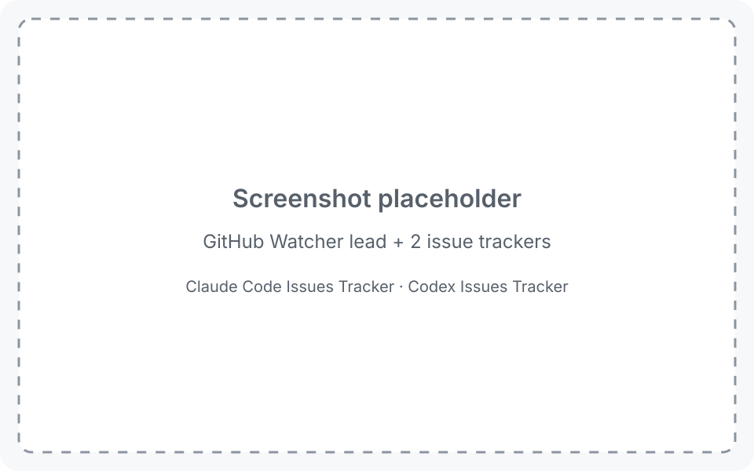
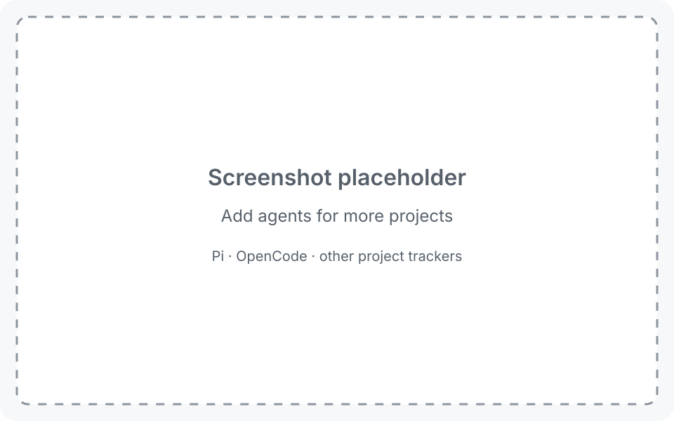
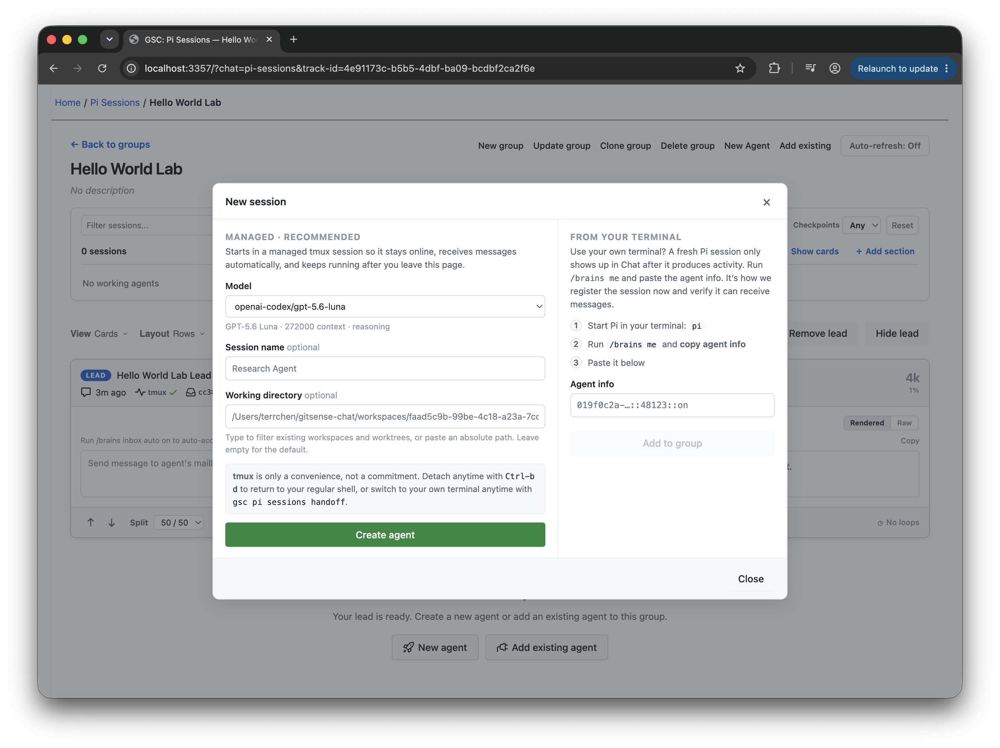
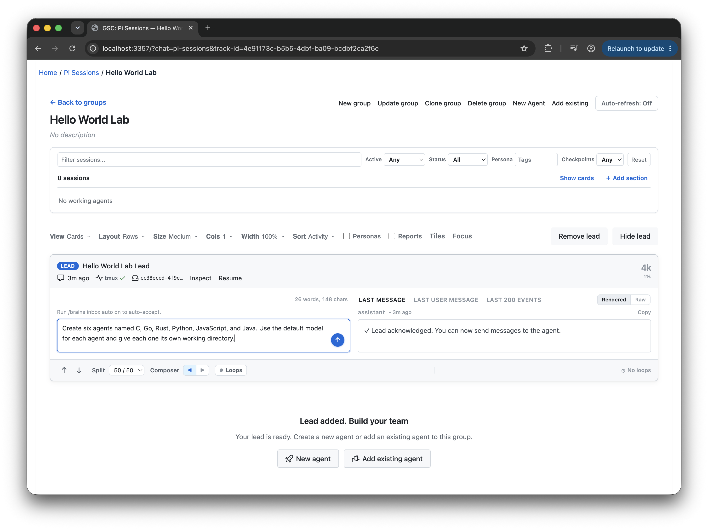
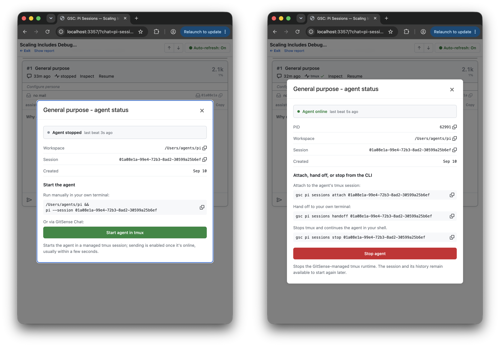
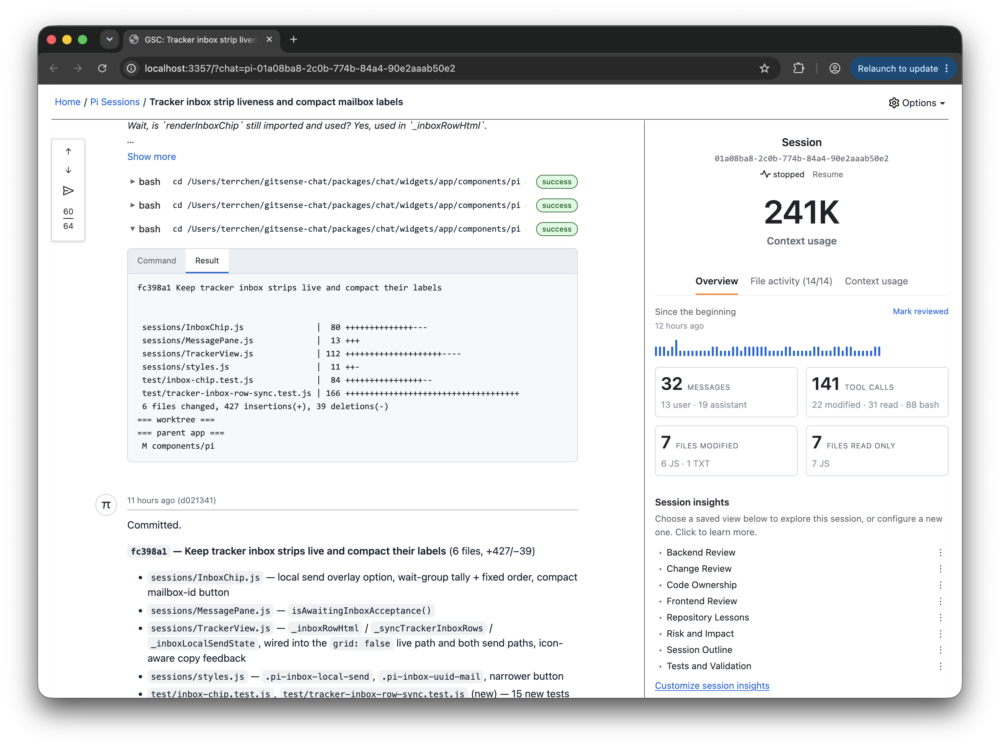
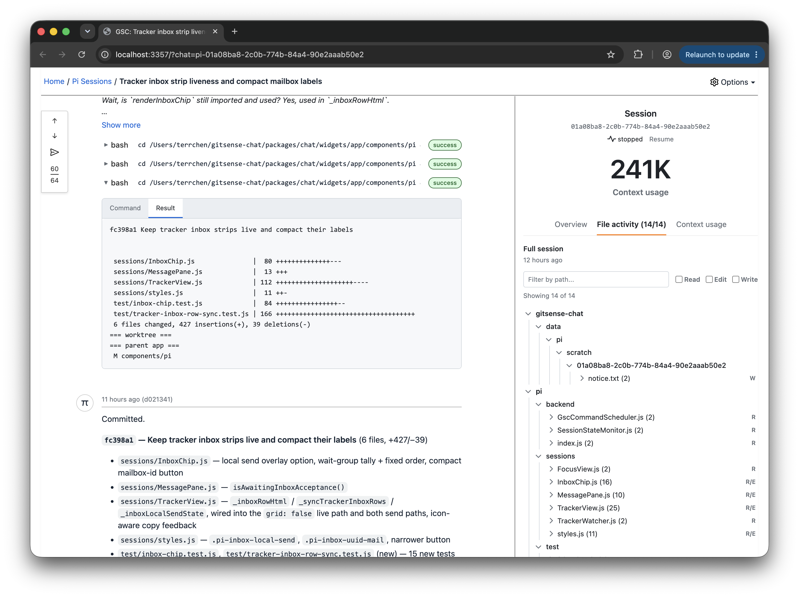

> **Coming soon:** This README previews the next iteration of GitSense Chat,
> where you bring your agents’ work together. The repository will be updated
> shortly.

# GitSense: Chat

**A platform for getting more from your agents.**

Your terminal, multiplexer, or agent development environment is where you run
your agents. GitSense Chat is where you bring their work together.

Whether you are keeping track of a few sessions or building and maintaining a
complex system, GitSense Chat helps you coordinate related work, build
knowledge you and your agents can reuse, and inspect activity when something
goes wrong.

Keep using the tools and workflows you already have. GitSense Chat works
alongside them. No proxy or wrapper is required.

### Make knowledge available to all

Share what you know and what you want your agents to know in a conversation.
GitSense Chat can turn it into useful context your agents can query. It can
help create focused knowledge agents, save useful findings as notes and
lessons, and make that knowledge available to you and any agent that can run
the GitSense Chat CLI, `gsc`.

Saved knowledge gives new work a better starting point. It can also help you
find previous sessions when all you remember is what was discussed or which
files were changed.

<table>
  <thead>
    <tr>
      <th width="50%" align="center">Same search, more context</th>
      <th width="50%" align="center">Find work worth reusing</th>
    </tr>
  </thead>
  <tbody>
    <tr>
      <td width="50%" valign="top"></td>
      <td width="50%" valign="top"></td>
    </tr>
    <tr>
      <td width="50%" valign="top">Regular ripgrep on the left. GitSense adds each file’s purpose on the right, helping your agents decide where to look next.</td>
      <td width="50%" valign="top">Search sessions by conversation, files, repository, role, or time to find work you want to pick up again.</td>
    </tr>
  </tbody>
</table>

**Build knowledge once, share it across agents**

Create a Group that other agents can turn to for help. Here, the GitHub
Watcher’s lead brings together recent issues from two repositories and answers
questions from Claude Code, Codex, and OpenCode through `gsc`.

**[▶ Download and watch the demo video (MP4, 3.1 MB)](assets/create-specialized-knowledge-agents.mp4)**

[](assets/create-specialized-knowledge-agents.png)

Any agent that can run `gsc` can ask your knowledge agents for help or share
information with them, such as new findings or a progress update.

**Scale knowledge across projects**

GitHub Watcher is a Group with a lead and dedicated agents tracking Claude Code
and Codex issues. Claude Code, Codex, and OpenCode ask the lead questions, and
it brings together information from those trackers. To cover another project,
add another tracker agent to the Group. Your other agents can keep asking the
same lead for updates.

<table>
  <thead>
    <tr>
      <th width="50%" align="center">Current GitHub Watcher Group</th>
      <th width="50%" align="center">Add agents for other projects</th>
    </tr>
  </thead>
  <tbody>
    <tr>
      <td width="50%" valign="top"></td>
      <td width="50%" valign="top"></td>
    </tr>
    <tr>
      <td width="50%" valign="top">The lead coordinates the issue tracker agents and answers questions from other agents.</td>
      <td width="50%" valign="top">Add another project agent to extend the knowledge the same lead can provide.</td>
    </tr>
  </tbody>
</table>

**[Try it yourself](docs/github-watcher-demo-prompt.md)**

### See related work in one place

Find sessions by what was discussed or which files they touched, then bring
related work into a Group. Follow activity across the Group, and add a lead or
dedicated agent to compare approaches, summarize progress, and help coordinate
what happens next.

Session activity stays current while your agents work, so you can follow the
Group from one place even when its sessions are scattered across terminal tabs,
windows, or workspaces.

<p align="center"><strong>Review and monitor the work</strong></p>


Use Groups to organize your sessions by status, recent activity, role, or
whatever makes sense for the work. A session can appear in multiple Groups
without being moved or copied.

<table>
  <thead>
    <tr>
      <th width="33%" align="center">Organize by status</th>
      <th width="33%" align="center">Review recent activity</th>
      <th width="34%" align="center">Filter what you see</th>
    </tr>
  </thead>
  <tbody>
  <tr>
    <td width="33%" valign="top"></td>
    <td width="33%" valign="top"></td>
    <td width="34%" valign="top"></td>
  </tr>
  </tbody>
</table>

### Make complex workflows easier to manage

Use a Group when your task benefits from several agents, such as independent
code reviews, competing implementations, or experiments. Your lead can create
agents, bring in existing sessions, and direct follow-ups to specific members
as the work changes.

Add agents without leaving the Group. Create and configure an agent directly,
bring in one already running in your terminal, or tell your lead what team you
need.

| Create an agent directly | Ask your lead to create the team |
| --- | --- |
|  |  |
| Click **Create agent** to add it to the Group. You can always change the model or thinking level later. | Tell your lead how many agents you need or explain the problem first. Refine the team before creating it. |

Managed agents can keep working in the background. When you want to interact
with one, use the GitSense Chat CLI: `gsc pi sessions attach <session-id>` to
join it or `gsc pi sessions handoff <session-id>` to move it into your terminal.

This example uses Hello World to keep the workflow easy to follow. The lead
creates six agents named C, Go, Rust, Python, JavaScript, and Java. One request
reaches all six, then a follow-up changes only the C and Go programs.

**[▶ Download and watch the demo video (MP4, 7.4 MB)](assets/scale-coordination-hello-world-lab.mp4)**


### Scaling includes debugging

Doing more with your agents also means being able to understand what went wrong
and improve the next run. Bring sessions into a Group, track their activity, and
start or stop your managed agents as needed. Open a session to inspect its
history,
review message and tool-call counts, or browse reads, writes, and edits by file.

| Start and stop agents | Session overview | File activity |
| --- | --- | --- |
|  |  |  |

Turn a wall of tool calls into findings you can act on. From the Overview, open
Session Insights to investigate failed commands, recovery attempts, and
verification after edits. Create different analyzers to examine the same logs
from different perspectives, such as tool usage, code changes, or progress.

For example, when building a GitHub Watcher, create an analyzer to review its API
calls and look for evidence that it read the required skill instructions. Use
the findings to investigate mistakes, refine instructions, and improve future
runs.

### Take action from the conversation

You can ask an agent to open a diff or run a command. But coming back later can
mean finding the right session and asking again. GitSense Chat lets agents
include actions directly in their answers and reports, so you can open files,
launch applications, or run commands when you're ready.

You control execution permissions, including which commands can run without
another confirmation and for how long.

Here, a lead brings together findings from multiple sessions and adds actions
that take you to the work. Opening Zed is already approved for this demo, so
the diff opens with one click.


## Quick Start

Review the [install script](install.sh), then install the `gsc` CLI:

```bash
curl https://raw.githubusercontent.com/gitsense/chat/refs/heads/main/install.sh | bash
```

This installs the `gsc` CLI. To install and configure GitSense Chat, ask your
coding agent:

```text
Install and configure GitSense Chat for me. Start by running `gsc docs help`.
```

You can also [build the CLI from source](https://github.com/gitsense/gsc-cli).

GitSense Chat currently supports Pi sessions, which you can organize into Groups
with lead agents. Follow
[pi-brains](https://github.com/gitsense/pi-brains) to see how sessions, Session
Insights, checkpoints, shared knowledge, messaging, lead agents, and group
observation loops work together.

GitSense knowledge is not tied to Pi. Any agent that can run `gsc` can query the
same Brains, notes, lessons, and rules.

## Start with a lead

Your lead is a personal GitSense assistant. Tell it what you need help with,
from keeping an eye on sessions to creating agents and coordinating their work.
Start small and let it help you grow, without managing every session yourself.

### Create a lead in seconds

Adding a lead to a Group takes two clicks. No setup, no scripting.

<table>
  <tbody>
    <tr>
      <td width="50%" valign="top"><strong>1. Add a lead</strong><br><br><br><br>Click <strong>Add a lead</strong> from the Group.</td>
      <td width="50%" valign="top"><strong>2. Create the lead agent</strong><br><br><br><br>Confirm the settings and click <strong>Create lead agent</strong>.</td>
    </tr>
  </tbody>
</table>

Once it's running, tell the lead what you need or ask how it can help:

- Create agents or bring existing sessions into the Group.
- Arrange sessions into columns or sections that fit your work.
- Check progress and bring findings together.
- Set up reminders or monitoring for things you care about.

### Work smarter with a lead

Give your lead something to watch, remind you about, or help coordinate. It
can check for changes and use saved checkpoints to stay informed without
rereading every conversation. The examples below show a few ways to put it
to work.

<table>
  <tr>
    <td width="50%" align="center"><strong>Delegate the watching</strong></td>
    <td width="50%" align="center"><strong>Monitor what matters</strong></td>
  </tr>
  <tr>
    <td align="center" valign="top">Give the lead a job, like notifying you when a session stalls or finishes.</td>
    <td align="center" valign="top">Add focused agents that each watch a responsibility.</td>
  </tr>
  <tr>
    <td valign="top"></td>
    <td valign="top"></td>
  </tr>
</table>

## Security

GitSense Chat is currently designed to complement an individual’s local agent
workflow. It does not provide authentication or multi-user access controls.

Only make GitSense Chat available through the local loopback interface, such as
`localhost` or `127.0.0.1`. Do not expose it directly to a local network or the
public internet.

If you access GitSense Chat through a tunnel, restrict access to yourself and
make sure the tunnel provides its own authentication. Treat anyone with access
as having terminal-level access to your agent environment: they may be able to
send messages to your agents, inspect session activity, and trigger actions
allowed by your existing permissions.

## Current Support and Boundaries

Pi is currently the supported runtime integration. Codex, Claude Code,
OpenCode, and other coding-agent harnesses are not yet integrated for session
logs, lifecycle state, or Group coordination.

GitSense knowledge is portable. Any agent that can run `gsc` can query the same
Brains, notes, lessons, and rules without requiring runtime integration.

GitSense Chat surfaces evidence and supports action. Executable actions remain
subject to application authorization and command validation. It does not decide
whether an agent's work is correct, and agent findings do not automatically
become trusted knowledge. People remain responsible for reviewing evidence,
resolving uncertainty, and deciding what happens next.

## License

The [`gsc` CLI](https://github.com/gitsense/gsc-cli) is licensed under the
[Apache License 2.0](https://www.apache.org/licenses/LICENSE-2.0).

Manifests are plain JSON files built on an open format. You can create, modify,
distribute, and use them with the open-source `gsc` CLI without requiring
GitSense Chat.

GitSense Chat is licensed under the
[Fair Core License (FCL-1.0-ALv2)](https://fcl.dev/). You may use, modify, and
run it internally, including for personal projects, shared workflows, and
self-hosted deployments. You may not use it to build or operate a product or
service that competes directly with GitSense Chat.

The core GitSense Chat application currently ships as minified source while the
project is in its early stages. We intend to open the source further as the
project matures. Under the Fair Core License, each release becomes available
under Apache 2.0 two years after it is published. See [LICENSE](LICENSE) and
[NOTICE](NOTICE) for the complete terms.
