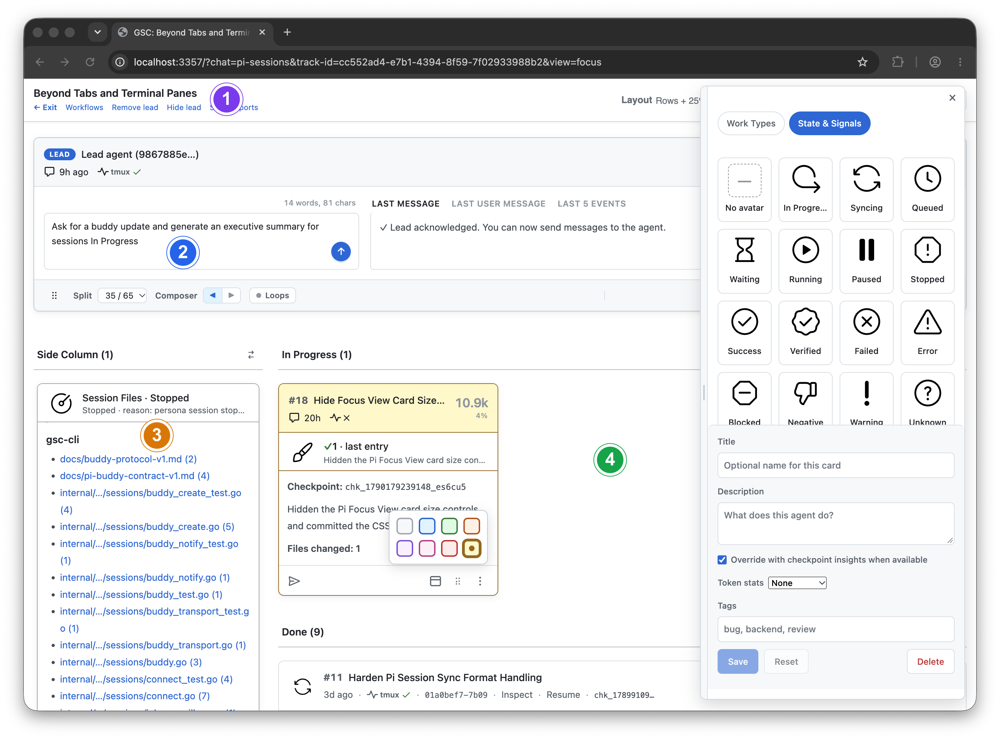

> **Coming soon:** This README previews the next iteration of GitSense Chat,
> where you bring your agents’ work together. The repository will be updated
> shortly.

# GitSense: Chat

**Reimagining how people and agents work together**

Keep running your agents in your terminal, multiplexer, or agent development
environment. Use GitSense Chat to bring their work together and decide what
happens next.

GitSense uses your agents’ session logs in the background. No wrapper or proxy required.

<p align="center">
  <a href="#quick-start">Quick start</a> &nbsp;·&nbsp;
  <a href="#runtime-details">Runtime details</a> &nbsp;·&nbsp;
  <a href="#work-together">Work together</a> &nbsp;·&nbsp;
  <a href="#communicate">Communicate</a> &nbsp;·&nbsp;
  <a href="#share-knowledge">Share knowledge</a> &nbsp;·&nbsp;
  <a href="#organize-related-work-into-groups">Organize work</a>
</p>



<table>
  <tbody>
    <tr>
      <td width="50%"><strong>1. Find related work</strong><br><video src="assets/01-find-related-work.mp4" controls muted loop playsinline width="100%"></video></td>
      <td width="50%"><strong>2. Bring work together</strong><br><video src="assets/02-bring-work-together.mp4" controls muted loop playsinline width="100%"></video></td>
    </tr>
    <tr>
      <td width="50%"><strong>3. Build smart dashboards</strong><br><video src="assets/03-build-smart-dashboards.mp4" controls muted loop playsinline width="100%"></video><br><a href="workflows/checkpoint-file-dashboard/README.md">Learn more: Checkpoint File Dashboard</a></td>
      <td width="50%"><strong>4. Give each agent an identity</strong><br></td>
    </tr>
  </tbody>
</table>

## Quick Start

Review the [install script](install.sh), then install the `gsc` CLI:

```bash
curl https://raw.githubusercontent.com/gitsense/chat/refs/heads/main/install.sh | bash
```

This installs the `gsc` CLI. To install and configure GitSense Chat, ask your
coding agent:

```text
Install and configure GitSense Chat for me. Start by running `gsc docs help`.
```

You can also [build the CLI from source](https://github.com/gitsense/gsc-cli).

For Pi setup and instructions for bringing in sessions from other agents, see
[Runtime details](#runtime-details).


## Keep your agents. Make working with them better.

Ask a lead agent to coordinate related sessions so you don’t have to repeat
instructions in each one. Keep useful findings available for the next agent
that needs them.

Any agent that can run `gsc` can share knowledge and communicate with agents
in GitSense Chat. See [Quick Start](#quick-start) and
[Current Support and Boundaries](#current-support-and-boundaries) for more
information.

<a id="work-together"></a>

### Same agents. More ways to work together.

Your agents can include actions in their responses. Click to send a message
or open a result in another app when you’re ready.

<table width="100%">
  <tr>
    <td width="50%" valign="top">
      <strong>Choose your next step</strong>
      <a href="https://raw.githubusercontent.com/gitsense/chat/main/assets/reimagining-human-agent-collaboration.mp4"></a>
      <p>Click to tell the lead agent to start. Workers return actions to open a diff and a spreadsheet. You choose when to act.</p>
      <p><a href="https://raw.githubusercontent.com/gitsense/chat/main/assets/reimagining-human-agent-collaboration.mp4">Download to watch the demo</a></p>
    </td>
    <td width="50%" valign="top">
      <strong>One conversation. Multiple sessions.</strong>
      <a href="assets/scale-coordination-hello-world-lab.mp4"></a>
      <p>Ask the lead agent to start six language sessions. One request reaches them all. A follow-up updates only C and Go.</p>
      <p><a href="https://raw.githubusercontent.com/gitsense/chat/main/assets/scale-coordination-hello-world-lab.mp4">Download to watch the demo</a></p>
    </td>
  </tr>
</table>

<a id="communicate"></a>

### Same agents. More ways to communicate.

<table width="100%">
  <tr>
    <td width="50%" valign="top">
      <p>An agent working in Claude Code can ask an agent in GitSense Chat for help through <code>gsc</code>, then continue working in Claude Code. Other agents that can run <code>gsc</code> can ask questions or send updates too.</p>
      <p>Supported Buddy connections let external agents bring completed work back to a shared Group without moving their conversations out of their own environments.</p>
      <p><a href="https://raw.githubusercontent.com/gitsense/chat/main/assets/more-ways-to-communicate.mp4">Download to watch the demo</a></p>
    </td>
    <td width="50%" valign="top">
      <a href="https://raw.githubusercontent.com/gitsense/chat/main/assets/more-ways-to-communicate.mp4"></a>
    </td>
  </tr>
</table>

<a id="share-knowledge"></a>

### Same agents. A better starting point.

Save what you learn as Brains, notes, and lessons. Any agent with access to
`gsc` can look up that context rather than asking you to explain it again.

**Same search, more context**

Regular ripgrep finds matching text. GitSense can add each file’s purpose,
helping your agents decide where to look next.

<a href="assets/same-search-more-to-go-on.png"></a>


**Build knowledge once, share it across agents**

The GitHub Watcher’s lead agent brings together issues from two repositories and
answers questions from Claude Code, Codex, and OpenCode through `gsc`.

<a href="https://raw.githubusercontent.com/gitsense/chat/main/assets/create-specialized-knowledge-agents.mp4"></a>

<a href="https://raw.githubusercontent.com/gitsense/chat/main/assets/create-specialized-knowledge-agents.mp4">Download to watch the demo</a>

Any agent that can run `gsc` can ask your knowledge agents for help or share
new findings with them. Shared knowledge is not tied to Pi or to one Group.

## Understand what happened

Open a session to see its conversation history and tool calls. Browse file
activity to check what an agent read or changed.

| Session overview | File activity |
| --- | --- |
|  |  |

From the Overview, open Session Insights to investigate failed commands,
recovery attempts, and verification after edits. Create focused analyzers to
examine the same logs from different perspectives, such as tool usage, code
changes, or progress.

For a GitHub Watcher, for example, an analyzer can review API calls and look
for evidence that the agent read the required skill instructions. Use those
findings to investigate mistakes and refine instructions for the next run.


<a id="runtime-details"></a>

## Runtime details

### Use Pi with pi-brains

GitSense Chat uses Pi sessions for browsing and analysis. Install
[pi-brains](https://github.com/gitsense/pi-brains) to connect Pi to GitSense:

```bash
pi install npm:@gitsense/pi-brains
```

Start Pi in a workspace and run `/brains`. Pi-Brains provides the session
history, checkpoints, and other information GitSense Chat uses to help you
review and organize work.

### Bring sessions from other agents into Pi

In the meantime, use [txcript](https://github.com/gitsense/txcript) to bring
snapshots from Claude Code, Codex, and other agents into a Pi session:

```bash
cargo install --git https://github.com/gitsense/txcript txcript-cli --locked

txcript list --from claude_code
txcript continue <session-id> \
  --from <harness> \
  --with pi \
  --no-resume
```

The converted snapshot appears in GitSense Chat shortly after the Pi session
sync service processes it. Repeat the conversion when you want to refresh it;
this is a temporary workaround until near-real-time synchronization is
available for other runtimes.

GitSense knowledge is not tied to Pi. Any agent that can run `gsc` can query the
same Brains, notes, lessons, and rules.

## Security

GitSense Chat is currently designed to complement an individual’s local agent
workflow. It does not provide authentication or multi-user access controls.

Only make GitSense Chat available through the local loopback interface, such as
`localhost` or `127.0.0.1`. Do not expose it directly to a local network or the
public internet.

If you access GitSense Chat through a tunnel, restrict access to yourself and
make sure the tunnel provides its own authentication. Treat anyone with access
as having terminal-level access to your agent environment: they may be able to
send messages to your agents, inspect session activity, and trigger actions
allowed by your existing permissions.

## Current Support and Boundaries

Pi is the runtime GitSense Chat uses for session browsing and analysis. Use
[txcript](https://github.com/gitsense/txcript) when you want to bring a
snapshot from another agent environment into a Pi session. Other runtime
integrations may provide different capabilities.

GitSense knowledge is portable. Any agent that can run `gsc` can query the same
Brains, notes, lessons, and rules without requiring runtime integration.

GitSense Chat surfaces evidence and supports action. Executable actions remain
subject to application authorization and command validation. It does not decide
whether an agent's work is correct, and agent findings do not automatically
become trusted knowledge. People remain responsible for reviewing evidence,
resolving uncertainty, and deciding what happens next.

## License

The [`gsc` CLI](https://github.com/gitsense/gsc-cli) is licensed under the
[Apache License 2.0](https://www.apache.org/licenses/LICENSE-2.0).

Manifests are plain JSON files built on an open format. You can create, modify,
distribute, and use them with the open-source `gsc` CLI without requiring
GitSense Chat.

GitSense Chat is licensed under the
[Fair Core License (FCL-1.0-ALv2)](https://fcl.dev/). You may use, modify, and
run it internally, including for personal projects, shared workflows, and
self-hosted deployments. You may not use it to build or operate a product or
service that competes directly with GitSense Chat.

The core GitSense Chat application currently ships as minified source while the
project is in its early stages. We intend to open the source further as the
project matures. Under the Fair Core License, each release becomes available
under Apache 2.0 two years after it is published. See [LICENSE](LICENSE) and
[NOTICE](NOTICE) for the complete terms.
