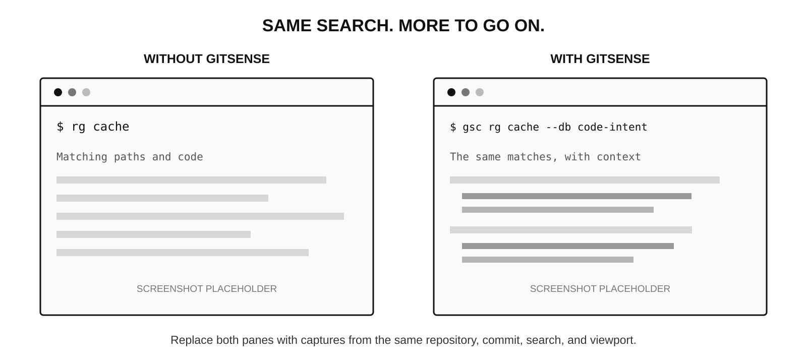
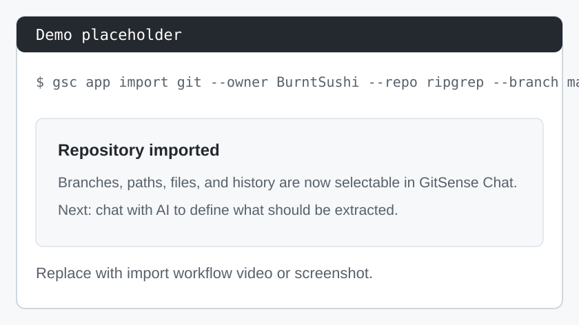
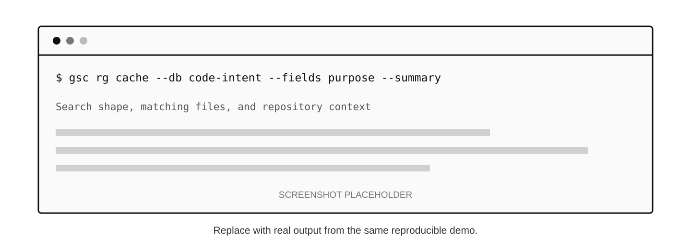
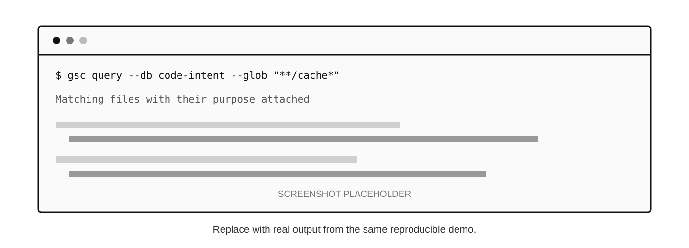
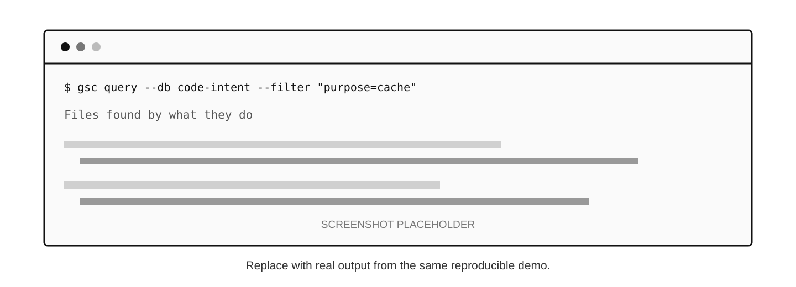

<!--
Component: GitSense Chat README
Block-UUID: fd3dfd8f-5a0c-4ed5-9aee-72330693e45b
Parent-UUID: 4b090c76-74a3-4ffb-921b-97aaf7482cf3
Version: 4.6.0
Description: Reframed the README around managed analysis, a concise workflow, practical examples, and a shorter Quick Start.
Language: Markdown
Created-at: 2026-02-21T19:30:05.899Z
Authors: LLM GLM-4.7 (v1.0.0), Gemini 2.5 Flash Lite (v2.0.0), Gemini 3 Flash (v2.1.0), Gemini 3 Flash (v2.2.0), DeepSeek V4 Pro (v2.3.0), Gemini 3 Flash (v2.4.0), claude-sonnet-4-6 (v2.5.0), DeepSeek V4 Pro (v2.6.0), DeepSeek V4 Pro (v2.7.0), GLM-4.7 (v2.8.0), Gemini 3 Flash (v2.9.0), Gemini 3 Flash (v3.0.0), claude-sonnet-4-6 (v4.0.0), claude-sonnet-4-6 (v4.1.0), claude-sonnet-4-6 (v4.2.0), Codex GPT-5 (v4.3.0), Codex (v4.4.0), Codex (v4.5.0), Codex (v4.6.0)
-->


# GitSense: Chat

**Help your coding agent understand your codebase and how you work before it starts changing things.**


## Why GitSense Chat?

Coding agents are designed to reason from the context they have. GitSense Chat helps you build the repository knowledge that makes that context better.



Both commands search the same code. The GitSense version also tells the agent what each file is for and why it may be worth following.

That extra information has to come from somewhere. Ask an agent to generate it once and it probably will. Keeping it consistent across thousands of files, branches, and many repositories is where it stops being a simple prompt.

GitSense Chat manages that work. [See how it works](#how-it-works), or [skip to the examples](#examples).

## How It Works

Import a repository, tell GitSense Chat what you want to know, try the analysis on real files, and adjust it until the results are useful. When it is ready, package the metadata so coding agents can use it later.

| Step | Demo |
| :--- | :--- |
| **Import**<br>Bring repository data into GitSense Chat. |  |
| **Create**<br>Explain what you want to know and save it as an Analyzer. | <a href="public/assets/create-analyzer-demo.mp4"></a> |
| **Analyze**<br>Choose files, run the Analyzer, and review the results. | <a href="public/assets/analyze-batch-demo.mp4"></a> |
| **Package**<br>Select useful fields and package them for agents. | <a href="public/assets/package-analysis-demo.mp4"></a> |

## Analysis You Can Manage

Useful analysis is not a one-time answer. Files change, repositories grow, and the first version of an Analyzer may not find exactly what you need. GitSense Chat keeps that work visible so you can update it instead of starting over.

| What you need | How GitSense Chat helps |
| :--- | :--- |
| Use the same analysis again | Save the instructions as a reusable Analyzer. |
| Work across one repository or many | Run the Analyzer wherever that knowledge is needed. |
| Avoid starting over | Analyze files that are new, changed, or still missing results. |
| Keep large jobs manageable | Select files, apply filters, and process them in batches. |
| Use lower batch pricing | Send work in batches when the provider offers it. |
| Check the quality | Inspect the metadata, adjust the Analyzer, and run it again. |
| Work across branches | Keep analysis tied to the repository and branch it came from. |
| Share the result | Package selected fields as a portable JSON manifest. |

## Examples

These examples show what changes once repository knowledge is available. Each one uses a real command and will be replaced with output from a reproducible demo.

### See the Shape Before Reading the Code

```bash
gsc rg cache --db code-intent --fields purpose --summary
```



A summary shows where something appears without loading every matching line into the agent's context.

### Find Files and See What They Are For

```bash
gsc query --db code-intent --glob "**/cache*" --fields file_path,purpose
```



The agent can look for familiar paths and filenames while seeing what each result is for.

### Find Files by What They Do

```bash
gsc query --db code-intent --filter "purpose=cache" --fields purpose,keywords
```



The agent can also search by purpose, risk, ownership, decisions, or any other information the Analyzer was built to extract.

## Quick Start

Install the `gsc` CLI. You can [review the install script](install.sh) before running it:

```bash
curl https://raw.githubusercontent.com/gitsense/chat/refs/heads/main/install.sh | bash
```

### Ask Your Coding Agent

Once `gsc` is installed, ask your agent:

```text
Install and configure GitSense Chat for me. Start by running `gsc docs help`.
```

Your agent will check what is already installed, guide you through setup, and stop when you need to enter an API key privately.

### Install It Yourself

```bash
gsc docs install
```

When the app is running, open it and start with **Code Smarter 101**.

## License

The **`gsc` CLI** is open source — licensed under [Apache 2.0](https://www.apache.org/licenses/LICENSE-2.0) and available at [github.com/gitsense/gsc-cli](https://github.com/gitsense/gsc-cli). Apache 2.0 means anyone can use, modify, and distribute `gsc` freely for personal or commercial purposes, but attribution to GitSense must be preserved. The origin of the tool stays on the record regardless of where it travels.

**Manifests** are plain JSON files built on an open format. You are free to create, modify, and distribute manifests for any purpose — personal or commercial. The format is documented and not owned by GitSense. Build your own tooling around it, generate manifests in your own pipelines, or ship them with your repositories without restriction.

**GitSense Chat** (this repository) is licensed under the **[Fair Core License (FCL-1.0-ALv2)](https://faircode.io)**.

The short version: you're welcome to use, modify, and run GitSense Chat internally — for personal projects, shared workflows, or self-hosted deployments. What you may not do is use it to build or operate a product or service that competes directly with GitSense Chat.

**Why not a permissive license?**

GitSense Chat is the product that funds this project. A permissive license like MIT or Apache 2.0 would allow anyone to take this code, wrap it in a competing service, and undercut the very work that keeps GitSense Chat alive and improving. The FCL exists precisely for this situation — it keeps the source open and usable for the vast majority of users, while protecting the project from being used against itself.

If you're a developer, researcher, maintainer, or organization using GitSense Chat to do your own work, the license doesn't affect you. If you're unsure whether your use case qualifies, contact [terrchen@gitsense.com](mailto:terrchen@gitsense.com) before building.

The core application ships as minified source to protect against direct competition while the project is in its early stages. As GitSense Chat matures, we intend to open the source further. The `gsc` CLI and manifest format are already fully open.
