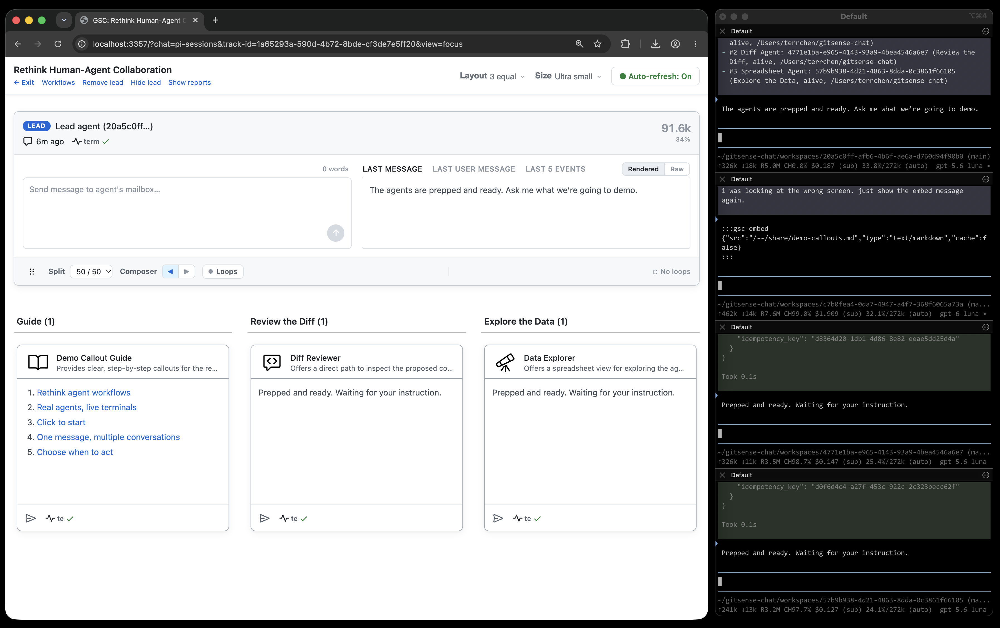
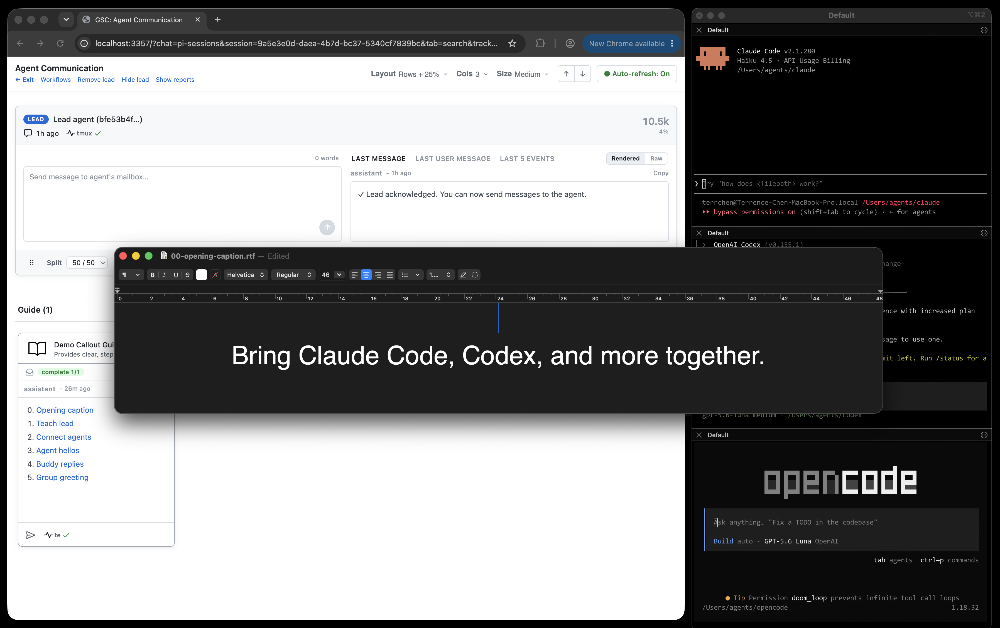
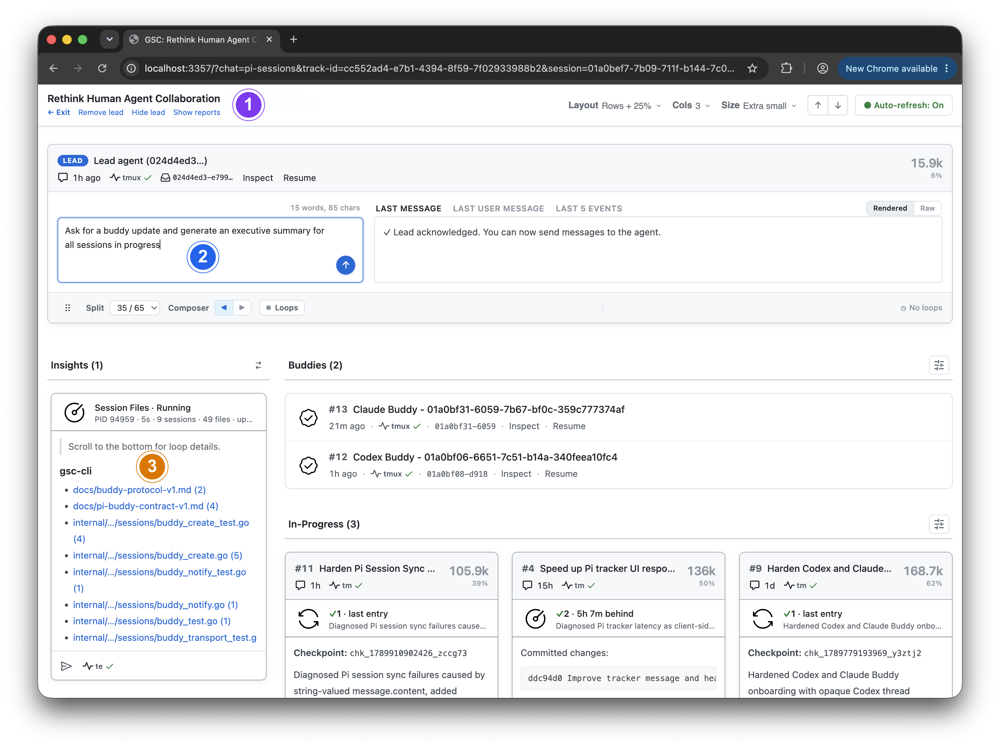
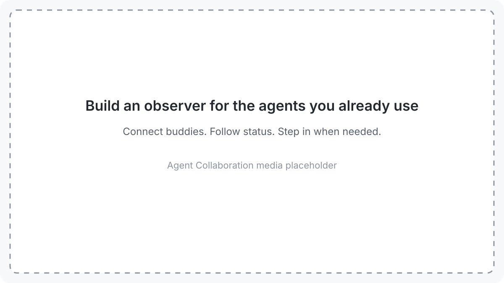

> **Coming soon:** This README previews the next iteration of GitSense Chat,
> where you bring your agents’ work together. The repository will be updated
> shortly.

# GitSense: Chat

**Reimagining how people and agents work together**

Your terminal, multiplexer, or agent development environment is where you run
your agents. GitSense Chat is where you bring their work together.

Coordinate related work, build knowledge you and your agents can reuse, and
inspect activity when something goes wrong, from a few sessions to a complex
system.

No proxy or wrapper required.

<h3 align="center">Same agents. More ways to work together</h3>

<p align="center"><strong><a href="https://raw.githubusercontent.com/gitsense/chat/main/assets/reimagining-human-agent-collaboration.mp4">Download the video</a></strong></p>



<h3 align="center">Same agents. More ways to communicate together</h3>

<p align="center"><strong><a href="https://raw.githubusercontent.com/gitsense/chat/main/assets/more-ways-to-communicate.mp4">Download the video</a></strong></p>



<h3 align="center">Go beyond tabs and terminal panes. Organize around the work</h3>



<table>
  <tbody>
    <tr>
      <td width="50%"><strong>1. Find related work and review it together</strong><br><video src="https://github.com/user-attachments/assets/7e18ad89-fafc-42fc-934b-57fd2b113fd6" controls muted loop playsinline width="100%"></video></td>
      <td width="50%"><strong>2. Bring together your work with a lead</strong><br><video src="https://github.com/user-attachments/assets/b7ae882f-c528-4117-9c9c-73e70414d17a" controls muted loop playsinline width="100%"></video></td>
    </tr>
    <tr>
      <td width="50%"><strong>3. Build rich dashboards with less agent context</strong><br><video src="https://github.com/user-attachments/assets/eaabef24-8273-4782-be47-138ec6e4c84c" controls muted loop playsinline width="100%"></video><br><a href="workflows/checkpoint-file-dashboard/README.md">Learn more: Checkpoint File Dashboard</a></td>
      <td width="50%"><strong>4. Give each agent a recognizable identity</strong><br><a href="agent-collaboration-workflow.gif"></a></td>
    </tr>
  </tbody>
</table>

## Quick Start

Review the [install script](install.sh), then install the `gsc` CLI:

```bash
curl https://raw.githubusercontent.com/gitsense/chat/refs/heads/main/install.sh | bash
```

This installs the `gsc` CLI. To install and configure GitSense Chat, ask your
coding agent:

```text
Install and configure GitSense Chat for me. Start by running `gsc docs help`.
```

You can also [build the CLI from source](https://github.com/gitsense/gsc-cli).

GitSense Chat currently supports Pi sessions, which you can organize into Groups
with lead agents. Follow
[pi-brains](https://github.com/gitsense/pi-brains) to see how sessions, Session
Insights, checkpoints, shared knowledge, messaging, lead agents, and group
observation loops work together.

### Connect Claude Code, Codex, and other agents

GitSense Chat works directly with Pi sessions. Claude Code, Codex, and other
agents that can run `gsc` can message agents in GitSense Chat using `gsc ask`
or `gsc inform`.

Claude Code and Codex support bidirectional Buddy connections. Given a peer
Buddy's mailbox, an agent can ask that Buddy for the paired agent's current
direct-contact instructions, then message the paired agent directly without
using the Buddy as a relay. Agents can send completed work back to their own
Buddies to publish it in the shared Group.

To make an external agent's session visible in GitSense Chat, use
[txcript](https://github.com/gitsense/txcript) to convert a snapshot into a Pi
session:

```bash
cargo install --git https://github.com/gitsense/txcript txcript-cli --locked

txcript list --from claude_code
txcript continue <session-id> \
  --from <harness> \
  --with pi \
  --no-resume
```

The converted snapshot appears in GitSense Chat shortly after the Pi session
sync service processes it. Repeat the conversion when you want to refresh it;
this is a temporary workaround until near-real-time synchronization is
available for other runtimes.

GitSense knowledge is not tied to Pi. Any agent that can run `gsc` can query the
same Brains, notes, lessons, and rules.

## Work smarter with your agents

Bring related sessions together, give your agents a lead, and delegate the
progress checks and follow-ups you would otherwise handle yourself.

<table>
  <thead>
    <tr>
      <th width="50%" align="center">Create an assistant to watch the work</th>
      <th width="50%" align="center">Organize the work</th>
    </tr>
  </thead>
  <tbody>
    <tr>
      <td width="50%" valign="top"></td>
      <td width="50%" valign="top"></td>
    </tr>
    <tr>
      <td valign="top">Give your lead a job, like notifying you when a session stalls or finishes.</td>
      <td valign="top">Arrange related sessions by status, recent activity, or whatever makes sense for your work.</td>
    </tr>
  </tbody>
</table>

Create agents, bring in existing sessions, and start or stop managed agents as
the work changes. A session can appear in multiple Groups without being moved
or copied.

**Guide multiple sessions through one conversation**

Tell your lead what team you need, then direct their work from the Group. In
this Hello World demo, the lead creates six agents for C, Go, Rust, Python,
JavaScript, and Java. One request reaches all six; a follow-up changes only
the C and Go programs.

**[▶ Download and watch the demo video (MP4, 7.4 MB)](assets/scale-coordination-hello-world-lab.mp4)**


## Give your agents a better starting point

Help your agents build on what you already know and what previous work
uncovered. Save useful context as Brains, notes, and lessons that any agent
with access to `gsc` can query.

**Same search, more context**

Regular ripgrep finds matching text. GitSense can add each file’s purpose,
helping your agents decide where to look next.


**Build knowledge once, share it across agents**

Create a Group that other agents can turn to for help. Here, the GitHub
Watcher’s lead brings together recent issues from two repositories and answers
questions from Claude Code, Codex, and OpenCode through `gsc`.

**[▶ Download and watch the demo video (MP4, 3.1 MB)](assets/create-specialized-knowledge-agents.mp4)**

[](assets/create-specialized-knowledge-agents.png)

Any agent that can run `gsc` can ask your knowledge agents for help or share
new findings with them.

## Understand what happened

When you need more than a progress update, open a session to inspect its
history, review message and tool-call counts, and browse reads, writes, and
edits by file.

| Session overview | File activity |
| --- | --- |
|  |  |

From the Overview, open Session Insights to investigate failed commands,
recovery attempts, and verification after edits. Create focused analyzers to
examine the same logs from different perspectives, such as tool usage, code
changes, or progress.

For a GitHub Watcher, for example, an analyzer can review API calls and look
for evidence that the agent read the required skill instructions. Use those
findings to investigate mistakes and refine instructions for the next run.

## Security

GitSense Chat is currently designed to complement an individual’s local agent
workflow. It does not provide authentication or multi-user access controls.

Only make GitSense Chat available through the local loopback interface, such as
`localhost` or `127.0.0.1`. Do not expose it directly to a local network or the
public internet.

If you access GitSense Chat through a tunnel, restrict access to yourself and
make sure the tunnel provides its own authentication. Treat anyone with access
as having terminal-level access to your agent environment: they may be able to
send messages to your agents, inspect session activity, and trigger actions
allowed by your existing permissions.

## Current Support and Boundaries

Pi is currently the first full runtime integration for session logs, lifecycle
state, and Group coordination. Supported Buddy transports provide a lighter
connection for external harnesses, but they do not automatically import a
private transcript or provide the same lifecycle integration. Other harnesses
can use the generic one-way Buddy connection to publish updates and initiate
messages to supported agents. Receiving direct messages or Buddy replies
requires a supported bidirectional adapter and wake-up transport.

GitSense knowledge is portable. Any agent that can run `gsc` can query the same
Brains, notes, lessons, and rules without requiring runtime integration.

GitSense Chat surfaces evidence and supports action. Executable actions remain
subject to application authorization and command validation. It does not decide
whether an agent's work is correct, and agent findings do not automatically
become trusted knowledge. People remain responsible for reviewing evidence,
resolving uncertainty, and deciding what happens next.

## License

The [`gsc` CLI](https://github.com/gitsense/gsc-cli) is licensed under the
[Apache License 2.0](https://www.apache.org/licenses/LICENSE-2.0).

Manifests are plain JSON files built on an open format. You can create, modify,
distribute, and use them with the open-source `gsc` CLI without requiring
GitSense Chat.

GitSense Chat is licensed under the
[Fair Core License (FCL-1.0-ALv2)](https://fcl.dev/). You may use, modify, and
run it internally, including for personal projects, shared workflows, and
self-hosted deployments. You may not use it to build or operate a product or
service that competes directly with GitSense Chat.

The core GitSense Chat application currently ships as minified source while the
project is in its early stages. We intend to open the source further as the
project matures. Under the Fair Core License, each release becomes available
under Apache 2.0 two years after it is published. See [LICENSE](LICENSE) and
[NOTICE](NOTICE) for the complete terms.
