<!--
Component: GitSense Chat README
Block-UUID: fd3dfd8f-5a0c-4ed5-9aee-72330693e45b
Parent-UUID: 4b090c76-74a3-4ffb-921b-97aaf7482cf3
Version: 5.5.0
Description: Positioned GitSense Chat as the workspace for both agent context and multi-session organization.
Language: Markdown
Created-at: 2026-02-21T19:30:05.899Z
Authors: LLM GLM-4.7 (v1.0.0), Gemini 2.5 Flash Lite (v2.0.0), Gemini 3 Flash (v2.1.0), Gemini 3 Flash (v2.2.0), DeepSeek V4 Pro (v2.3.0), Gemini 3 Flash (v2.4.0), claude-sonnet-4-6 (v2.5.0), DeepSeek V4 Pro (v2.6.0), DeepSeek V4 Pro (v2.7.0), GLM-4.7 (v2.8.0), Gemini 3 Flash (v2.9.0), Gemini 3 Flash (v3.0.0), claude-sonnet-4-6 (v4.0.0), claude-sonnet-4-6 (v4.1.0), claude-sonnet-4-6 (v4.2.0), Codex GPT-5 (v4.3.0), Codex (v4.4.0), Codex (v4.5.0), Codex (v4.6.0), Codex (v4.7.0), Codex (v4.8.0), Codex (v4.9.0), Codex (v5.0.0), Codex (v5.1.0), Codex (v5.2.0), Codex (v5.3.0), Codex (v5.4.0), Codex (v5.5.0)
-->


# GitSense: Chat

**Give every coding agent better context, and give yourself one place to organize, review, and steer their work.**

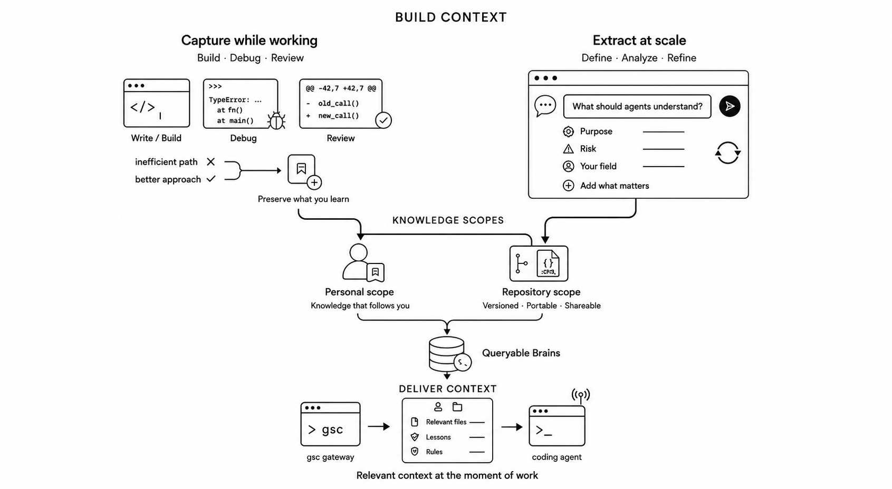

GitSense Chat is the right side of the picture: a workspace where repository knowledge and agent sessions come together. It works with the open-source [`gsc` CLI](https://github.com/gitsense/gsc-cli), which records what matters while you work, delivers it to agents when they need it, and brings their sessions into one place.

Building useful context is only half the job. As agent sessions pile up, it becomes harder to remember which agent touched a file and where to pick the work back up. You can grep session logs or write a script to find a match. GitSense Chat gives you a place to manage what comes next: inspect the session, resume the agent, or hand off the work.

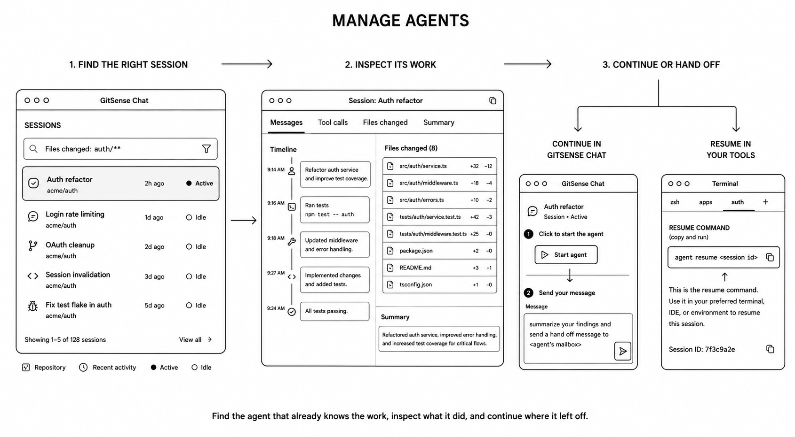

## Why GitSense Chat?

Once several coding agents are working, keeping track of their sessions becomes
as important as the work itself. GitSense Chat gives you one place to find,
organize, review, and communicate with those agents. It also turns what you know
about your codebase and how you work into context agents can find and use, so
each session can start from a better understanding of the code.

### Same sessions. Better structure

Coding-agent sessions already contain the work, decisions, and context you need.
GitSense Chat gives those sessions structure, so you can find the right one,
understand what happened, and decide what should happen next.

| Find | Inspect | Build a dashboard |
| :--- | :--- | :--- |
| 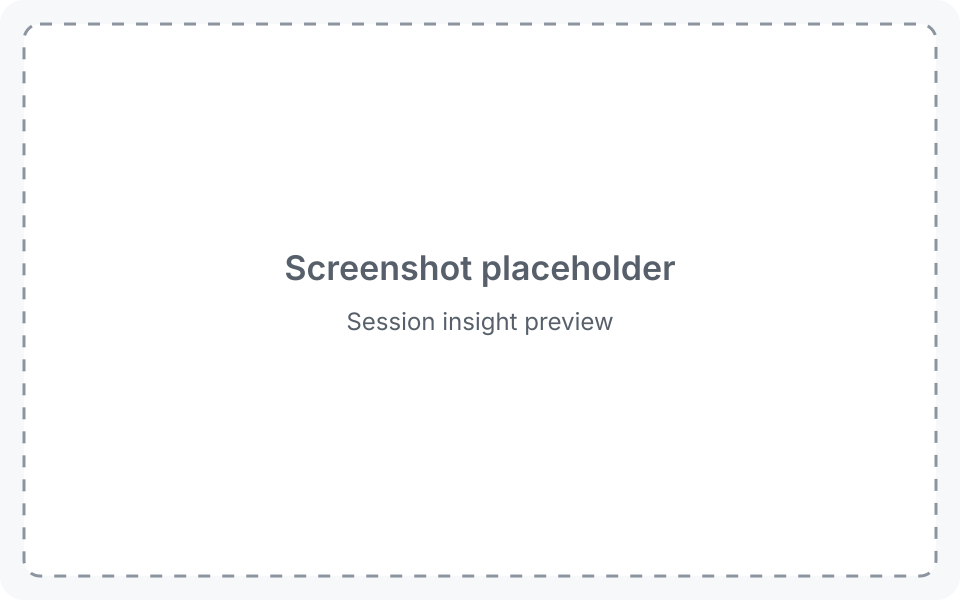 |  |  |
| Search across recorded sessions by file, content, repository, activity, time, and other filters. | Review messages, tool calls, changed files, summaries, and focused slices of a session timeline. | Bring any set of sessions into one live board for a project, workstream, or review. |

| Organize | Monitor | Continue or hand off |
| :--- | :--- | :--- |
|  |  |  |
| Add named sections, choose a board layout, reorder sessions, or group them by activity. | Watch working state, recent activity, timestamps, liveness, and inbox status as they change. | Start or message an agent, give an existing session a task, or copy a command to resume it in your terminal. |

The [Pi](https://github.com/gitsense/pi) repository includes a runnable
`change-review` Analyzer for the Inspect step. It reduces a session to the files
that changed, then adds purpose and dependency risk from Pi's repository Brains.

Pi is the first supported agent runtime. Sessions are reviewed from the local
`gsc` mirror, so freshness depends on the sync watcher. Saved groups are stored
per browser. The messaging protocol is designed to support more agent runtimes
through the same workspace in the future.

### Same search. Better starting point

The left shows matching lines, the right shows matching lines and what each file is for.

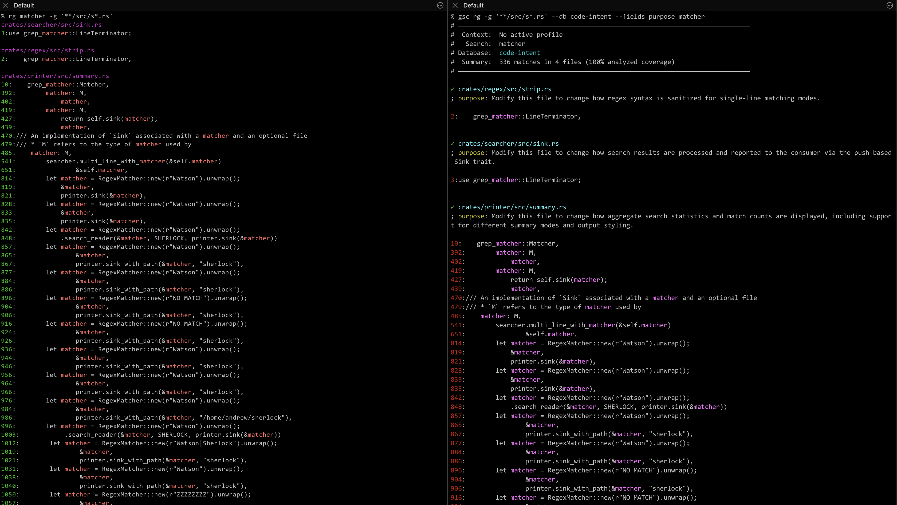

Both searches find the same matches. GitSense adds what each file is for, giving the agent better context to reason with before deciding what to read.

The [smart-ripgrep](https://github.com/gitsense/smart-ripgrep) example makes this
concrete. Its `file-review-context` Analyzer combines code intent, change risk,
dependency and test metadata, and repository lessons. Ask an agent to investigate
the proposed `--max-filesize-warning` change and show which lessons apply to the
files it touches.

### Where does that context come from?

The file purpose, risk, and reminders shown above all come from metadata. Ask an agent to generate that metadata once and it probably will. Keeping it useful as files change, repositories grow, and the way your team works evolves is where it stops being a simple prompt.

GitSense Chat manages that work. [See how it works](#how-it-works), [learn how analysis stays manageable](#analysis-you-can-manage), or [jump to the examples](#examples).

## Quick Start

Review the [install script](install.sh), then install `gsc`:

```bash
curl https://raw.githubusercontent.com/gitsense/chat/refs/heads/main/install.sh | bash
```

or [build it yourself](https://github.com/gitsense/chat).

### Ask Your Coding Agent

```text
Install and configure GitSense Chat for me. Start by running `gsc docs help`.
```

Your agent will guide you through the rest and stop when you need to enter an API key privately.

For detailed installation instructions, run:

```bash
gsc docs install
```

## How It Works

GitSense helps turn what you and your team know into context coding agents can
use. Capture knowledge while you work with `gsc`, or use GitSense Chat to extract
structured knowledge across a repository. Organize it into personal and
repository scopes, package the useful results as queryable Brains, and let `gsc`
deliver relevant files, lessons, and rules when an agent needs them.

| Step | Demo |
| :--- | :--- |
| **Import**<br>Bring repository data into GitSense Chat. | <a href="assets/how-it-works-import-repo-subtitled.mp4">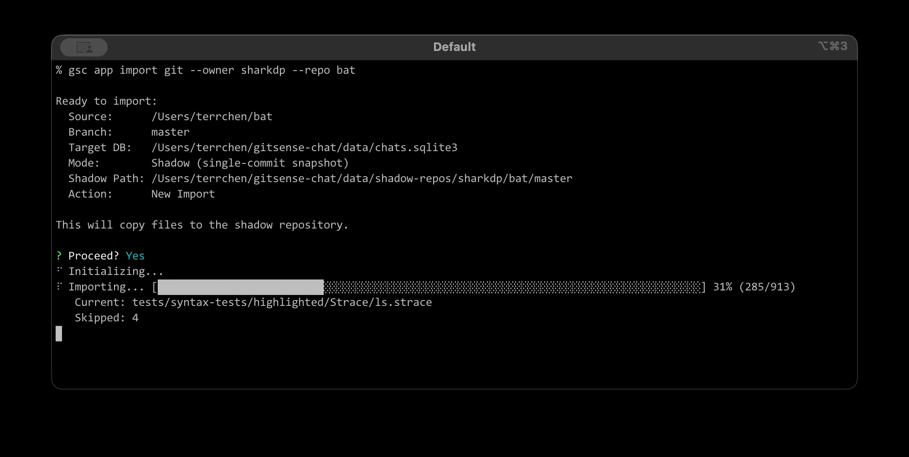</a> |
| **Define**<br>Create an Analyzer that defines the fields, types, instructions, and output you want. | <a href="public/assets/create-analyzer-demo.mp4">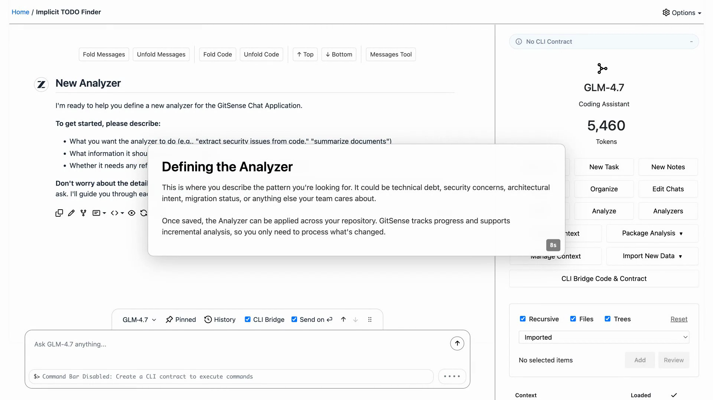</a> |
| **Populate**<br>Generate results with GitSense Chat, deterministic programs, or both, then review them. | <a href="public/assets/analyze-batch-demo.mp4">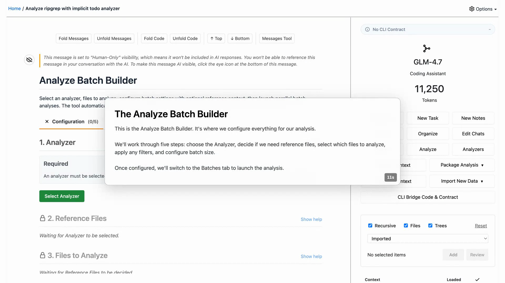</a> |
| **Package**<br>Select useful fields and package them as a portable, queryable Brain. | <a href="public/assets/package-analysis-demo.mp4">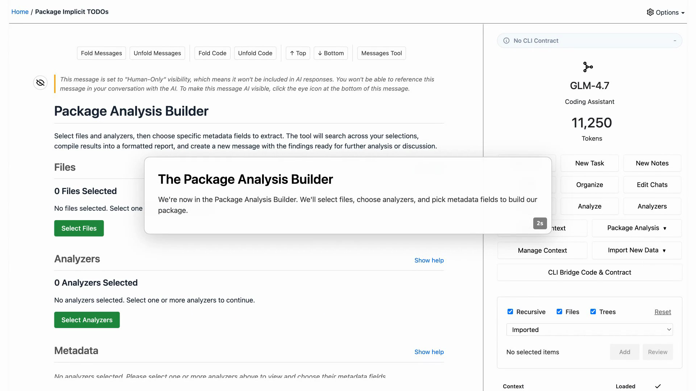</a> |

An Analyzer is the contract, not necessarily an AI prompt. GitSense Chat can populate it with managed model analysis. Existing programs can read other Analyzer results and write deterministic results through the same interface:

```bash
gsc app analysis get
gsc app analysis set
```

Both paths produce the same reviewable metadata. A repository can even ship the Analyzer and the program that populates it under `.gitsense/`, keeping the analysis workflow beside the code it explains.

## Analysis You Can Manage

Useful analysis is not a one-time answer. Files change, repositories grow, and the first version of an Analyzer may not find exactly what you need. GitSense Chat keeps that work visible so you can update it instead of starting over.

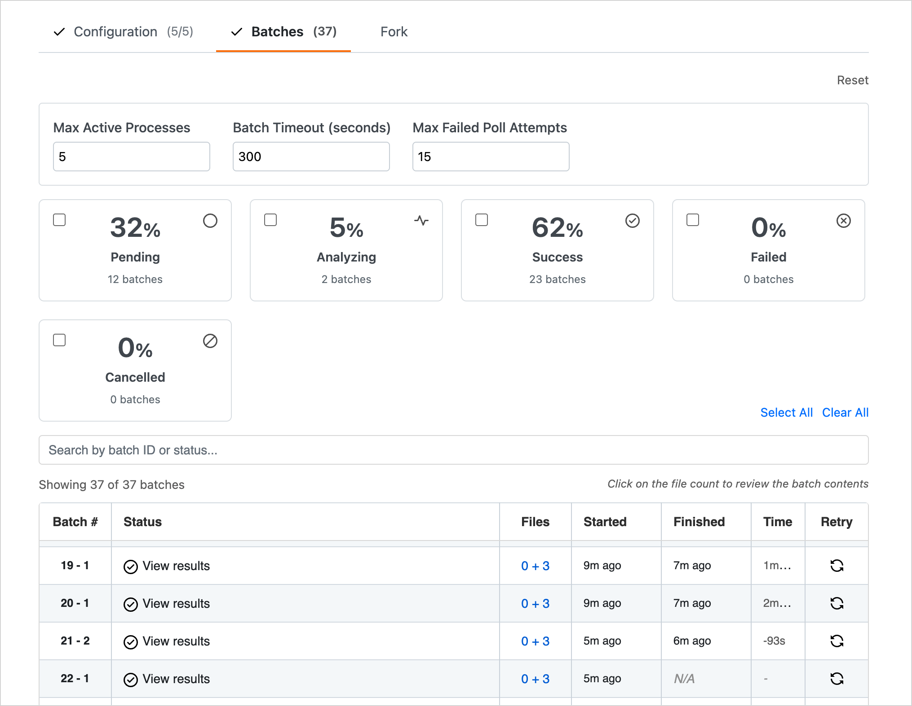

| What you need | How GitSense Chat helps |
| :--- | :--- |
| Use the same analysis again | Save the instructions as a reusable Analyzer. |
| Work across one repository or many | Run the Analyzer wherever that knowledge is needed. |
| Avoid starting over | Analyze files that are new, changed, or still missing results. |
| Keep large jobs manageable | Select files, apply filters, and process them in batches. |
| Use lower batch pricing | Send work in batches when the provider offers it. |
| Check the quality | Inspect the metadata, adjust the Analyzer, and run it again. |
| Work across branches | Keep analysis tied to the repository and branch it came from. |
| Share the result | Package selected fields as a portable JSON manifest. |

## Examples

These examples show what changes once repository knowledge is available. Each one uses a real command and will be replaced with output from a reproducible demo.

<table>
  <thead>
    <tr>
      <th width="32%">Command</th>
      <th width="68%">Example</th>
    </tr>
  </thead>
  <tbody>
    <tr>
      <td width="32%" valign="top">
        <strong>See the shape before reading the code</strong>
        <pre><code>gsc rg cache \
  --db code-intent \
  --glob '**/src/**' \
  --fields purpose,keywords \
  --summary</code></pre>
        <p>See where something appears without loading every matching line.</p>
      </td>
      <td width="68%" valign="top">
        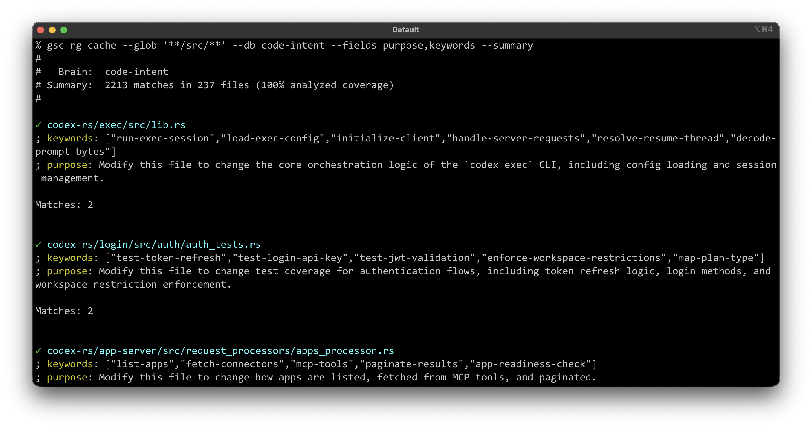
      </td>
    </tr>
    <tr>
      <td width="32%" valign="top">
        <strong>Find files and see what they are for</strong>
        <pre><code>gsc query \
  --db code-intent \
  --glob "**/cache*" \
  --fields purpose,keywords</code></pre>
        <p>Find familiar paths while seeing what each result does.</p>
      </td>
      <td width="68%" valign="top">
        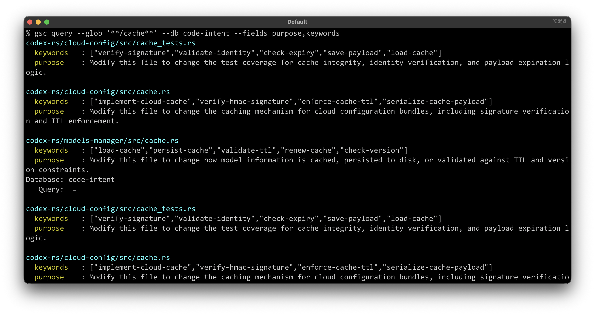
      </td>
    </tr>
    <tr>
      <td width="32%" valign="top">
        <strong>Find files by what they do</strong>
        <pre><code>gsc query \
  --db code-intent \
  --glob '**/*.rs' \
  --filter "keywords=send-input" \
  --fields purpose,keywords \
  --limit 20</code></pre>
        <p>Search repository knowledge instead of guessing the source wording.</p>
      </td>
      <td width="68%" valign="top">
        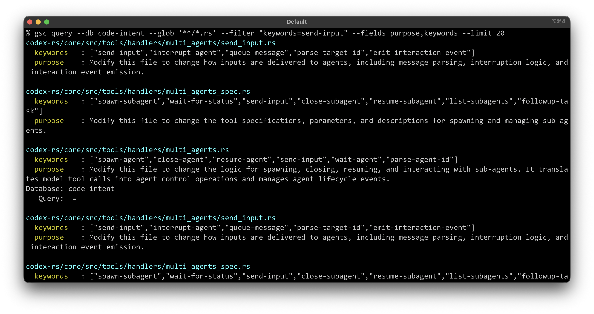
      </td>
    </tr>
  </tbody>
</table>

## Route What You Already Have

Structured knowledge does not have to replace your skills, runbooks, or project
instructions. A GitSense note can act as a small index entry: what the source is
for, where it lives, and which part matters. A rule can fetch the matching notes
when an agent starts work, without loading a large table of contents into every
conversation.

The [skill-router demo](https://github.com/gitsense/gsc-rules-demos#3-route-to-an-existing-skill)
shows the full path. Work on a documentation file loads the `doc-styling` notes,
which point the agent to the relevant skill. GitSense Chat can help create and
refine this kind of repository knowledge at scale; `gsc` delivers it when the
agent needs it.

## License

The **`gsc` CLI** is open source — licensed under [Apache 2.0](https://www.apache.org/licenses/LICENSE-2.0) and available at [github.com/gitsense/gsc-cli](https://github.com/gitsense/gsc-cli). Apache 2.0 means anyone can use, modify, and distribute `gsc` freely for personal or commercial purposes, but attribution to GitSense must be preserved. The origin of the tool stays on the record regardless of where it travels.

**Manifests** are plain JSON files built on an open format. You are free to create, modify, and distribute manifests for any purpose — personal or commercial. The format is documented and not owned by GitSense. Build your own tooling around it, generate manifests in your own pipelines, or ship them with your repositories without restriction.

**GitSense Chat** (this repository) is licensed under the **[Fair Core License (FCL-1.0-ALv2)](https://fcl.dev/)**.

The short version: you're welcome to use, modify, and run GitSense Chat internally — for personal projects, shared workflows, or self-hosted deployments. What you may not do is use it to build or operate a product or service that competes directly with GitSense Chat.

Each version automatically becomes available under Apache 2.0 on the second
anniversary of the date it was made available. Copyright and origin attribution
to Terrence Chen and GitSense must be preserved as required by the license.

**Why not a permissive license?**

GitSense Chat is the product that funds this project. A permissive license like MIT or Apache 2.0 would allow anyone to take this code, wrap it in a competing service, and undercut the very work that keeps GitSense Chat alive and improving. The FCL exists precisely for this situation — it keeps the source open and usable for the vast majority of users, while protecting the project from being used against itself.

If you're a developer, researcher, maintainer, or organization using GitSense Chat to do your own work, the license doesn't affect you. If you're unsure whether your use case qualifies, contact [terrchen@gitsense.com](mailto:terrchen@gitsense.com) before building.

The core application ships as minified source to protect against direct competition while the project is in its early stages. As GitSense Chat matures, we intend to open the source further. The `gsc` CLI and manifest format are already fully open.
