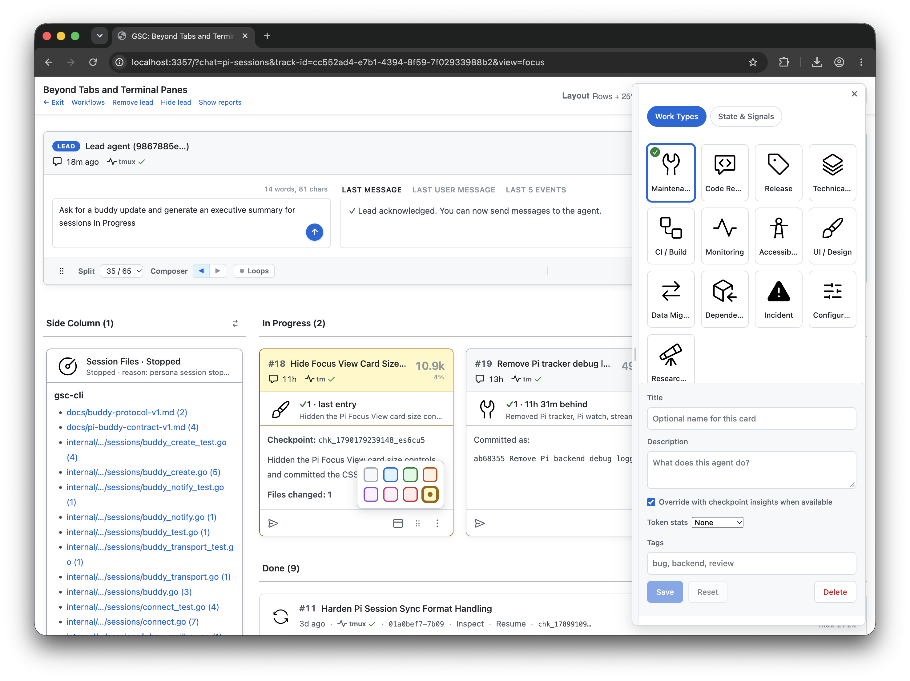
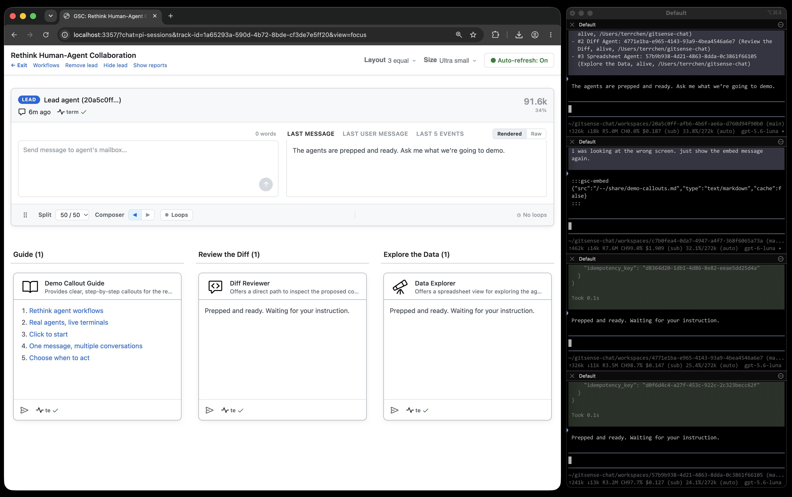
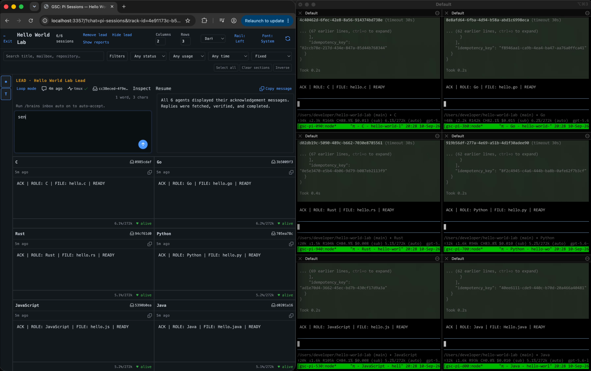
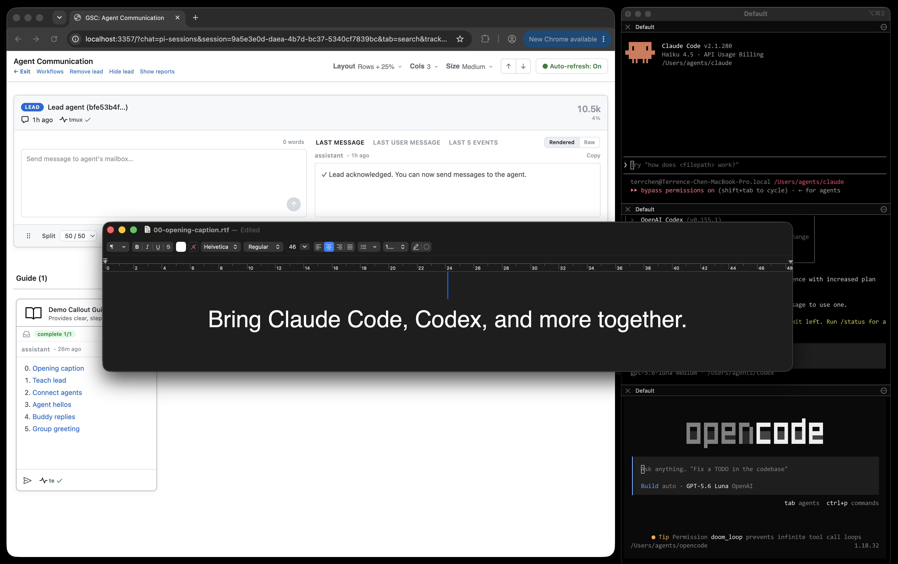
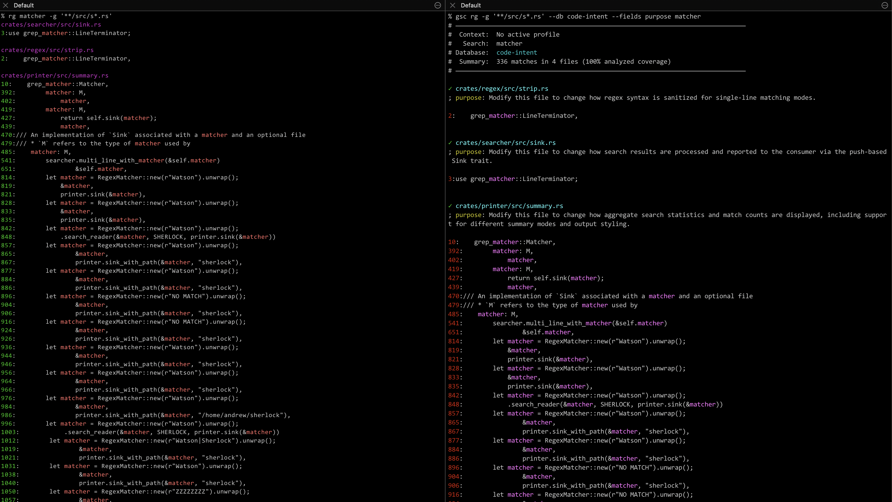
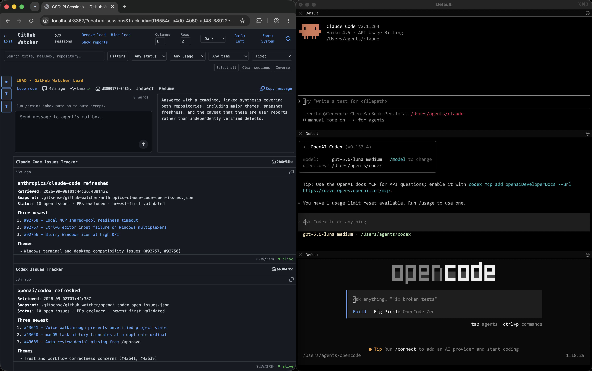
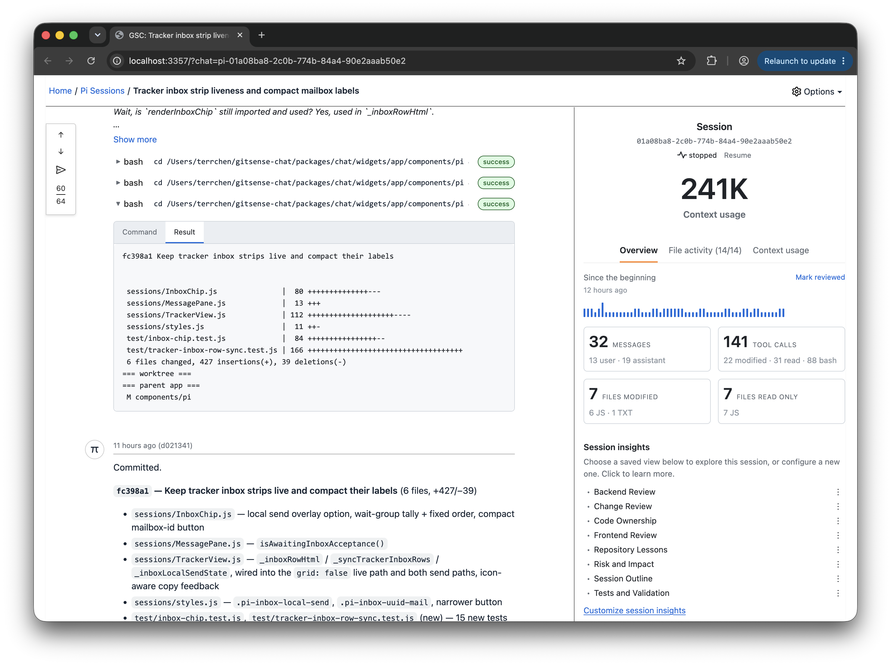
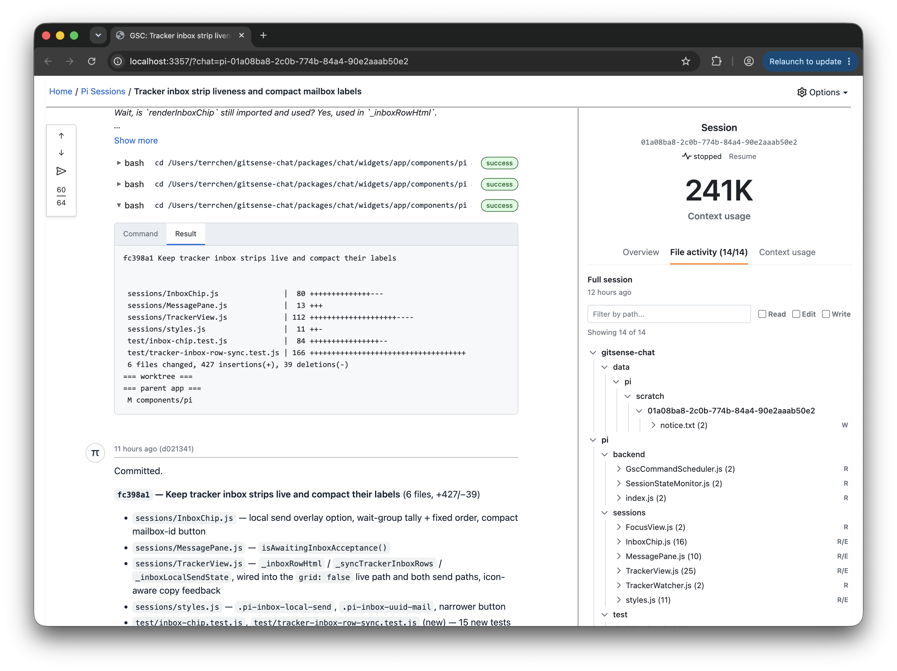

> **Coming soon:** This README previews the next iteration of GitSense Chat,
> where you bring your agents’ work together. The repository will be updated
> shortly.

<h1 align="center">GitSense Chat</h1>

<h3 align="center">Same agents. More possibilities.</h3>

<p align="center">
  <a href="#quick-start">Quick start</a> &nbsp;·&nbsp;
  <a href="#runtime-details">Runtime details</a> &nbsp;·&nbsp;
  <a href="#work-together">Work together</a> &nbsp;·&nbsp;
  <a href="#communicate">Communicate</a> &nbsp;·&nbsp;
  <a href="#share-knowledge">Share knowledge</a>
</p>



Keep running your agents in your terminal, multiplexer, or agent development environment. Use GitSense Chat to bring their work together and decide what happens next.

GitSense uses your agents’ session logs in the background. No wrapper or proxy required.

## What would you do if your agents could already work together?

Your agents keep running in the terminals and environments you already use.
GitSense Chat gives you and your agents a shared place to bring sessions
together, talk to each other, and see what is happening.

Tell a lead what you want. It proposes a setup for you to review and approve.

### Bring six agents into the conversation

> Create six agents with unique names.

The lead gives you a form to review names, models, working directories, and
instructions. Change what you want, then approve the setup. GitSense Chat
creates the team so you can talk to the agents and follow their conversations.

<!-- Add the Multi-Agent Conversation video here. -->

### Build knowledge at scale

> Build a scalable knowledge layer for Codex at `~/codex`, which has close to
> 9,000 files.

You don’t need to figure out the team structure before you start. Tell the lead
what you want to build, and it helps you work out how to divide the work.
You review and approve the proposed setup, then use the dashboards to follow
what the agents are doing and guide the work.

<!-- Add the Distributed Agents video here. -->

**Whether you want a few perspectives or a whole team, start by asking.**

## Rethink what you and your agents can do together.

Bring related conversations into a shared workspace. Give a lead agent the
coordination work, build dashboards your agents can update, and give each
agent an identity that helps you recognize its role.

<table>
  <tbody>
    <tr>
      <td width="50%"><strong>Find, group, and review related work</strong><br><video src="https://github.com/user-attachments/assets/33975bb2-9461-4be8-aaf5-9efb158a33f6" controls muted loop playsinline width="100%"></video><br><a href="https://raw.githubusercontent.com/gitsense/chat/main/assets/01-find-related-work.mp4">Download to watch the demo</a></td>
      <td width="50%"><strong>Bring sessions together with a lead</strong><br><video src="https://github.com/user-attachments/assets/fc34dd03-a98c-4230-a9a5-82f6a479393f" controls muted loop playsinline width="100%"></video><br><a href="https://raw.githubusercontent.com/gitsense/chat/main/assets/02-bring-work-together.mp4">Download to watch the demo</a></td>
    </tr>
    <tr>
      <td width="50%"><strong>Build dashboards with fewer tokens</strong><br><video src="https://github.com/user-attachments/assets/b077b9f0-f4e7-40eb-9125-4d4e398e5555" controls muted loop playsinline width="100%"></video><br><a href="https://raw.githubusercontent.com/gitsense/chat/main/assets/03-build-smart-dashboards.mp4">Download to watch the demo</a></td>
      <td width="50%"><strong>Give agents a recognizable identity</strong><br><video src="https://github.com/user-attachments/assets/b27add1a-0fc7-42af-847c-c1acec2ef04e" controls muted loop playsinline width="100%"></video><br><a href="https://raw.githubusercontent.com/gitsense/chat/main/assets/04-agent-identity.mp4">Download to watch the demo</a></td>
    </tr>
  </tbody>
</table>

## Quick start

Review the [install script](install.sh), then install the `gsc` CLI:

```bash
curl https://raw.githubusercontent.com/gitsense/chat/refs/heads/main/install.sh | bash
```

This installs the `gsc` CLI. To install and configure GitSense Chat, ask your
coding agent:

```text
Install and configure GitSense Chat for me. Start by running `gsc docs help`.
```

You can also [build the CLI from source](https://github.com/gitsense/gsc-cli).

For Pi setup and instructions for bringing in sessions from other agents, see
[Runtime details](#runtime-details).


## Why GitSense Chat?

Tabs and panes organize your windows. GitSense Chat helps you organize the
work across them.

Bring related sessions into a Group, whether they’re tackling one task or
specializing in different parts of a codebase. Work with a lead agent to find
the right agent to ask, coordinate their efforts, and bring their findings
together.

Share what they learn and act directly from their responses, without carrying
context between every conversation yourself.

<a id="work-together"></a>

### More ways to work with your agents

Turn one conversation into coordinated work across multiple agents. A lead
can direct an experiment or complex task, bring the responses together, and
help decide what to do next. Agents can also include actions in their
responses, so you can send a follow-up or open a result in another app when
you’re ready.

<table width="100%">
  <tr>
    <td width="50%" valign="top">
      <strong>Choose your next step</strong>
      <a href="https://raw.githubusercontent.com/gitsense/chat/main/assets/reimagining-human-agent-collaboration.mp4"></a>
      <p>Click to tell the lead agent to start. Workers return actions to open a diff and a spreadsheet. You choose when to act.</p>
      <p><a href="https://raw.githubusercontent.com/gitsense/chat/main/assets/reimagining-human-agent-collaboration.mp4">Download to watch the demo</a></p>
    </td>
    <td width="50%" valign="top">
      <strong>One conversation. Multiple sessions.</strong>
      <a href="https://raw.githubusercontent.com/gitsense/chat/main/assets/scale-coordination-hello-world-lab.mp4"></a>
      <p>Ask the lead agent to start six language sessions. One request reaches them all. A follow-up updates only C and Go.</p>
      <p><a href="https://raw.githubusercontent.com/gitsense/chat/main/assets/scale-coordination-hello-world-lab.mp4">Download to watch the demo</a></p>
    </td>
  </tr>
</table>

<a id="communicate"></a>

### Connect agents across environments

<table width="100%">
  <tr>
    <td width="50%" valign="top">
      <p>An agent working in Claude Code can ask an agent in GitSense Chat for help through <code>gsc</code>, then continue working in Claude Code. Other agents that can run <code>gsc</code> can ask questions or send updates too.</p>
      <p>Supported Buddy connections let external agents bring completed work back to a shared Group without moving their conversations out of their own environments.</p>
      <p><a href="https://raw.githubusercontent.com/gitsense/chat/main/assets/more-ways-to-communicate.mp4">Download to watch the demo</a></p>
    </td>
    <td width="50%" valign="top">
      <a href="https://raw.githubusercontent.com/gitsense/chat/main/assets/more-ways-to-communicate.mp4"></a>
    </td>
  </tr>
</table>

<a id="share-knowledge"></a>

### Give agents a better starting point

Save what you learn as Brains, notes, and lessons. Any agent with access to
`gsc` can look up that context rather than asking you to explain it again.

**Same search, more context**

Regular ripgrep finds matching text. GitSense can add each file’s purpose,
helping your agents decide where to look next.

<a href="assets/same-search-more-to-go-on.png"></a>


**Build knowledge once, share it across agents**

Create a GitHub Watcher to follow issues across two repositories. Agents using
Claude Code, Codex, and OpenCode can ask its lead for the latest findings
through `gsc`.

<a href="https://raw.githubusercontent.com/gitsense/chat/main/assets/create-specialized-knowledge-agents.mp4"></a>

<a href="https://raw.githubusercontent.com/gitsense/chat/main/assets/create-specialized-knowledge-agents.mp4">Download to watch the demo</a>

Any agent that can run `gsc` can ask your knowledge agents for help or share
new findings with them.

## Understand what happened

Open a session to see its conversation history and tool calls. Browse file
activity to check what an agent read or changed.

| Session overview | File activity |
| --- | --- |
|  |  |

From the Overview, open Session Insights to investigate failed commands,
recovery attempts, and verification after edits. Create focused analyzers to
examine the same logs from different perspectives, such as tool usage, code
changes, or progress.

For a GitHub Watcher, for example, an analyzer can review API calls and look
for evidence that the agent read the required skill instructions. Use those
findings to investigate mistakes and refine instructions for the next run.


<a id="runtime-details"></a>

## Runtime details

### Use Pi with Pi-Brains

GitSense Chat uses Pi sessions for browsing and analysis. Install
[Pi-Brains](https://github.com/gitsense/pi-brains) to connect Pi to GitSense:

```bash
pi install npm:@gitsense/pi-brains
```

Start Pi in a workspace and run `/brains`. Pi-Brains provides the session
history, checkpoints, and other information GitSense Chat uses to help you
review and organize work.

### Bring sessions from other agents into Pi

Use [txcript](https://github.com/skillsynchq/txcript) to bring snapshots from
Claude Code, Codex, and other agents into a Pi session. The CLI bootstrap
installer installs the matching upstream release binary into `~/.local/bin`
(on supported Unix platforms). You can also download binaries directly from
the [txcript Releases](https://github.com/skillsynchq/txcript/releases) page
if you need to install it separately.

```bash
txcript list --from claude_code
txcript continue <session-id> \
  --from <harness> \
  --with pi \
  --no-resume
```

The converted snapshot appears in GitSense Chat shortly after the Pi session
sync service processes it. Repeat the conversion when you want to refresh it;
this is a temporary workaround until near-real-time synchronization is
available for other runtimes.

## Security

GitSense Chat is currently designed to complement an individual’s local agent
workflow. It does not provide authentication or multi-user access controls.

Only make GitSense Chat available through the local loopback interface, such as
`localhost` or `127.0.0.1`. Do not expose it directly to a local network or the
public internet.

If you access GitSense Chat through a tunnel, restrict access to yourself and
make sure the tunnel provides its own authentication. Treat anyone with access
as having terminal-level access to your agent environment: they may be able to
send messages to your agents, inspect session activity, and trigger actions
allowed by your existing permissions.

## Current support and boundaries

GitSense knowledge is portable. Any agent that can run `gsc` can query the same
Brains, notes, lessons, and rules without requiring runtime integration.

GitSense Chat surfaces evidence and supports action. Executable actions remain
subject to application authorization and command validation. It does not decide
whether an agent's work is correct, and agent findings do not automatically
become trusted knowledge. People remain responsible for reviewing evidence,
resolving uncertainty, and deciding what happens next.

## License

The [`gsc` CLI](https://github.com/gitsense/gsc-cli) is licensed under the
[Apache License 2.0](https://www.apache.org/licenses/LICENSE-2.0).

Manifests are plain JSON files built on an open format. You can create, modify,
distribute, and use them with the open-source `gsc` CLI without requiring
GitSense Chat.

GitSense Chat is licensed under the
[Fair Core License (FCL-1.0-ALv2)](https://fcl.dev/). You may use, modify, and
run it internally, including for personal projects, shared workflows, and
self-hosted deployments. You may not use it to build or operate a product or
service that competes directly with GitSense Chat.

The core GitSense Chat application currently ships as minified source while the
project is in its early stages. We intend to open the source further as the
project matures. Under the Fair Core License, each release becomes available
under Apache 2.0 two years after it is published. See [LICENSE](LICENSE) and
[NOTICE](NOTICE) for the complete terms.
