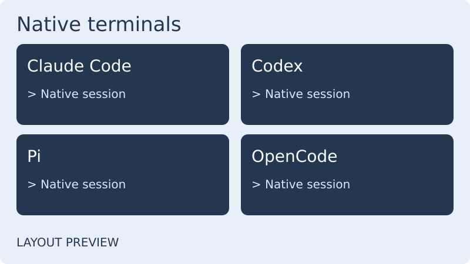
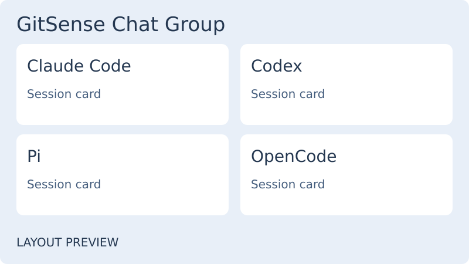
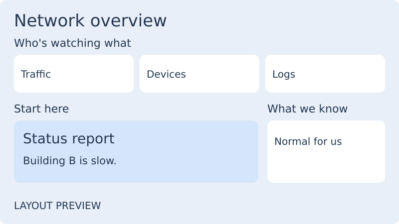
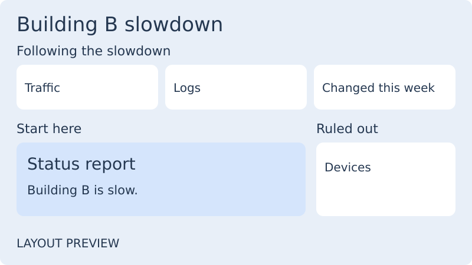
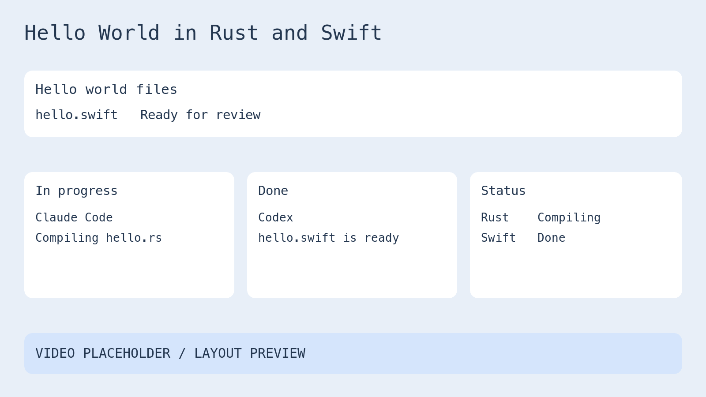
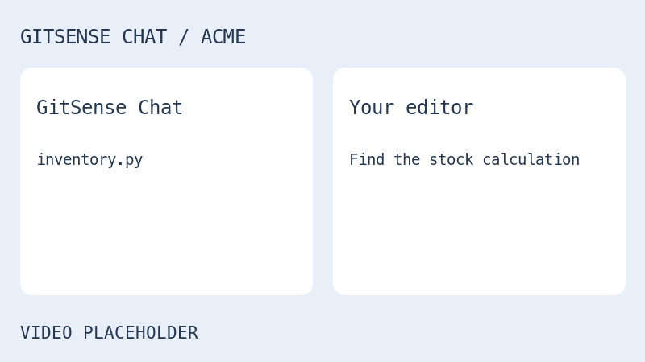
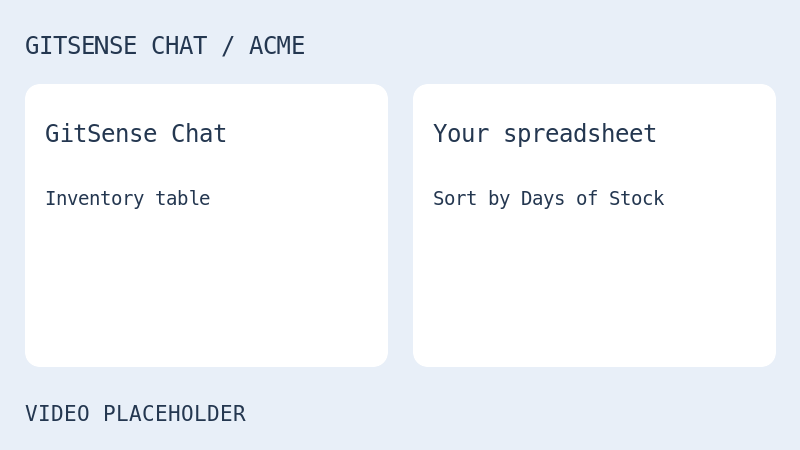

<h1 align="center">GitSense Chat</h1>

<h3 align="center">Same agents. More possibilities.</h3>

<p align="center">
  <a href="#quick-start">Quick start</a> &nbsp;·&nbsp;
  <a href="README-previous.md#runtime-details">Runtime details</a> &nbsp;·&nbsp;
  <a href="#give-yourself-and-your-agents-more-ways-to-collaborate">Work together</a> &nbsp;·&nbsp;
  <a href="README-previous.md#connect-agents-across-environments">Communicate</a> &nbsp;·&nbsp;
  <a href="README-previous.md#give-agents-a-better-starting-point">Share knowledge</a>
</p>

<p align="center">Your agents keep working where they are. GitSense Chat gives you more ways to work together.</p>

<a href="hero-combined-gap-arrow.png"></a>

## Quick start

Review the [install script](install.sh), then install the `gsc` CLI:

```bash
curl -fsSL https://raw.githubusercontent.com/gitsense/chat/refs/heads/main/install.sh | bash
```

To install and configure GitSense Chat, ask your coding agent:

```text
Install and configure GitSense Chat for me. Start by running `gsc docs help`.
```

You can also [build the CLI from source](https://github.com/gitsense/gsc-cli). See [Runtime details](README-previous.md#runtime-details) for Pi setup and bringing in sessions from other agents.

## Give yourself and your agents more ways to collaborate

Create a Group in GitSense Chat to give yourself and your agents a shared workspace. It's like a breakout room with whiteboards you can talk to. Ask your agent in its terminal to update a table or show a different diff, then see the change in Chat.

Watch how you can test and update the ACME inventory tool with Claude Code and Codex.


*Video placeholder. Recording to come.*

<!-- Layout previews only. These images are not screenshots from the recording. -->

### Start a Group at any point

You can ask your agent to start a Group even if you're halfway through a task. Keep talking in the same terminal session, and use the Group to see the results your agent shares as you go.

**Start a Group.** Paste this into the agent you're already working with:

```text
Run gsc groups help, then create a group and add yourself
```

**Bring in another agent.** When you want another agent's help, give it this prompt. Replace `<group-id>` with your Group's ID.

```text
Run gsc groups help, then join group <group-id>
```

<table>
  <tr>
    <td width="50%" valign="top"><br>Agents in their terminals</td>
    <td width="50%" valign="top"><br>Same agents in Chat</td>
  </tr>
</table>

### Make the Group your own

Name your sections and arrange cards to suit the work at hand. Keep a status report beside the details you're investigating, and set aside what you don't need right now. As your focus changes, you can rearrange the same cards.

<table>
  <tr>
    <td width="50%" valign="top"><br>Scan the whole network</td>
    <td width="50%" valign="top"><br>Focus on the Building B slowdown</td>
  </tr>
</table>

### Follow parallel work in one place

When you're working with several agents at once, checking where things stand can mean switching terminals and scrolling through each conversation. Ask your agents to keep progress updates and finished files visible in a Group. You can see what's still underway and open what's ready to review.



*Video placeholder. Recording to come.*

## Keep using the tools you know

Start in Chat, then keep working in the tools you already use. When an agent shares a file, diff, or table, you can look it over in Chat and open it in an app you've set up.

*Video placeholders. Short clips to come.*

<table>
  <tr>
    <td width="33%" valign="top"><br><strong>Open a file</strong><br>Find the stock calculation in your editor.</td>
    <td width="33%" valign="top"><br><strong>Open a diff</strong><br>Read the lines around the change in Zed.</td>
    <td width="33%" valign="top"><br><strong>Open a table</strong><br>Sort by Days of Stock in your spreadsheet.</td>
  </tr>
</table>

## Define how you and your agents can work together

Is AI overkill for a pizza party? Probably, but it's a familiar task for seeing how you, your agents and programs can work together in GitSense Chat. Start with pizza, then imagine your next code review, product launch or root cause analysis.

<!-- Draft layout: these are placeholder images, not playable videos. Replace with verified recordings and check captions before publication. -->

### Create your collaboration space

Agents need context, and so do you. Start the pizza party workflow and bring in your agents. Explore the available choices, then give each agent the saved information it needs for its part.


Explore what you can do next:

<table>
  <tr>
    <th width="50%">Work with the Steps agent</th>
    <th width="50%">Plan with an expert</th>
  </tr>
  <tr>
    <td width="50%" valign="top">
      
      <p>Edit the checklist yourself, then ask its agent to read your changes and help refine it.</p>
    </td>
    <td width="50%" valign="top">
      
      <p>Ask the expert to choose toppings, size and quantity, then review and adjust the selections directly in the builder.</p>
    </td>
  </tr>
  <tr>
    <th width="50%">Get another perspective</th>
    <th width="50%">Talk to your data</th>
  </tr>
  <tr>
    <td width="50%" valign="top">
      
      <p>Read each agent's review in its own pane, with their sign-offs recorded in Your Order.</p>
    </td>
    <td width="50%" valign="top">
      
      <p>Ask about restaurants and get recommendations in a new column beside each restaurant.</p>
    </td>
  </tr>
</table>

The restaurants in this demo are fictional. No order is placed.

What would you spread out, and where would you bring an agent in? [Workflow Builder](https://github.com/gitsense/workflows/blob/main/workflow-builder/README.md) can help you design your own workflow.
